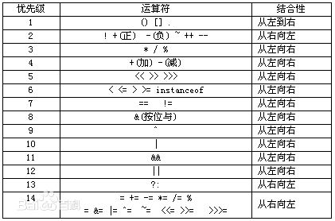
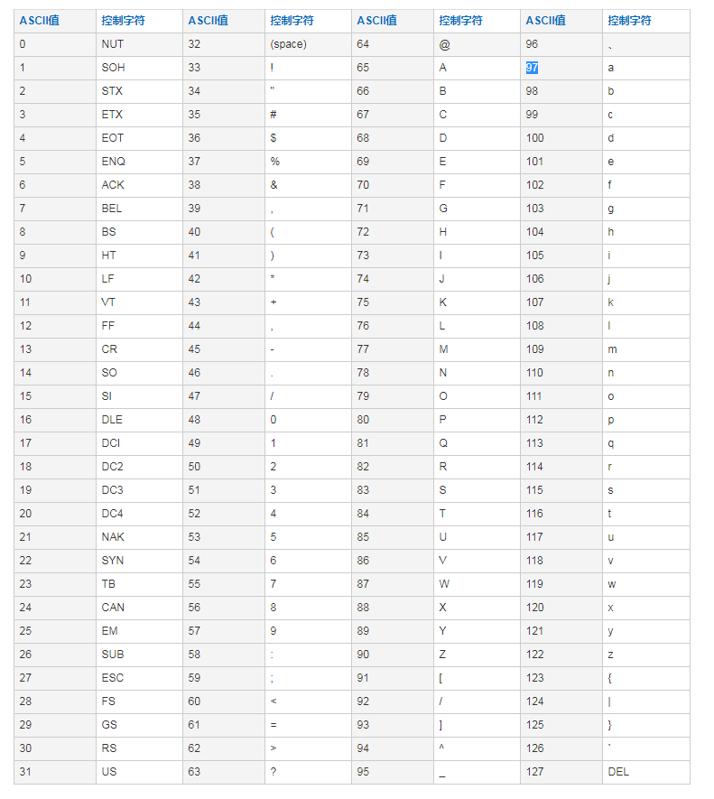

## 运算符
#### 算数运算符
 `+ - * / %(取模，取余) ++(自增) --(自减)`

前++和后++在自己使用时没有任何区别，只有在和其他运算符同时存在时，才有区别
```
var i = 1;
i++;
console.log('i:', i);   // i: 2
++i;
console.log('i:', i);   // i: 3

var j = 1;
var g = j++;
consle.log('j =',j,'; g =',g);  // j = 2; g = 1;
// 后++优先级低于赋值运算符=
// 1. 赋值操作 g = j    j = 1,g = 1
// 2. 后++自增操作 j++ ==> j = j + 1; ==> j = 2

var t = 1;
var s = ++t;
consle.log('t =',t,'; s =',s);  // j = 2; g = 1;
// 前++优先级高于赋值运算符=
// 1. 前++操作 ++s ==> s = s + 1 ==> s = 2
// 2. 赋值操作 t = s = 2

var h = 1;
h = h++;
console.log('h:', h);   // h: 1

var p = 1;
p = ++p;
console.log('p:', p);   // p: 2
```

#### 比较（关系）运算符
    优先级大于赋值运算符    
    `> < >= <= == != === !==`
    == 比较值是否相同，忽略数据类型
    === 比较值和数据类型是否相同
    数字字符串和数字比较 数值字符串会隐式转换为数值类型然后比较
    * 注：比较运算符比较的结果是布尔值
#### 逻辑运算符
    &() &&() | || !(逻辑非)
    && 和 || 执行效率高，开发中应用比较多

    双与 && 具有短路的效果，判断前面的条件是否成立，如果条件不成立则直接返回结果(false)，不执行&&后面部分(不再判断后面的条件) 返回结果true或false
    单与 & 前面条件不成立还会执行后面的条件语句 返回结果0或1

    双或 || 具有短路的效果，判断前面的条件是否成立，如果条件成立则直接返回结果(true)，不执行||后面部分(不再判断后面的条件) 返回结果true或false
    单或 | 前面条件成立还会执行后面的条件语句 返回结果0或1

    !(逻辑非)  实际开发过程中一般使用逻辑非而不直接使用true或false，使用灵活性更高

    比较的过程中会隐式转换为布尔值去比较，但不会输出布尔值，还是会输出原来的值

    练习：
    ```
        false || !false && false || true;
    =   false || true && false || true
    =   false || false || true
    =   true

        4 && "hello" || !false || !true && null;
    =   4 && "hello" || true || false && null
    =   "hello" || true || null
    =   "hello"
    ```
    练习1：
    ```
    var a = 4;
    var sum = 1 * (2+3) && a++ || 5 > 6 && 7 < 8 || 9;

    /*
        计算步骤：
        sum = 1 * (2+3) && a++ || 5 > 6 && 7 < 8 || 9
            = 1 * 5 && a++ || 5 > 6 && 7 < 8 || 9
            = 5 && a++ || 5 > 6 && 7 < 8 || 9
            = 5 && a++ || false && true || 9
            = a++ || false || 9
            = a++
        1.先执行赋值操作
            sum = a = 4;
        2.再进行后加加自增操作
            a = a + 1 = 5;
     */

    console.log("a:",a,"sum:",sum); // a: 5 sum: 4
    ```
    练习2：
    ```
    var a = 4;
    var sum = 1 + 2 && 3 * a++ % 5 || 6 < 7 == 8 / !false
    console.log("a:",a,"sum:",sum);

    /*
        计算步骤：
        sum = 1 + 2 && 3 * a++ % 5 || 6 < 7 == 8 / !false
            = 1 + 2 && 3 * a++ % 5 || 6 < 7 == 8 / true
            = 1 + 2 && 2 || 6 < 7 == 8
            = 3 && 2 || 6 < 7 == 8
            = 3 && 2 || true == 8
            = 3 && 2 || false
            = 2 || false
            = 2

        a++ ==> a = a + 1 = 5;
     */

    console.log("a:",a,"sum:",sum); // a: 5 sum: 2
    ```

#### 赋值运算符
    `= += -= *= /= %=`
    运算符的优先级 
    | 优先级 | 运算符 | 结合性 |
    ||||
    | 1 | `()` `[]` `.` | 从左到右  |
    | 2 | `!` `+`(正) `-`(负) `~` `++` `—-` | 从右向左  |
    | 3 | * / % | 从左向右  |
    | 4 | +(加）-(减) | 从左向右  |
    | 5 | << >> >>> | 从左向右  |
    | 6 | < <= > >= instdnceof | 从左向右  |
    | 7 | == != | 从左向右  |
    | 8 | &(按位与) | 从左向右  |
    | 9 | ^ | 从左向右 |
    | 10 | `|` | 从左向右 |
    | 11 | `&&` | 从左向右 |
    | 12 | `||` | 从左向右 |
    | 13 | `?:` | 从右向左 |
    | 14 | `=` `+=` `-=` `*=` `/=` `%=` `&=` `|=` `^=` `~=` `<<=` `>>=` `>>>=` | 从右向左 |
    ASSIC码表 
#### 三元(三目)运算符
    条件表达式 ? 条件表达式成立执行的操作 : 条件表达式不成立执行的操作
    例如  
    ```
    var a = 10,
    b = 20,
    maxNum = a > b ? a :b;
    ```

#### 拓展
    JavaScript运算符中的隐式转换规律：
    一、递增递减运算符(前置、后置)
    1.如果包含的是有效数字字符串或者是有效浮点数字符串，则会将字符串转换(Number())为数值，再进行加减操作，返回值的类型是：number类型。
    2.如果不包含有效数字字符串，则会将字符串的值转换为NaN,返回值的类型是：number类型。
    3.如果是boolean类型，则先会把true或者false转换为1或者0，再进行加减操作，返回值的类型是：number类型。
    4.如果是null类型，则先会把null转换为0，在进行加减操作，返回值的类型是：number类型。
    5.如果是undefined，则先会把undefined转换为NaN，再进行加减操作，返回值的类型是：number类型。
    6.如果是对象，则先会通过对象的valueOf()方法，进行转换，如果返回的是NaN，调用toString()方法，在进行前面的操作，返回值的类型是：number类型。（注：空数组[]会返回0，在进行加减操作，空对象则会返回NaN）。

    二、逻辑操作符中的隐式转换规律（注：只有undefined、null、NaN、0、空字符串会被转换为false，其余都为true）：
    逻辑操作符一般用于语句判断中。通过判断结果返回的值进行后面的语句操作。
    1.逻辑非(!)操作符：首先会通过Boolean()函数将其操作值转换为布尔值，然后求反。
    2.逻辑与(&&)操作符：如果第一个值经过Boolean()函数转换后为true，则返回第二个操作值，否则返回第一个操作值。如果有一个操作值为null这返回null，如果有一个操作值为undefined，则返回undefined，如果有一个值为NaN，则返回NaN。
    3.逻辑或(||)操作符：如果第一个值经过Boolean()函数转换为false，则返回第二个操作值，否则返回第一个操作值。
    （注：逻辑操作符的运算为短路逻辑运算：前一个条件已经能够得出结果后续条件不再执行！）

    三、关系操作符的隐式转换规律(关系操作符的操作值也可以是任意类型)：
    1.如果两个操作值都是数值，则直接比较大小。
    2.如果两个操作值都是字符串，则字符串进行其Unicode编码进行比较。
    3.如果一个操作值是数值，则另一个值转换为数值进行比较。
    4.如果一个操作值是对象，则调用对象的valueOf()和toString()方法，然后再进行上述比较。
    5.如果一个操作值是布尔值，则将布尔值转换为数值再进行比较。
    (注：NaN和任何值都不相等，包括自己，同时它与任何类型比较都会返回false。)

    相等操作符==和===的隐式转换规律：
    1.布尔值、字符串和数值进行比较，会先将其转换为数值再进行比较。
    2.null和undefined比较是相等的，但不是全等的。
    3.NaN与任何值都不相等，都会返回false。
