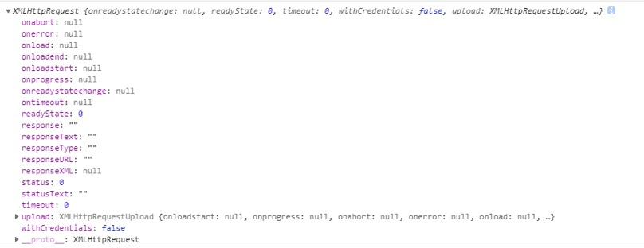
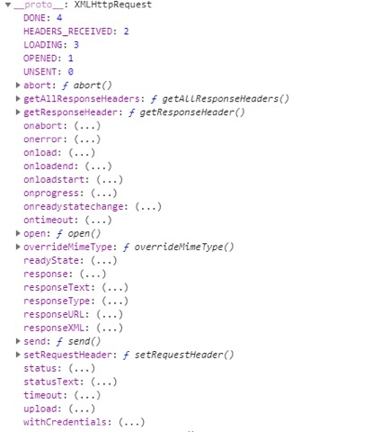

# 一、静态服务器  
通过从浏览器发送请求到服务器，请求的资源类型有两种：  
&emsp;1 静态资源  
&emsp;&emsp;例如： html、css、js... 这些称为静态资源  
&emsp;2 动态资源  
&emsp;&emsp;例如: 实现登录、注册...这些称为动态资源  
## 1.1 实现静态服务器  
```  
// 引入http  
let http = require('http');  
// 引入fs模块  
let fs = require('fs');  
// 引入url模块  
let url = require('url');  

// 创建服务器对象  
let server = http.createServer((req, res) => {  
	// console.log('前端发送请求了');  
	// 获取前端请求的路径  
	let url_obj = url.parse(req.url);  
	// console.log(url_obj);  
	// 获取pathname部分  
	let pathname = url_obj.pathname;  
	// console.log(pathname);  

	// 读取文件并返回  
	fs.readFile('.' + pathname, (err, data) => {  
		// 捕获错误  
		if (err) {  
			// 设置响应头  
			res.setHeader('content-type', 'text/plain;charset=utf-8');  
			// 提示用户  
			res.end('您读取的' + req.url + '文件不存在');  
			return;  
		}  
		// 执行到这里说明没有问题  
		res.end(data);  
	})  
})  

// 监听端口号  
server.listen(3000, () => console.log('listen server at 3000'));  
```  

## 1.2 Mime Type  
Mime Type： 是互联网中每一种资源类型的定义  
例如：  
&emsp;‘html’:  ‘text/html’,  
&emsp;‘css’:  ‘text/css’,  
&emsp;‘js’:  ‘application/x-javascript’  
&emsp;‘jpg’: ‘image/jpg’,  
&emsp;‘jpeg’: ‘image/jpeg’  

```  
// 定义MT对象  
let MT = {  
	'html': 'text/html',  
	'css': 'text/css',  
	'js': 'application/x-javascript',  
	'jpg': 'image/jpg',  
	'jpeg': 'image/jpeg',  
	'png': 'image/png'  
}  
// 自适配Mime Type资源类型  
res.setHeader('content-type', MT[extName] + ';charset=utf-8');  
```  

# 二、路径  
在js中书写的路径分为两种：  
&emsp;第一种:前端路径  
&emsp;&emsp;指的是以html、js、css自身查找的文件路径  
&emsp;&emsp;绝对路径：  
&emsp;&emsp;&emsp;1 补全写法 http://localhost:3000/web/demo.css  
&emsp;&emsp;&emsp;2 省略协议 //localhost:3000/web/demo.css  
&emsp;&emsp;&emsp;3 省略协议以及端口  /web/demo.css (常用方式)  
&emsp;&emsp;&emsp;相对于服务器上的根目录  

&emsp;&emsp;相对路径：  
&emsp;&emsp;&emsp;是相对于文件自身开始查找  
&emsp;&emsp;&emsp;在路径的前面加上./或者不加都是以自身文件开始查找  
&emsp;&emsp;&emsp;注意： css文件是相对于自身所在的文件开始查找  

&emsp;第二种：后端路径  
&emsp;&emsp;绝对路径：  
&emsp;&emsp;&emsp;相对于盘符根目录  
&emsp;&emsp;相对路径：  
&emsp;&emsp;&emsp;是相对于文件自身来查找的  
&emsp;&emsp;如果通过require方法引入的文件，没有在node_modules中的时候，引入的时候必须加上./  


# 三、表单提交  
## 3.1 接口  
表单在设计之初，就是为了我们与页面之间进行交互的，例如：当我们填写完一个表单的时候，如果验证用户名以及密码通过的时候，则登录成功，如果验证失败的时候，则返回不同的信息，所以动态资源返回的数据是不定的，而静态资源是不变的  

```  
// 处理接口  
if (pathname === '/login' && method === 'post') {  
    // console.log('有post请求了');  
    // 设置响应头  
    res.setHeader('content-type', 'text/plain;charset=utf-8');  
    // 模拟动态资源  
    Math.random() > .5 ? res.end('登录成功') : res.end('登录失败');  
    return;  
}  
```  


下午复习：  
静态服务器： 处理静态资源的  
Mime Type: 规定每一种媒体资源类型  

路径：  
&emsp;分为前端路径和后端路径  
&emsp;&emsp;前端路径：  
&emsp;&emsp;&emsp;绝对路径：  
&emsp;&emsp;&emsp;&emsp;1 补全写法  
&emsp;&emsp;&emsp;&emsp;2 省略协议  
&emsp;&emsp;&emsp;&emsp;3 省略协议以及端口号  
&emsp;&emsp;&emsp;&emsp;相对于服务器上的根目录  
&emsp;&emsp;&emsp;相对路径：  
&emsp;&emsp;&emsp;&emsp;是以文件自身开始查找的  
&emsp;&emsp;&emsp;&emsp;在路径的前面加上./或者不加都可以  

接口：  
&emsp;每一次返回的数据是不定的  
&emsp;而静态资源是不变的  

# 四、在Nodejs中处理GET请求  
get请求的的数据携带在query上，而query又属于url，所以我们可以利用url模块去处理get请求  

```  
// 创建服务器对象  
let server = http.createServer((req, res) => {  
// console.log('前端发送请求了');  
// 获取前端请求的路径  
// let url_obj = url.parse(req.url);  
// 获取前端请求的路径 然后传递第二个参数  
let url_obj = url.parse(req.url, true);  
// 获取pathname部分  
let pathname = url_obj.pathname;  
// 获取提交的方式  
let method = req.method.toLowerCase();  


// 处理get请求  
if (pathname === '/regist' && method === 'get') {  
	// 设置响应头  
	res.setHeader('content-type', 'text/plain;charset=utf-8');  

	// console.log('有get请求发送');  
	// console.log(url_obj);  
	// 获取用户名  
	let username = url_obj.query.username;  
	// 获取密码  
	let password = url_obj.query.password;  
	// console.log(username, password);  

	// 判断传递的用户名在数据库中是否存在  
	// 遍历数组  
	// for (let i = 0; i < arr.length; i++) {  
	// 	// 判断并匹配用户名  
	// 	if (username === arr[i].username) {  
	// 		// 说明用户名已经存在  
	// 		// 返回信息提示用户  
	// 		res.end('抱歉，该用户名已经使用了');  
	// 	}  
	// }  

	// 使用ES5中提供的 some方法  
	let result = arr.some(item => item.username === username);  

	// 判断result  
	if (result) {  
		// 说明用户名已经存在  
		// 返回信息提示用户  
		res.end('抱歉，该用户名已经使用了');  
		return;  
	}  

	// 遍历完成没有找到  
	res.end('恭喜， 该用户名可以使用');  

	// 终止执行  
	return;  
}  
```  

# 五、Nodejs中处理Post请求  
post请求的数据量可大可小，因此在nodejs中提供了两个事件统一处理post请求：  
&emsp;data:  该方法会在每一次上传数据的时候触发  
&emsp;end:  该方法会在数据传递完毕之后触发一次  
例如：  
&emsp;当用户只是提交一个简单的数据的时候，data方法只会触发一次  
&emsp;而当用户上传了一个超大的视频的时候，2g， 此时，data方法将会触发多次  

```  
// 处理post请求  
if (pathname === '/login' && method === 'post') {  
	// 设置响应头  
	res.setHeader('content-type', 'text/plain;charset=utf-8');  
	// console.log('有post请求发送');  
	// 定义结果变量  
	let data = '';  
	// 监听data事件  
	req.on('data', data_chunk => {  
		data += data_chunk;  
	})  

	// 监听end事件  
	req.on('end', () => {  
		// console.log(94, data);  
		// 处理query数据  
		let obj = qs.parse(data);  
		// console.log(obj);  
		// 获取用户名  
		let username = obj.username;  
		// 获取密码  
		let password = obj.password;  

		// 与数据库中的数据进行比较  
		let result = arr.some(obj => obj.username === username && obj.password === password);  

		// 判断result  
		if (result) {  
			// 说明用户存在  
			res.end('登录成功');  
			return;  
		}  

		// 执行到这里说明没有找到用户  
		res.end('请检查用户名以及密码');  
	})  

	// 终止代码执行  
	return;  
}  
```  


# 六、AJAX  
在很久以前，浏览器只是为了渲染静态页面  
但是随着技术更新换代，人们开始大量使用表单与网页进行交互  
但是我们都知道，如果使用表单提交数据的时候，会刷新页面（跳转页面）  
例如：当我们只是修改表单中某一个字段的时候，点击提交按钮，依然会跳转页面  
为了避免跳转页面，所有AJAX就出现了  
特点：  
&emsp;使用AJAX不仅仅可以与服务器中进行数据交互  
&emsp;还可以在不跳转页面的情况下实现局部页面更新  

全称：Asynchronous javascript And XML  异步的JS和XML  
XML：可拓展标记语言，也以前也是进行前后端数据交互的  
&emsp;特点：只要具备文档声明， 所有的标签都是自定义的  
&emsp;但是使用XML传递数据的时候，前端解析起来比较麻烦，后端生成文件也是比较麻烦，所以逐渐被json数据所代替  
XML：  
```  
<?xml version="1.0" ?>  
<classroom>  
	<teacher>  
		<name>MR Hou</name>  
		<sex>male</sex>  
	</teacher>  
	<students>  
		<name>zhangfa</name>  
		<sex>male</sex>  
	</students>  
	<students>  
		<name>zhangfa</name>  
		<sex>male</sex>  
	</students>  
	<students>  
		<name>zhangfa</name>  
		<sex>male</sex>  
	</students>  
</classroom>  
```  

json:  
```  
<!-- json -->  
{  
	"classroom": {  
		"teacher": {  
			"name": "Mr Hou",  
			"sex": "male"  
		},  
		"students": [  
			{  
				"name": "Mr Cai",  
				"sex": "male"  
			},  
				{  
				"name": "Mr Cai",  
				"sex": "male"  
			},  
			{  
				"name": "Mr Cai",  
				"sex": "male"  
			},  
			{  
				"name": "Mr Cai",  
				"sex": "male"  
			},  
		]  
	}  
}  
```  

## 6.1 体验AJAX  
网易注册：  
  

花瓣网：  
  

## 6.2 使用AJAX  
&emsp;AJAX不是一门新技术，最早出现在IE5  
&emsp;在IE8以上包括高级浏览器它们都支持XMLHttpRequest这个构造函数  
&emsp;在IE8之前它们支持ActiveXObject这个构造函数  
&emsp;通过构造函数的实例化对象调用某些方法即可发送AJAX请求  
查看：  
  
方法：  
  

重要的属性以及方法：  
&emsp;onreadyStatechang: 该方法会在状态码发生改变的时候执行  
&emsp;readyState: 状态码  
&emsp;&emsp;0：未初始化  
&emsp;&emsp;1：已经调用open方法  
&emsp;&emsp;2：已经接受到响应头  
&emsp;&emsp;3：已经接受一部分响应文本  
&emsp;&emsp;4：接受全部响应文本  
&emsp;status: 服务器的状态码  
&emsp;&emsp;200 表示成功  
&emsp;&emsp;404 表示文件没有找到  
&emsp;&emsp;500 服务器内部发生错误  
&emsp;responseText: 接受到的响应文本  
&emsp;open: 建立TCP连接  
&emsp;send: 发送HTTP请求  
&emsp;setRequestHeader： 该方法用于将数据模拟为真正的表单数据  

### 6.2.1 open方法  
open方法用于建立TCP连接  
使用方式：  
&emsp;xhr.open(method, url, bool)  
&emsp;&emsp;method:  本次请求的方式  
&emsp;&emsp;url:		 本次请求的路径 （可以携带query数据）  
&emsp;&emsp;bool:	 决定了本次发送请求的时候使用异步或是同步 通常传递true表示异步  

```  
xhr.open('get', '/regist?username=wanglaowu1', true);  
```  

### 6.2.2 send方法  
该方法用于发送HTTP请求  
使用方式：  
&emsp;xhr.send(query)  
&emsp;&emsp;query： 本次请求的时候携带的数据 （get请求是不需要传递的）而post请求需要传递  

```  
xhr.send(); // get请求没有参数  
```  

发送get请求的步骤：  
```  
// 定义变量  
let xhr = null;  
// 浏览器支持哪种能力  
if (window.XMLHttpRequest) {  
	xhr = new XMLHttpRequest();  
} else if (window.ActiveXObject) {  
	xhr = new ActiveXObject('Microsoft.XMLHttp');  
} else {  
	throw new Error('您的浏览器不支持AJAX, 请升级');  
}  

// 监听状态的变化  
xhr.onreadystatechange = function() {  
	// 判断是否已经接受全部响应文本  
	if (xhr.readyState === 4) {  
		// console.log(1);  
		// 接受数据  
		// console.log(xhr.responseText);  
		// 将数据解析为json对象  
		let obj = JSON.parse(xhr.responseText);  
		// console.log(obj);  

		// 提示用户  
		tips.innerHTML = obj.data;  

		// 处理数据  
		if (!obj.error) {  
			// 处理其它逻辑  
			return;  
		}  
	}  
}  

// 建立TCP连接  
xhr.open('get', '/regist?username=wanglaowu1', true);  

// 发送HTTP请求  
xhr.send();  
```  


# 七、jQuery中的AJAX  
## 7.1 jquery中发送get请求  
使用方式：  
&emsp;$.get(url, data, callback, dataType)  
&emsp;&emsp;url:		 	本次请求的路径 （可以携带query数据）  
&emsp;&emsp;data:		 	本次请求携带的数据 可以是字符串 可以是对象  
&emsp;&emsp;callback:		回调函数  
&emsp;&emsp;dataType:		数据类型 默认是字符串 当我们传递json的时候，将数据转为json格式  

```  
$get.click(function() {  
	// 发送请求  
	// $.get('/regist', 'username=wanglaowu', res => {  
	$.get('/regist', { username: 'wanglaowu1' }, res => {  
		console.log(res);  
	}, 'json')  
})  
```  

## 7.2 jquery中发送post请求  
使用方式：  
&emsp;$.post(url, data, callback, dataType)  
&emsp;&emsp;url:		 	本次请求的路径 （可以携带query数据）  
&emsp;&emsp;data:		 	本次请求携带的数据 可以是字符串 可以是对象  
&emsp;&emsp;callback:		回调函数  
&emsp;&emsp;dataType:		数据类型 默认是字符串 当我们传递json的时候，将数据转为json格式  

```  
$post.click(function() {  
	// 发送请求  
	$.post('/login', { username: 'wanglaowu', password: '123456' }, res => console.log(res), 'json')  
})  
```  

## 7.3 发送ajax请求  
$.ajax(optioins)  
&emsp;该方法用于发送一切请求（get以及post请求）  
&emsp;options: 是一个配置对象  
&emsp;&emsp;url:		 本次请求的路径 （可以携带query数据）  
&emsp;&emsp;type: 	 本次请求的类型  
&emsp;&emsp;data:		 本次请求携带的数据  
&emsp;&emsp;dataType:	 数据的类型  
&emsp;&emsp;success:	 成功时候执行的回调函数  
&emsp;&emsp;error:	 失败时候执行的回调函数  
&emsp;&emsp;complete:	 完成时候执行的回调函数  
&emsp;&emsp;processData: 是一个布尔值，指示是否由jQuery进行表单序列化，默认是true  
&emsp;&emsp;contentType: 是一个布尔值，指示是否由jQuery设置请求头中的content-type字段，默认true  

```  
// 发送请求  
$.ajax({  
	// 发送get请求  
	// type: 'get',  
	// 发送post请求  
	type: 'post',  
	url: '/login',  
	data: {  
		username: 'wanglaowu',  
		password: '123456'  
	},  
	dataType: 'json',  
	success(res) {  
		console.log(res);  
	}  
})  
```  
