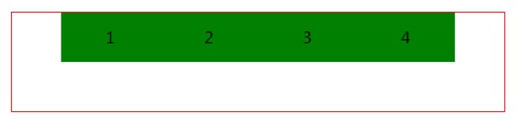
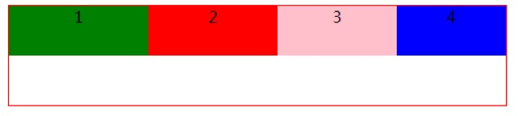

# 一、域  
域: 指的是域名  
域名对应的是一个ip地址  
域名与ip地址的关系存储在域名解析系统中（DNS）  

# 二、跨域  
例如： 有一个服务器A，有一个服务器B，当浏览器从服务器A上面请求资源并渲染完毕之后，再操作该页面的时候发送了另一个请求到服务器B，这个行为就称为跨域请求资源  

演示跨域：  
server1.js:  
```  
// 监听端口号  
server.listen(3001, () => console.log('listen server at 3001'));  
```  

server2.js:  
```  
// 监听端口号  
server.listen(3000, () => console.log('listen server at 3000'))  
```  

当请求回来的页面中，又发送请求到其它服务器中请求资源：  
    ```  
    // 不跨域  
    url: 'http://localhost:3000/regist?username=zhaoliu1',  
    // 跨域  
    url: 'http://localhost:3001/regist?username=zhaoliu1',  
    ```  
比较协议、域名、端口号三者有任意不同的地方，就可以判定为跨域  
结果：  
  

# 三、同源策略  
浏览器有一个同源策略不允许跨域请求资源  
但是静态资源是不受同源策略的影响  

# 四、jSONP  
jsonp: json + padding  
jsonp就是一种跨域请求资源的方式，json是一种数据格式  
我们可以利用script表现无视同源策略的特点，将该标签上的src指向目标服务器上的接口  
我们发现，请求确实发送出去了  
但是报了一个警告  
于是我们效仿百度注册案例中 返回一个方法的执行结果  
然后我们去到目标服务器中修改了源码  
此时，在发送请求的页面中报了一个代码的执行错误信息  
因此，我们要在该页面中提前预定义一个方法  
此时，我们预定义的方法中的参数就是得到的数据  

```  
<script type="text/javascript">  
// 预定义方法  
function hello(res) {  
	console.log(res);  
}  

</script>  
<!-- 指向目标服务器上的接口 -->  
<scrip ttype="text/javascript" src="http://localhost:3001/regist?username=zhaoliu"></script>  
```  

结果：  
  

## 4.1jQuery中跨域请求数据的方式  
使用方式：  
&emsp;$.ajax({  
&emsp;&emsp;url: 		 		请求的路径  
&emsp;&emsp;type： 			请求的方式  
&emsp;&emsp;dataType:  		jsonp’  
&emsp;&emsp;jsonpCallback: 	指定回调函数的名称  
&emsp;&emsp;success: 		成功时候执行的回调函数  
&emsp;})  
```  
// 发送请求  
$.ajax({  
	// url: 'http://localhost:3000/regist?username=zhaoliu',  
	// 跨域请求  
	url: 'http://localhost:3001/regist?username=zhaoliu',  
	type: 'get',  
	dataType: 'jsonp',  
	// 指定callback名称  
	jsonpCallback: 'hello',  
		success(res) {  
			console.log(res);  
		}  
	})  
```  

## 4.2 封装jsonp轮子  
```  
/**  
 * jsonp方法  	用于实现jsonp跨域请求的方式  
 * @url 	  	本次请求的接口路径  
 * @data  		携带的数据  
 * @callback 	回调函数  
 */  

function jsonp(url, data, callback) {  
	// 处理data数据 转为query数据  
	// 定义变量  
	let str = '';  
	// 遍历data数据  
	for (let i in data) {  
		str += '&' + i + '=' + data[i]  
	}  
	// 处理str  
	str = str.slice(1);  
	// console.log(str);  

	// 创建script标签  
	let script = document.createElement('script');  
	// 设置src  
	script.src = url + '?' + str;  
	// 预定义方法  
	window[data.back] = callback;  
	// 上树  
	document.body.appendChild(script);  
	// 当请求完毕数据之后 删除script 和 hello方法  
	script.onload = function() {  
		// 移除script标签  
		document.body.removeChild(this);  
		// 删除hello  
		delete window[data.back];  
	}  
}  

// 使用  
jsonp('http://localhost:3001/regist', { username: 'wanglaowu', back: 'hello' }, res => {  
	console.log(res);  
});  
```  

# 五、服务器允许跨域设置  
```  
res.setHeader('Access-Control-Allow-Origin', '*');  
res.setHeader('Access-Control-Allow-Methods', 'GET,PUT,POST,DELETE');  
res.setHeader('Access-Control-Allow-Headers', 'Content-Type');  
res.setHeader('Access-Control-Allow-Credentials', 'true');  
```  

```  
// 创建服务器对象  
let server = http.createServer((req, res) => {  
	// 获取前端请求的路径 然后传递第二个参数  
	let url_obj = url.parse(req.url, true);  

	// 获取pathname部分  
	let pathname = url_obj.pathname;  
	// 获取提交的方式  
	let method = req.method.toLowerCase();  

	// 以下设置是允许服务器跨域请求  
	res.setHeader('Access-Control-Allow-Origin', '*');  
	res.setHeader('Access-Control-Allow-Methods', 'GET,PUT,POST,DELETE');  
	res.setHeader('Access-Control-Allow-Headers', 'Content-Type');  
	res.setHeader('Access-Control-Allow-Credentials', 'true');  


	// 处理get请求  
	if (pathname === '/regist' && method === 'get') {  
		// 设置响应头  
		// res.setHeader('content-type', 'text/plain;charset=utf-8');  

		// 获取用户名  
		let username = url_obj.query.username;  
		// 获取密码  
		let password = url_obj.query.password;  

		// 使用ES5中提供的 some方法  
		let result = arr.some(item => item.username === username);  

		// 判断result  
		if (result) {  
			// 说明用户名已经存在  
			// 返回json数据  
			res.end(JSON.stringify({  
				error: 1,  
				data: '抱歉，该用户名已经使用了'  
			}))  
			return;  
		}  

		// 遍历完成没有找到  
		// 返回json数据  
		res.end(JSON.stringify({  
			error: 0,  
			data: '恭喜， 该用户名可以使用'  
		}))  

		// 终止执行  
		return;  
	}  

	// 获取后缀名称  
	let extName = pathname.split('.').pop();  
	// 读取文件并返回  
	fs.readFile('.' + pathname, (err, data) => {  
		// 捕获错误  
		if (err) {  
			// 设置响应头  
			res.setHeader('content-type', 'text/plain;charset=utf-8');  
			// 提示用户  
			res.end('您读取的' + req.url + '文件不存在');  
			return;  
		}  

		// 自适配Mime Type资源类型  
		res.setHeader('content-type', MT[extName] + ';charset=utf-8');  

		// 执行到这里说明没有问题  
		res.end(data);  
	})  
})  
```  

# 六、搭建HTTPS服务器  
HTTP是一个无状态的协议，在请求的过程中，不会进行安全校验，可以会注入广告或者被拦截，因此HTTPS协议就出现了，HTTPS协议在请求过程中会进行安全校验，所以更安全可靠  

如果要搭建HTTPS服务器需要证书：  
  

http协议默认的端口号 	80  
https协议默认的端口号 	443  
```  
// 引入http  
let http = require('http');  
// 引入https  
let https = require('https');  
// 引入url  
let url = require('url');  
// 引入fs  
let fs = require('fs');  
// 引入qs  
let qs = require('querystring');  

// 定义MT对象  
let MT = {  
	'html': 'text/html',  
	'css': 'text/css',  
	'js': 'application/x-javascript',  
	'jpg': 'image/jpg',  
	'jpeg': 'image/jpeg',  
	'png': 'image/png'  
}  

// 封装处理函数  
function handle(req, res) {  
	// 获取前端请求的路径  
	let url_obj = url.parse(req.url, true);  
	// 获取pathname部分  
	let pathname = url_obj.pathname;  
	// 获取后缀名称  
	let extName = pathname.split('.').pop();  

	// 读取文件  
	fs.readFile('.' + pathname, function(err, data) {  
		if (err) {  
			// 设置响应头  
			res.setHeader('content-type', 'text/plain;charset=utf-8');  
			// 返回数据  
			res.end('抱歉, 您读取的' + pathname + '文件不存在');  
			return;  
		}  

		// 自适应mime Type 类型数据  
		res.setHeader('content-type', MT[extName] + ';charset=utf-8');  

		// 返回数据  
		res.end(data);  
	})  
}  

// 定义对象  
let options = {  
	key: fs.readFileSync('./ssl/private.pem'),  
	cert: fs.readFileSync('./ssl/file.crt')  
}  

// 创建服务器对象  
let server1 = http.Server(handle)  
	// .listen(3000, () => console.log('listen http server at 3000'));  
	.listen(80, () => console.log('listen http server at 80'));  

let server2 = https.Server(options, handle)  
	.listen(443, () => console.log('listen https server at 443'));  
```  

# 七、 Cookie  
Cookie是HTTP协议中请求头中的一个字段  
作用：验证用户是否登录  
Cookie是服务器来设置，由浏览器来保存，cookie的内存空间是受到限制的，大约4kb  

## 7.1 登录原理  
HTTP协议是一个无状态的协议，理论上来说是无法保持登录的  
当用户填写完数据并且点击提交按钮的时候，此时浏览器会发送一个HTTP请求到服务器，服务器得到响应并经过验证之后，会在响应头中set-cookie字段中设置用户的信息，之后返回给前端，前端检测到set-cookie字段中的内容之后，会生成一个cookie文件，将用户的信息保存起来  
当下一次用户向同一个服务器发送请求的时候，会将cookie文件中的内容携带到服务器中，经过服务器验证之后，就可以判断出使用是否登录过  
例如：  
&emsp;用户名张三，当通过表单填写完数据之后，发送HTTP请求到服务器，服务器经过验证用户信息无误的时候，会在响应头中的set-cookie字段中设置用户的信息: username=张三;password=123456，之后返回给前端，前端经过检测set-cookie中的内容之后，会生成cookie文件，将用户的信息保存起来  
&emsp;之后再次向同一个服务器发送请求的时候，会将cookie文件中的内容带到服务器中，服务器经过验证之后，就可以判断出用户是否登录  


# 八、 Session  
Session是服务器上的一段内存空间，也是用于存储数据  
但是Session依赖于Cookie的  

## 8.1 登录原理  
当用户通过表单或者是ajax发送请求的时候，浏览器会发出一个HTTP请求到服务器，服务器得到响应并开始处理，之后返回一个随机字符（也叫作密钥），该字符串对于浏览器来说没有什么作用， 但是对于服务器来说，可以通过该随机字符串识别用户的信息，之后返回数据给前端，并在响应头的set-cookie中设置用户的信息（随机字符串）  
之后，浏览器检测cookie字段中的内容，会生成一个cookie文件，当再次向同一个服务器发送请求的时候，则会将cookie中的内容（随机字符串）携带到服务器中，然后经过服务器处理之后，就可以判断用户是否登录过  
Session是服务器上的一段内存空间，通常是保存一些重要的信息，一些不重要的信息保存在cookie中就好  


# 九、 Token  
token是‘凭证’、‘令牌’的意思  
是由服务器自定义加密的一种手段  

## 9.1 登录原理  
当用户通过表单或者是ajax填写数据并发送请求的时候，浏览器会发出一个HTTP请求到服务器，服务器经过处理，将用户的信息和指定的加密字符串一起生成一个随机字符串并签名（token字符串），之后将该字符串返回给前端，前端可以将该字符串保存起来，通常可以保存在本地中，之后浏览器可以将该token字符串获取之后，在发送请求的时候协带到服务器中，然后经过服务器的特殊处理（解密）之后，从而获取用户的信息，就可以判断出来用户是否登录过  


# 十、 Flex布局  
Flex是CSS3中提出的，用于定义弹性、响应式布局  

## 10.1 基础概念  
在flex布局中分为容器和项目  
具备display: flex 这条代码就称为容器  
容器的直接子元素称为项目，间接子元素不属于项目  

示意图：  
  


## 10.2 容器属性  
### 10.2.1 flex-wrap  
该属性决定了是否换行  
属性值：  
&emsp;nowrap: 		不换行  默认值  
&emsp;wrap：  		换行  默认新行出现在下方  
&emsp;wrap-reverse: 换行 新行出现在上方  

结构:  
```  
<div class="wrap">  
	<div class="item">1</div>  
	<div class="item">2</div>  
	<div class="item">3</div>  
	<div class="item">4</div>  
	<div class="item">5</div>  
	<div class="item">6</div>  
	<div class="item">7</div>  
	<div class="item">8</div>  
</div>  
```  

样式：  
```  
.wrap {  
	width: 500px;  
	height: 100px;  
	margin: 50px auto;  
	border: 1px solid red;  
}  
.item {  
	width: 100px;  
	height: 50px;  
	text-align: center;  
	background-color: green;  
}  
```  

nowrap:  
  

wrap：  
  

wrap-reverse:  
  

### 10.2.2 flex-direction  
该属性决定了布局方向  
属性值：  
&emsp;row: 			从主轴的起点渲染到终点 默认值  
&emsp;row-reverse:		从主轴的终点渲染到起点  
&emsp;column:			从侧轴的起点渲染到终点  
&emsp;column-reverse:	从侧轴的终点渲染到起点  
row:  
  

row-reverse:  
  

column:  
  

column-reserve:  
  

### 10.2.3 justify-content  
该属性决定了项目在主轴上的排列方式  
属性值：  
&emsp;flex-start:			从主轴的起点到终点  
&emsp;flex-end:			从主轴的终点到起点  
&emsp;center:			居中  
&emsp;space-around:		成员之间均分空白，两侧成员空间减半  
&emsp;space-between:	成员之间均分空白，两侧成员贴边  
&emsp;space-evenly:		成员之间均分空白  
flex-start:  
  

flex-end:  
  

center:  
  

space-around:  
  

space-between:  
  

space-evenly:  
  

### 10.2.4 algin-items  
该属性决定了项目在侧轴上的对齐方式  
属性值：  
&emsp;flex-start:  	从侧轴的起点开始渲染  默认值  
&emsp;flex-end:		从侧轴的终点开始渲染  
&emsp;center:		居中  
flex-start:  
  

flex-end:  
  

center:  
  

### 10.2.5 algin-content  
该属性是用于设置多行  
属性值：  
&emsp;flex-start:		从侧轴的起点到终点  
&emsp;flex-end:			从侧轴的终点到起点  
&emsp;center:			居中  
&emsp;space-around:		成员之间均分空白，两侧成员空间减半  
&emsp;space-between:	成员之间均分空白，两侧成员贴边  
&emsp;space-evenly:		成员之间均分空白  

flex-start:  
  

flex-end:  
  

center：  
  


space-around:  
  

space-between:  
  

space-evenly:  
  

## 10.3 项目属性  
### 10.3.1 order  
该属性决定的是项目的顺序，数字越大越靠后，默认值1  
结构：  
```  
<div class="wrap">  
	<div class="item item1">1</div>  
	<div class="item item2">2</div>  
	<div class="item item3">3</div>  
	<div class="item item4">4</div>  
</div>  
```  

样式：  
```  
.wrap {  
	width: 500px;  
	height: 100px;  
	margin: 50px auto;  
	border: 1px solid red;  
	/*设置为容器*/  
	display: flex;  
}  
.item {  
	width: 100px;  
	height: 50px;  
	text-align: center;  
	background-color: green;  
}  
.item1 {  
	order: 3;  
}  

.item2 {  
	order: 4;  
	background-color: red;  
}  
.item3 {  
	background-color: pink;  
}  
.item4 {  
	background-color: blue;  
}  
```  

结果：  
  

### 10.3.2 flex-grow  
该属性决定了当容器的宽度大于所有项目之后的时候，每一个项目应该扩大的比例，默认值0  
计算公式：  
&emsp;flex-grow值： flex-gorw值 * （容器的宽度 - 所有项目之后的宽度）/ 所有flex-grow之和  

样式：  
```  
.item1 {  
	flex-grow: 1;  
}  
.item2 {  
	flex-grow: 2;  
	background-color: red;  
}  
.item3 {  
	flex-grow: 3;  
	background-color: pink;  
}  
.item4 {  
	flex-grow: 4;  
	background-color: blue;  
}  
```  

结果：  
  

### 10.3.3 flex-shrink  
该属性决定了当项目之和大于了容器之和的时候，每一个项目应该缩小的比例， 默认值1  
计算公式：  
&emsp;flex-shrink值： flex-shrink * （所有项目之和的宽度- 容器的宽度） / 所有的flex-shrink之和  

```  
.item {  
	width: 150px;  
	height: 50px;  
	text-align: center;  
	background-color: green;  
}  
.item1 {  
	flex-shrink: 1;  
}  
.item2 {  
	flex-shrink: 2;  
	background-color: red;  
}  
.item3 {  
	flex-shrink: 3;  
	background-color: pink;  
}  
.item4 {  
	flex-shrink: 4;  
	background-color: blue;  
}  
```  

结果：  
  

### 10.3.4 flex-basis  
该属性决定了每一个项目的宽度，当设置了该属性之后，所以的项目的宽度将失去作用  

样式：  
```  
.item {  
	width: 100px;  
	height: 50px;  
	text-align: center;  
	background-color: green;  
}  
.item1 {  
	flex-basis: 50px;  
}  
.item2 {  
	flex-basis: 60px;  
	background-color: red;  
}  
.item3 {  
	flex-basis: 70px;  
	background-color: pink;  
}  
.item4 {  
	flex-basis: 80px;  
	background-color: blue;  
}  
```  

结果：  
  

### 10.3.5 flex  
该属性是一个综合属性  
例如：  
&emsp;flex: 1; flex-grow: 1; flex-shrink: 1; felx-basis: 0%;  
样式：  
```  
.item {  
	width: 100px;  
	height: 50px;  
	text-align: center;  
	background-color: green;  
}  
.item1 {  
	flex: 1;  
}  
```  

结果：  
  

### 10.3.6 algin-self  
该属性决定某一个项目在侧轴上的排列方式  
属性值：  
&emsp;flex-start:  	从侧轴的起点开始渲染  默认值  
&emsp;flex-end:		从侧轴的终点开始渲染  
&emsp;center:		居中  

```  
.item2 {  
	align-self: flex-start;  
}  
.item3 {  
	align-self: flex-end;  
}  
```  

结果：  
  


# 十一、 Underscore  
underscore是js的一个实用库  
中文官网：[https://underscorejs.net/](https://underscorejs.net/)  

```  
// 模板函数  
var compiled = _.template("hello: <%= name.toUpperCase()%>");  
console.log(compiled)  
console.log(compiled({name: 'ickt'}));  

// 将HTML转义  
var template = _.template("<b><%- value %></b>");  
console.log(template({value:  '<script>'}));  
```  

结果：  
  

# 十二、 Nodejs中的变量  
问题：  
&emsp;当我们书写代码的时候，明明没有定义require、module、exports这些变量，但是为什么可以使用呢  
原因：  
&emsp;当我们书写代码的时候，不是直接执行了，而是先对nodejs中的模块文件进行打包了  

例如：  
&emsp;let http = require(‘http’)  
打包：  
```  
define(function(require, exports, module, __dirname, __filename) {})  
```  

code:  
```  
console.log(111, __dirname);  
console.log(222, __filename);  
```  

结果：  
  

\_\_dirname: 	指向是当前文件所在的目录  
\_\_filename:	指向当前文件所在的完整的绝对路径  
