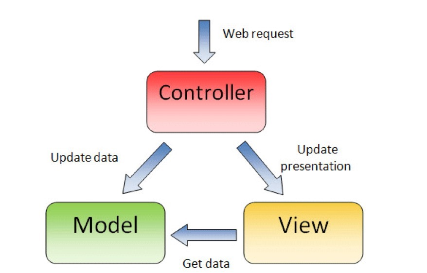

# 一、MVC设计模式  
MVC的思想很简单，就是“分层”。  
以前写代码，都是所有的代码放在一起。功能实现了，但是显得很臃肿，不方便维护。  
MVC的分层：分成三层。  
&emsp;M：Model 模型层          负责存储和提供数据  
&emsp;V：View  视图层          负责渲染页面  
&emsp;C：Controller 控制器层   负责实现逻辑交互  

  

                         |  
                         | Web request  
                         ↓  
                    ————————————  
                   | Controller |  
                    ————————————  
                    ↙          ↘  
     Update data  ↙              ↘ Update presentation  
                ↙                  ↘  
            ———————                  ——————  
           | Model |    ←———————    | View |  
            ———————     Get data     ——————  

MVC的功能：  
&emsp;C是核心，可以从M中获取数据、更新数据 可以更新视图  
&emsp;V可以从M中获取数据  
&emsp;M只负责存储和提供数据  
