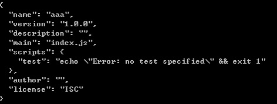

# 一、MVVM  
M：模型层 负责存储数据  
V：视图层 负责渲染视图  
VM：视图模型层 负责将模型层与视图层联系起来  
MVVM最大的特点：双向绑定  
双向绑定：  
&emsp;当视图发生变化，能够影响到模型层中的数据  
&emsp;当模型层中的数据发生变化，会立即渲染视图  

  

                                ViewModel  

         ——————          ——————————————————————        ——————  
        |      |  ———— |     DOM Listeners     | ———→ |      |  
        | View |       |                       |      | Model|  
        |      |  ←——— |       Directives      | ———— |      |  
         ——————          ——————————————————————        ——————  
           ↓                     ↓                        ↓  
          DOM                   Vue                 Plain JavaScript  
                                                        Objects  

# 二、NPM  
官网：https://www.npmjs.com/  
NPM： Node Package Manager （node的第三方包管理器）  
在nodejs中的文件分为两类：  
&emsp;1 核心模块  		这类文件可以直接引入  
&emsp;2 第三方模块文件 	这类文件引入的时候必须在前面加上./  
node_modules文件夹：  
&emsp;该文件夹中用于存储所有的第三方文件，当我们需要引入内部文件的时候，就可以像引入内置模块那样直接引入了  

## 2.1 使用指令  
npm install ModelName    
&emsp;该指令可以实现将ModelName下载到本地  
&emsp;注意： install 可以简写为i  
npm install ModelName1 ModelName2  
&emsp;该指令可以实现将ModelName1以及ModelName2共同下载到本地  
注1：  
&emsp;在下载模块的时候，如果在同级目录中存在node_modules文件，则直接下载到该文件中，如果当前层级没有node_modules文件夹，则往上级或者是上上级目录开始查找，如果找到了，直接下载到文件中，如果直到根目录下还没有找到node_modules文件夹，则返回到使用指令的方法创建一个node_modules文件夹并下载  

注2：  
&emsp;如果在当前目录下，存在一个package.json文件的话，则直接创建node_modules文件并下载  

注3：  
&emsp;在下载模块文件的时候，如果使用指令 npm install ModelName --save    
&emsp;&emsp;此时文件将被下载到package.json文件中的dependencies中，表示“运行的时候的模块”  

&emsp;在下载模块文件的时候，如果使用指令 npm install ModelName --save-dev  
&emsp;&emsp;此时文件将被下载到package.json文件中的Devdependencies中，表示“开发的时候的模块”  

当我们需要去下载别人的项目的时候，可以npm install 即可将dependencies以及Devdependencies相关的文件全部下载到本地  

## 2.2 package.json  
每一个项目的根目录中，都有一个package.json文件，用于定义了这个项目所需要的各种模块,以及项目的配置信息  
## 2.3 生成package.json  
我们可以通过npm init 即可生成该文件  
但是在创建的时候会出现一些列的询问：  
&emsp;一路按下回车即可  
  

结果：  
  
