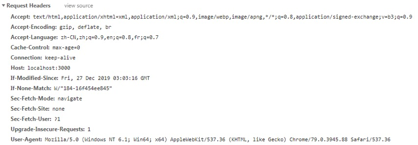

# 一、Express
Express是基于Nodejs平台的一个快速、开放、极简的web应用框架
可以帮助我们快速的搭建后台服务器，快速的处理get请求、post请求......

## 1.1 官网
http://www.expressjs.com.cn/


## 1.2 下载
`npm install express`

## 1.3 搭建后台服务器
```
// 引入express
let express = require('express');

// 创建应用程序
let app = express();

// 监听端口号
app.listen(3000);
```

## 1.4 静态目录
当我们需要访问某一个目录的时候，此时就要对该目录进行静态化
我们可以使用Express唯一的一个中间件， 叫做static方法即可实现静态化目录
```
// 静态化目录
// 第一个参数，决定在访问目录的时候 是否带有前缀
// app.use('/ickt', express.static('./web'));
app.use(express.static('./web'));
```


## 1.5 处理get请求
在Express中处理请求的方式有两种： 1 通过app.get   2 通过Router路由对象
第一种：
    使用方式：
        app.get(path, callback)
            path: 	请求的路径接口
            callback: 回调函数
                有三个参数：
                    第一个参数： req 请求对象
                    第二个参数： res 响应对象
                    第三个参数： next放行函数

```
// 处理get请求
app.get('/getMsg', function(req, res, next) {
	// console.log(arguments.length);
	console.log('有get请求发送');

})
```

结果：


### 1.5.1 get请求中获取query数据
想要获取query数据，我们可以通过req.query直接获取上串的数据
req.query是Express对请求对象的一个封装

请求的路径：
```
http://localhost:3000/getMsg?num=100&color=red
```

code:
```
// 处理get请求
app.get('/getMsg', function(req, res, next) {

	// 获取query数据
	console.log(req.query);
})
```

结果：


## 1.6 处理post请求
在Express中处理post请求
同get请求使用方式一致

```
// 处理post请求
app.post('/postMsg', (req, res, next) => {
	console.log('有post请求发送');
})
```

### 1.6.1 获取post请求的数据
如果想要获取post请求传递的数据，则需要借助中间件body-parse
之后还要进行配置
    app.use(bodyParser.urlencoded({ extended: false }));
然后我们就可以通过req.body来获取上传的数据

请求路径：


结果：


## 1.7 Router路由对象
在Express中也可以通过路由对象处理各种请求
使用方式：
    1 要获取路由模块，通过Express自身获取
    2 要获取实例化路由对象
    3 要进行配置

```
// 引入express
let express = require('express');
// 引入Router
let Router = express.Router;
// 获取路由实例化对象
let router = new Router();
// 配置路由
app.use(router);
```

## 1.8 放行函数
在Express中允许对一个接口，添加多个处理函数
在接口函数中的第三个参数就是next放行函数

```
// 处理get请求
router.get('/getMsg', function(req, res, next) {
	// 获取上传的数据
	console.log('这里是第一个处理函数');
	// 放行函数
	next();
})
// 处理get请求
router.get('/getMsg', function(req, res) {
	console.log('这里是第二个处理函数');
})
```

结果：


# 二、Express中设置cookie、session、Token
## 2.1 cookie
cookie是HTTP协议请求头中的一个字段
用于验证用户是否登录
由服务器设置，由浏览器保存

### 2.1.1登录原理
当用户通过AJAX或者是表单填写数据完毕之后，浏览器会发送一个HTTP请求到服务器，服务器接收响应并按照HTTP协议里面的规定，给响应头中的set-cookie字段设置，之后返回给前端，前端就按照HTTP协议里面的规定开始解析，检测到set-cookie字段之后，生成cookie文件夹，之后向同一个服务器发送任何请求的时候，都会携带cookie字段，服务器就可以验证用户是否登录


### 2.1.2 设置cookie
使用方式：
    req.cookie(key, value, options)
        key: 		数据名称
        value:	设置的数据
        options:	配置项

登录之前响应头中：


请求头中：


登录之后响应头：


请求头中：


### 2.1.3 获取cookie
想要获取cookie中的内容 必须借助cookie-parser
req.cookies对象获取
之后要进行设置

```
// 处理post请求
router.post('/login', (req, res) => {
	// console.log(req.body);
	// 获取用户名
	let username = req.body.username;
	// console.log(username);

	// 设置cookie
	res.cookie('username', username, {
		// 设置cookie的生命周期
		maxAge: 1000 * 60 * 60 * 24
	});

	// 返回数据
	// send方法用于返回数据，可以接收字符串，可以接收对象
	res.send('登陆成功');
})

// 获取cookie
router.get('/getCookie', (req, res) => {
	console.log(req.cookies);
})
```

## 2.2 设置session
在Express中可以通过req.session用于设置以及获取session
当想要获取session中的内容的时候，需要借助中间件 express-session
之后也要进行配置：
    app.use(expressSession({
        scret:  配置密钥
        resave: 每一次访问session的时候，是否重置
        saveUninitialized:  在初始化的时候是否设置session
    }))
```
// 处理post请求
router.post('/login', (req, res) => {
	// console.log(req.body);
	// 获取用户名
	let username = req.body.username;
	let password = req.body.password;
	// console.log(username);

	// 设置session
	req.session.username = username;
	req.session.password = password;

	// 返回数据
	// send方法用于返回数据，可以接收字符串，可以接收对象
	res.send('登陆成功');
})

// 获取session
router.get('/getSession', (req, res) => {
	// console.log(req.session);
	// 获取用户名
	console.log(req.session.username);
	// 获取密码
	console.log(req.session.password);

})
```

## 2.3 Token
含义：凭证、令牌
生成：由后端生成
存储：存储在前端的cookie中或者本地存储中
格式：头部，数据，签名
作用：验证用户身份
流程机制：
    客户端使用用户名跟密码发送登录请求
    服务端收到请求，去验证用户名与密码
    验证成功后，服务端会生成一个 Token字符串，再把这个 Token字符串发送给客户端，服务器端不会保留该Token字符串。
    客户端收到 Token字符串，可以把它存储起来，比如放在 Cookie 里或者 Local Storage 里
    客户端每次向服务端请求资源的时候需要带着服务端签发的 Token字符串
    服务端收到请求，然后去验证客户端请求里面带着的 Token，如果验证成功，响应本次请求，如果验证失败则服务器可以拒绝
特点：
    服务器无状态 因为服务器只负责解密 而不负责存储
    把所有状态信息都附加在 Token 上，服务器就可以不保存。但是服务端仍然需要认证 Token 有效。
    只要服务端能确认是自己签发的 Token，而且其信息未被改动过，那就可以认为 Token 有效。“签名”就是做这个的。
    Token 是在服务端产生的，如果前端使用用户名/密码向服务端请求认证，服务端认证成功，那么在服务端会返回 Token 给前端。
前端可以在每次请求的时候带上 Token 证明自己的合法地位。如果这个 Token 在服务端持久化（比如存入数据库），那它就是一个永久的身份令牌。
JWT标准：
    因为这个过程的验证并不是HTTP协议中规定的方式，而是自定义的。所以很可能一个公司就有一个公司的使用方式。（程序员们从一个公司到了另一个公司，还要再学习另一套使用方式）。所以，就出现了标准。
标准的 Token 有三个部分：
    header（头部）
    payload（数据）
        iss：Issuer，发行者
        sub：Subject，主题
        aud：Audience，观众
        exp：Expiration time，过期时间
        nbf：Not before
        iat：Issued at，发行时间
        jti：JWT ID
    signature（签名）
        header
        payload
        secret


使用步骤：
    1 引入jwt(jsonwebtoken)模块
    2 定义指定加密字符串
    3 当用户登录成功之后 通过jwt提供了sign方法 可以将用户的信息以及加密字符串捆绑到一起生成token字符串
    4 将用户的信息返回给前端 前端可以将token字符串保存在本地存储中
    5 当前端再次发送请求的时候，将token字符串携带到服务器中
    6 经过jwt提供的verify方法进行解密 之后返回给前端

```
// 引入jwt
let jwt = require('jsonwebtoken');
// console.log(jwt);
// 定义指定的加密字符串
let secret = 'alkahoisfnlkn';

// 处理post请求
router.post('/login', (req, res) => {
	// 获取用户名
	let username = req.body.username;
	let password = req.body.password;
	console.log(username, password);

	// 定义对象
	let obj = {
		username: username,
		password: password
	}

	// 加密 生成token字符串
	// sign方法 第一个参数是用于信息对象  第二个参数是指定的加密字符串
	let token = jwt.sign(obj, secret);
	// console.log(token);

	// 返回数据
	res.send({
		error: 0,
		token
	})
})

// 处理get请求
router.get('/checkName', (req, res) => {
	// 获取token
	let token = req.query.token;

	// 解密
	// 通过jwt.verify(token, secret, callback)
	// 该方法接收三个参数: 1 token字符串  2 指定的加密字符串  3 回调函数
	jwt.verify(token, secret, (err, result) => {
		if (err) {
			res.send({
				error: 1,
				data: 'token解密失败，请重新登录'
			})
			return;
		}

		// 执行到这里说明解密成功
		// console.log(result);

		// 将解密之后的内容返回给前端
		res.send({
			error: 0,
			data: result
		})
	})
})
```

# 三、EJS模板
EJS是后台服务器模板，天生可以与Express搭配使用，无需引入，但是需要下载
    通过 `npm install ejs`
当用户登录成功之后，可以通过 res.render 方法渲染一个模板，在该页面中提供了<%=%>插值语法
    在<%=%>中是真正的js环境，因此可以表达式
使用步骤：
    1 下载ejs
    2 创建一个views文件夹
    3 在views文件中创建以.ejs后缀名称的文件
    4 当用户登录成功之后，可以通过res.render(path, dic)渲染一个模板
    5 在<%=%>书写要被替换的内容
    6 只能通过普通的表单提交渲染模板
```    
// 处理post请求
router.post('/login', (req, res) => {
	// 获取用户名
	let username = req.body.username;
	let password = req.body.password;
	console.log(username, password);

	// 渲染一个模板
	res.render('main.ejs', {
		title: '模板',
		username: username
	})
})
```

# 四、单文件上传
如果想要处理除了请求正文之外的数据，我们必须借助formidable模块
该模块引入之后，可以处理普通的post请求之外的数据，还可以处理： 例如 上传的图片文件……
注意：
    此时，必须要给form表单设置enctype属性，才能够让formidable解析req对象
使用步骤：
    1 npm install formidable模块 并引入
    2 当上传数据完毕之后，实例化formidable对象
    3 要设置临时上传图片的路径
    4 通过fd对象上的parse方法解析req对象

```
// 引入formidable模块
let  Formidable = require('formidable');

// 处理post请求
router.post('/login', (req, res) => {
	// 实例化对象
	let fd = new Formidable();

	// 设置临时上传的路径
	fd.uploadDir = './uploads';

	// 解析req对象
	fd.parse(req, function(err, data, files) {
		console.log(data);
		console.log(files);
	})
})
```

# 五、多文件上传
如果想要选中多个文件，必须给input元素添加multiple属性
    此时，就可以按下ctrl同时选中多张图片
    但是如果还是使用单文件上传的方式，将不再适用
    此时要监听一个事件: file事件
        该事件会在每一次上传的时候都会执行一次
```
// 处理post请求
router.post('/login', (req, res) => {
	// 实例化对象
	let fd = new Formidable();
	// 设置临时上传的路径
	fd.uploadDir = './uploads';

	// 定义数组 用于存储上传的文件
	let arr = [];
	// 监听file事件
	fd.on('file', function(key, value) {
		console.log(1111, arguments);
		// 每上传一次保存一次图片
		arr.push(value);
	})

	// 解析req对象
	fd.parse(req, function(err, data, files) {
		// console.log(arr);

		// 为了捕获同步代码中可以出现的错误 所以要将语句放入在try catch语句中
		try {
			for (let i = 0; i < arr.length; i++) {
				// 获取原文件名称
				let oldName = arr[i].path;
				// 获取新文件名称
				let newName = fd.uploadDir + '/' + arr[i].name;
				// 更换名称
				fs.renameSync(oldName, newName);
			}
		} catch (e) {
			// 返回错误消息
			res.send({
				error: 1,
				data: '修改文件名称失败'
			})
		}

		// 执行到这里说明成功
		res.send({
			error: 0,
			data: '修改成功'
		})

	})
})
```

# 六、nodemon自启动工具
## 6.1 为什么要使用nodemon？
当我们在编写或者是调试node代码的时候，每一次代码的变化，我们都要进行关闭和重启动作，这样的话显得非常的繁琐，于是我们可以是用nodemon自启动工具
当我们使用了nodemon之后，就可以通过nodemon 指令 替代node指令
这样的话每一次保存文件，就无须关闭并重启服务器

## 6.2 使用nodemon
通过npm install nodemon -g 全局安装
全局安装的目录：
    C:\Users\Administrator\AppData\Roaming\npm
使用方式与node指令是一样的
按下ctrl + C即可关闭


# 七、MongoDB数据库
数据库：简单理解为存储数据的仓库。
世界上有各种各样的数据库应用程序。
大致可分为两类：
    SQL数据库： mySql、oracle、sqlserver等
    NoSql数据库：Mongodb数据库等
## 6.1 SQL数据库
结构化查询语言：structure query language
它的结构组成：应用程序 => 数据库 => 表 => 数据
使用SQL数据库要学习SQL语言。
## 6.2 NoSql数据库
它的结构组成：应用程序 => 数据库 => 集合 => 文档。
SQL与NOSQL的最大区别在于NoSQL的集合中的文档，它的结构可以不固定。

## 6.3 安装数据库
官网：https://www.mongodb.com/

点击右上角的try free


按照步骤下载：


下载完毕之后的安装包：


## 6.4 配置环境变量
作用： 是为了扩大调用命令的范围
    具体步骤：
        右键我的电脑-属性-高级系统设置-环境变量-系统变量-path
        将C:\Program Files\MongoDB\Server\3.2\bin目录粘贴到path路径的最后面（不要忘记在前面加上;）
        最后点击确定按钮 我们就可以在任何盘符下使用命令

## 6.5 开启数据库
我们可以通过提供的mongod指令开启
默认开启的是：c:/data/db
默认端口号： 27017

此时会报错, 没有找到该目录：


我们可以在c盘创建data目录以及db文件夹


再次执行指令：
`mongod`


此时db文件夹中：该目录中的所有文件不要修改


### 6.5.1 开启指定的数据库
我们可以输入 mongod --dbpath 目标数据库
例如：
    `mongod --dbpath c:/ickt/27`


## 6.6 连接数据库
可以使用mongo指令即可 连接一个已经开启的数据库


## 6.7 开启多个数据库
当我们需要开启多个数据库的时候
此时，需要指定新的端口号
例如：
    `mongod --dbpath c:/ickt26 --port 27018`


## 6.8 连接指定的数据库
当我们需要连接指定的数据库的时候
此时， 需要输入其它指令：
例如：
    `mongo --port 27018`

