# 一、Mongodb常用命令  
## 1.1 查看数据库  
show dbs  
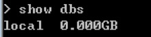  

## 1.2 创建/切换数据库  
use dbName  
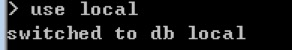  

## 1.3 查看集合  
show collections  
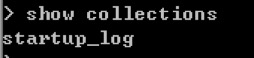  

## 1.4 添加数据  
db[collectionName].insert({})  
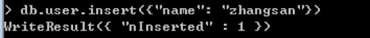  
以上一个指令，做了两件事件：  
1 创建了一个use集合  2 插入了一条数据  

## 1.5 查看集合中数据  
db[collectionName].find()  
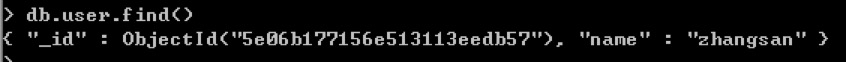  

## 1.6查看所在数据库  
db  
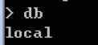  


## 1.7 删除数据  
db[collectionName].deleteOne()  
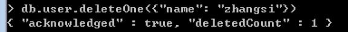  

再次查看集合中的数据：  
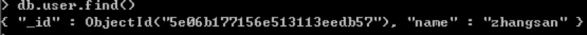  

## 1.8 清空数据  
db[collectionName].remove()  
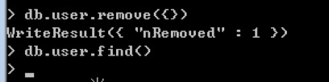  

## 1.9 修改数据  
db[collectionName].update(query, updated, options)  
&emsp;query：	查询条件  
&emsp;uptated:	修改成为的数据  
&emsp;options： 是配置项 决定是否修改多项数据  
修改之前：  
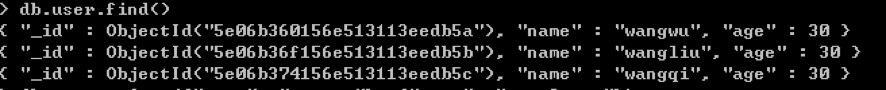  

修改：  
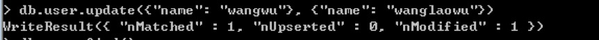  

修改之后：  
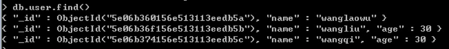  


当我们修改之后，发现数据丢失了，如果只是想要修改数据中的某一个字段的时候  
提供了$set修改器，允许我们只对其中的某一个字段修改  
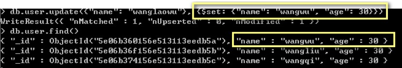  

传递第三个参数：  
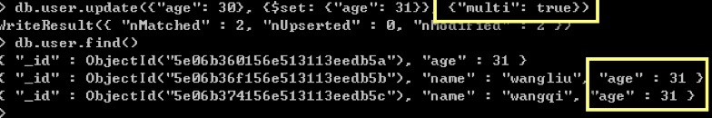  

## 1.10 删除指定的集合  
db[collectionName].drop()  
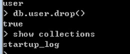  
将user集合删除完毕  

## 1.11 删除指定的数据库  
db.dropDatabase()  
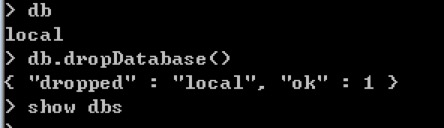  
删除完毕之后 显示空  


# 二、通过Nodejs操作MongoDB数据库  
nodejs与Mongodb都是单独的应用程序  
如何通过nodejs操作mongodb数据库呢  
需要借助模块： mongodb  

```  
// 引入mongodb  
let mongodb = require('mongodb');  
// 连接客户端  
let mongoClient = mongodb.MongoClient;  
// console.log(mongoClient)  
// 连接字符串  
let connectStr = 'mongodb://localhost:27017/';  
// 建立连接  
mongoClient.connect(connectStr, { useUnifiedTopology: true }, function(err, client) {  
	// err 表示错误异常参数  
	// 如果没有出现错误 client就是连接的这条线  
	// 之后所有的操作都是根据client完成的  

	// 连接数据库  
	let db = client.db('ickt');  
	// 连接集合  
	let coll = db.collection('students');  
	// 清空集合中的数据  
	coll.deleteMany({}, function(err, result) {  
		// console.log(err);  
		// console.log(result);  
		console.log('删除完毕了');  
	})  
})  
```  
