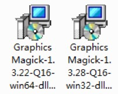
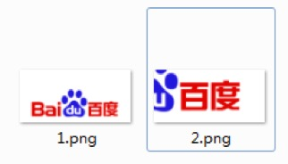
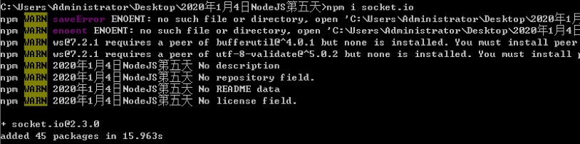
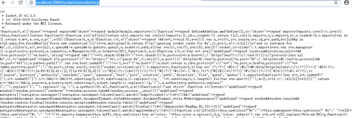
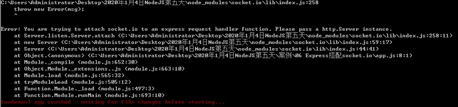
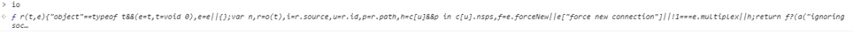
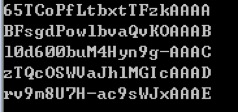

# 一、GM
Graphics Magick是专门用于处理图形的应用程序

## 1.1 安装
Graphics Magick安装包


## 1.2 使用
npm install gm

demo：
```
// 引入gm
let gm = require('gm');

// 裁剪
// crop接收四个参数 前两个参数是裁剪的宽高， 后两个参数是裁剪的位置
gm('./1.png').crop(270, 129, 270, 129).write('./2.png', err => {
	if (err) {
		console.log('裁剪失败');
		return;
	}
	console.log('裁剪成功');
})
```
结果：
(原文件路径下新增加裁剪后的文件)



# 二、WebSocket
webSocket是H5中新增的，与HTTP协议是同级别的，只不过它是有状态的（有持久连接）
HTTP协议：
    前端发送请求，后端得到响应并返回数据，断开连接，之后想要再次发送新的请求，就要再次建立连接通道才能发送请求
webSocket:
    前端发送请求，后端得到响应并返回数据，就保持连接，之后想要再次发送新的请求，就可以使用已经建立起来的通道再次发送请求

## 2.1 socket.io
socket.io是nodejs第三方模块文件，用于统一浏览器发送socket请求的方式

### 2.1.1 下载
npm install socket.io


### 2.1.2 使用socket.io
```
// 引入http
let http = require('http');
// 引入socket.io
let socket_io = require('socket.io');
// console.log(socket_io);

// 创建服务器对象
let server = http.Server(function(req, res) {
	// 返回数据
	res.end('nihao');
})

// 执行socket.io
socket_io(server);

// 监听端口号
server.listen(3000);
```
在地址栏中输入：
http://localhost:3000/socket.io/socket.io.js

此时得到：


### 2.1.3 Express搭配socket.io使用
Express天生不能与socket.io一起使用
demo:
```
// 引入express
let express = require('express');
// 引入socket.io
let socketIo = require('socket.io');
// 创建应用程序
let app = express();
// 执行socketIo
socketIo(app);
// 监听端口号
app.listen(3000);11
```

结果：


修改之后：
```
// 引入express
let express = require('express');
// 引入http
let http = require('http');
// 引入socket.io
let socketIo = require('socket.io');
// 创建应用程序
let app = express();
// 转为原生的实例
let server = http.Server(app);
// 执行socketIo
socketIo(server);
// 监听端口号
server.listen(3000);15
```
在地址栏中输入：
http://localhost:3000/socket.io/socket.io.js

此时：


### 2.1.4 后台搭建
第一步执行socket.io
第二步监听connection事件
    该事件会在前端发送socket请求的时候触发
```
// 执行socketIo
// 当socketIo执行的时候，就已经建立起来了监听前端发送socket请求的方式
// io就好比是一个大总管，前端所有的socket请求都要经过io处理
let io = socketIo(server);
// 监听connection事件
io.on('connection', function() {
	console.log(arguments);
})
```

### 2.1.5前端搭建
第一步：
    通过script标签引入socket.io.js文件

```
<script type="text/javascript" src="/socket.io/socket.io.js"></script>
```

第二步：
    当引入socket.io.js文件之后，向全局暴露一个io变量
    要执行io方法， 并且要监听connect方法
查看：


当我们执行io方法的时候，就会自动发送一个socket请求：
后台接收到的信息：


### 2.1.6 前后端通信
前端socket:
    on方法监听消息
        第一个参数表示消息名称
        第二个参数是执行的函数
    emit方法触发消息
        第一个参数是消息名称
        从第二个参数开始，是传递的数据
后端socket:
    on方法监听消息
        第一个参数表示消息名称
        第二个参数是执行的函数
    emit方法触发消息
        第一个参数是消息名称
        从第二个参数开始，是传递的数据

前端：
```
// 监听connect
socket.on('connect', function() {
	// 发布消息
	this.emit('msg', 100, true, 'abc');
})

// 监听消息
socket.on('massage', function() {
	console.log(arguments);
})
```

后端：
```
// 监听connection事件
io.on('connection', function(socket) {
	// 监听消息
	socket.on('msg', function() {
		console.log(arguments);
	})

	// 发布消息
	socket.emit('massage', 200, false, 'efg');
})
```
