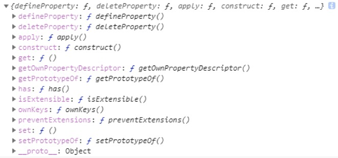
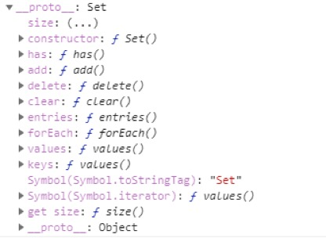
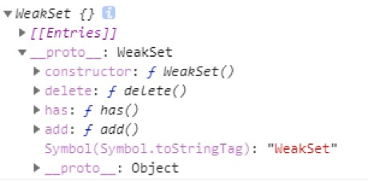
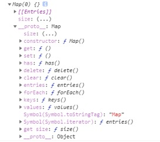
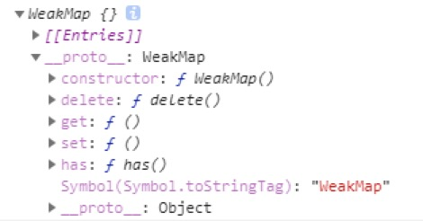

# 一、解构  
所谓解构就是解构聚合数据  
在ES5中的聚合数据有：对象、数组  
在之前对象中获取数据的方式只能通过点语法  
在之前数组中获取数据的方式只能通过中括号语法  
在ES6中简化了获取数据的方式，提供了解构语法  

## 1.1 解构对象  
语法：  
&emsp;let { key1, key2, ...keys } = obj;  
&emsp;&emsp;key1相当于 obj.key1  
&emsp;&emsp;key2相当于 obj.key2  
&emsp;&emsp;keys获取的是剩余的属性  
&emsp;&emsp;&emsp;如果没有剩余的属性，获取到的就是一个空对象  
&emsp;注意: 解构出来的属性、变量一定是和对象中的属性是同名的  
&emsp;解构问题：  
&emsp;&emsp;1 如果使用var解构，会污染全局作用域，我们可以使用let关键字解决  
&emsp;&emsp;2 解构出来的方法，方法中的this将发生变化  
&emsp;&emsp;3 对于引用类型来说，只是指向的改变，而对于值类型来说，是真正的复制  
逆运用：  
&emsp;我们可以通过三个点语法，将一个对象中的所有数据传递给一个对象字面量中  

```  
// 定义对象  
let obj = {  
	name: 'laozhang',  
	age: 30,  
	sex: '男',  
	getName() {  
		console.log(this);  
	},  
	colors: ['red', 'green', 'blue']  
}  
使用var解构  
var { name, age, ...keys } = obj;  
使用let解构  
let { name, age, ...keys } = obj;  
解构方法 方法中的this将发生变化  
let { name, getName, colors, ...keys } = obj;  
// 逆运用  
let demo = { a: 1, b: 2 };  
// 解构  
let { ...keys } = demo;  
// 定义新对象  
let demo1 = { ...keys };  
console.log(demo1);  
```  

## 1.2 解构数组  
语法：  
&emsp;let [arg1, arg2, ...args] = arr;  
&emsp;&emsp;arg1 表示第一个成员  
&emsp;&emsp;arg2 表示第二个成员  
&emsp;&emsp;args 表示剩余的成员  
&emsp;如果使用var解构，也会污染全局作用域，我们可以通过let关键字解决  
&emsp;获取剩余参数的语法：  
&emsp;&emsp;1如果有剩余的成员，获取到的是所有数组中的成员  
&emsp;&emsp;2 如果没有剩余的成员，获取到的是一个空数组  
&emsp;&emsp;3 前面解构的变量，可以正常使用  
逆运用：  
&emsp;我们可以通过三个点语法，将一个数组中的所有数据传递到一个数组字面量中  

```  
// 定义数组  
let colors = ['red', 'green', 'blue', 'pink'];  
// 解构  
let [red, green,  ...args] = colors;  
// console.log(red);  
// console.log(green);  
// console.log(args);  
// 解构数组  
let [...args] = colors;  
// 定义新数组  
let arr = [...args];  
console.log(arr);  
```  

# 二、函数拓展  
## 2.1 默认参数  
在之前适配默认参数的方式：  
&emsp;1可以通过||运算符来适配参数的默认值  
&emsp;&emsp;但是使用||运算符会忽略6个值为false的参数：0、‘’、undefined、null、false、NaN  
&emsp;2 可以使用三元运算符：？ ：  
&emsp;&emsp;如果参数过多，书写比较麻烦  
在ES6中为了解决这样的问题，提供了适配默认参数的方式，直接在参数集合中为形参赋值即可  
&emsp;如果传递了参数，则使用传递的参数  
&emsp;如果没有传递参数，则使用默认参数  
ES6拓展的适配默认参数的方式与三元运算符的方式是等价的  

```  
// ES6中提供的适配默认参数的方式  
function demo(arg = 'red') {  
	// 适配默认参数  
	// 使用三元运算符  
	// arg = arg === undefined ? 'red' : arg;  
	console.log(arg);  
}  
// 传递参数  
demo();  
demo('');  
demo(undefined);  
demo(null);  
demo(NaN);  
demo(false);  
demo('blue');  
```  

## 2.2 获取剩余参数  
在之前我们可以通过arguments来获取剩余参数，但是arguments是一个类数组对象，不能使用数组的常用方法，于是ES6拓展了获取剩余参数的方式，获取到的剩余参数是一个数组，因此可以使用数组的常用方法  
语法：  
&emsp;function demo(arg, arg1, ...args) {  
&emsp;&emsp;arg  表示第一个参数  
&emsp;&emsp;arg1 表示第二个参数  
&emsp;&emsp;args 表示剩余的参数  
&emsp;}  
获取剩余参数的语法:  
&emsp;1 如果有剩余的参数，获取到的是一个所有成员的数组  
&emsp;2 如果没有剩余的参数，获取到的是一个空数组  
&emsp;3 前面参数可以正常使用  
&emsp;4 在箭头函数中有广泛的应用  

逆运用：  
&emsp;语法：demo(...args)  
&emsp;我们可以将一个数组中数据，作为参数传递到一个方法中  
&emsp;在之前我们可以通过apply方法，将数组中的每一项数据传递到一个方法中  
&emsp;&emsp;但是使用apply需要考虑this的指向问题  
&emsp;我们可以使用获取剩余参数的语法，就不需要考虑this指向的问题了  
```  
// 获取剩余参数的语法  
function demo(...args) {  
	// console.log(args);  
	// 调用数组的累加方法  
	let result = args.reduceRight((pre, item) => {  
		return pre + item;  
	})  

	// 打印结果  
	console.log(result);  
}  
// 传递参数  
demo(1);  
demo(1, 2);  
demo(1, 2, 3);  
demo(1, 2, 3, 4);  
demo(1, 2, 3, 4, 5);  
```  
```  
// 定义数组  
let arr = [0, 1, 2, 3, 4, 5, 6, 7, 8, 9];  
// 实现CopyWithin  
Array.prototype.icktCopyWithin = function(pos, start, end) {  
	// 获取要赋值的数据  
	let subArr = this.slice(start, end);  
	// 插入成员  
	this.splice(pos, end - start, ...subArr);  
	// 返回this  
	return this;  
}  
console.log(arr.icktCopyWithin(3, 6, 9));  
```  

## 2.3 箭头函数  
在ES5中定义函数的方式： 1 函数定义式、 2 函数表达式、 3 构造函数式  
在ES6中又拓展了一种方式： 箭头函数  
语法：  
&emsp;let demo = () => {}  
&emsp;&emsp;(): 	表示参数集合  
&emsp;&emsp;=>:	是箭头函数的标志  
&emsp;&emsp;{}: 是函数体  
几点省略：  
&emsp;1 如果参数集合中只有一个参数，即可省略参数集合  
&emsp;&emsp;如果使用三个点语法获取剩余参数，不能省略参数集合  
&emsp;2 如果函数中只有一句话，或者只有返回值的时候，可以省略return以及函数体  

```  
// 省略参数集合  
let arrow = aaa => {  
	console.log(aaa);  
}  
// 执行  
// arrow('aaa');  
// 省略return 以及函数体  
let result = arr.map(item => item * item * item);  
```  

特点：  
&emsp;1 无法使用arguments，但是我们可以使用三个点语法获取剩余参数  
&emsp;2 无法作为构造函数来使用  
&emsp;3 箭头函数中的this指向永远是定义时的  
&emsp;&emsp;无论使用call、apply或者是bind方法都无法改变箭头函数的作用域  
&emsp;&emsp;改变箭头函数作用域唯一的方式就是改变其宿主环境作用域  
&emsp;&emsp;&emsp;也就是说改变其外部函数的作用域  

```  
// 定义函数  
let fn1 = function() {  
	console.log('fn1', this);  
}  
// 定义对象  
let obj = {  
	fn1,  
	// 普通函数  
	fn2: function() {  
		console.log('fn2', this);  
	},  
	// 省略语法  
	fn3() {  
		console.log('fn3', this);  
	},  
	fn4: function() {  
		console.log('fn4', this);  
		// 箭头函数  
		let fn5 = () => {  
			console.log('fn5', this);  
		}  
		// 执行  
		fn5();  
	},  
	ickt: {  
		fn6: function() {  
			console.log('fn6', this);  
		},  
		fn7: () => {  
			console.log('fn7', this);  
		}  
	}  
}  
```  

# 下午复习：  
总结三个点语法：  
&emsp;对象中：  
&emsp;&emsp;let {key1, key2, ...keys } = obj  
&emsp;逆运用：  
&emsp;&emsp;let obj = { ...keys };  
&emsp;数组：  
&emsp;&emsp;let [arg, arg1, ...args] = arr;  
&emsp;逆运用：  
&emsp;&emsp;let arr = [...args];  
&emsp;函数中：  
&emsp;&emsp;function demo(...arg) {}  
&emsp;逆运用：  
&emsp;&emsp;demo(...arg)  
函数拓展:  
&emsp;默认参数： 直接在参数集合中给形参赋值即可  
&emsp;箭头函数：  
&emsp;&emsp;省略：  
&emsp;&emsp;&emsp;省略参数集合    
&emsp;&emsp;&emsp;省略return 以及函数体  
&emsp;&emsp;特点：  
&emsp;&emsp;&emsp;1 无法使用arguments  
&emsp;&emsp;&emsp;2 无法作为构造函数使用  
&emsp;&emsp;&emsp;3 this指向是定义时的  

# 三、Symbol  
在js中有6种数据类型：数字、字符串、布尔值、undefined、null、对象  
在ES6中又添加了一中数据类型： Symbol数据类型，表示独一无二的数据  
我们可以通过Symbol方法创建Symbol数据  
&emsp;参数就是对象Symbol数据的描述，但是结果不受影响  
&emsp;我们可以通过typeof 查看Symbol数据类型  
&emsp;如果参数传递的是对象，默认会调用其toString方法  
&emsp;&emsp;我们可以重写该方法  
Symbol数据类型的出现是为了避免对象中同名属性被覆盖的问题  
&emsp;我们通过Symbol创建的数据类型，就可以避免对象中同名属性被覆盖的问题  
&emsp;Symbol创建的数据不能通过for in的方式查看，也不能通过Object.keys查看数据  
&emsp;只能通过Object.getOwnPropertySymbols查看数据  
&emsp;还可以通过变量，查看对应的数据类型  
Object.keys用来获取对象中所有的属性数据的  

```  
// 定义对象  
let obj = {  
	num: 100,  
	color: 'red'  
}  
// 创建Symbol  
let s = Symbol();  
let s1 = Symbol('hello');  
let s2 = Symbol('hello');  
// 添加数据  
obj[s] = 'ickt';  
obj[s1] = 'ickt';  
obj[s2] = 'hello';  
// console.log(obj)  
// 通过for in查看  
for (let i in obj) {  
	// console.log(i, obj[i]);  
}  
// 通过Object.keys查看  
// console.log(Object.keys(obj));  
// getOwnPropertySymbols  
let keys = Object.getOwnPropertySymbols(obj);  
```  


# 四、代理  
在某些应用程序中，总有一些重要的数据不希望别人看到，但是在js中，只要对象能够被访问到，就可以任意的操作它，于是ES6中提供了代理方式，对数据起到了拦截保护作用  
使用方式：  
&emsp;new Proxy(data, { get, set }) {}  
&emsp;&emsp;data: 表示目标对象  
&emsp;&emsp;{}：  
&emsp;&emsp;&emsp;操作对象  
&emsp;&emsp;&emsp;&emsp;get(obj, key) 获取属性数据的  
&emsp;&emsp;&emsp;&emsp;&emsp;obj: 目标对象  
&emsp;&emsp;&emsp;&emsp;&emsp;key: 数据名称  
&emsp;&emsp;&emsp;&emsp;&emsp;返回值就是获取到的数据  
&emsp;&emsp;&emsp;&emsp;&emsp;作用域是操作对象  
&emsp;&emsp;&emsp;&emsp;set(obj, key, value) 设置数据的  
&emsp;&emsp;&emsp;&emsp;&emsp;obj:  目标对象  
&emsp;&emsp;&emsp;&emsp;&emsp;key:  属性名  
&emsp;&emsp;&emsp;&emsp;&emsp;value: 属性值  
&emsp;&emsp;&emsp;&emsp;&emsp;作用域是操作对象  
```  
// 定义对象  
let star = (function() {  
	// 定义重要的数据  
	let data = {  
		name: '赵丽颖',  
		boyFriend: '冯绍峰'  
	}  
	// 代理  
	return new Proxy(data, {  
		// get  
		get(obj, key) {  
			console.log('get', this, arguments);  
			// 如果想要知道男朋友是谁 则不可以  
			if (key === 'boyFriend') {  
				return '不告诉你';  
			}  
			// 其它信息可以返回  
			return obj[key];  
		},  
		// set  
		set(obj, key, value) {  
			// console.log('set', this, arguments);  
			// 不能随意更改男朋友  
			if (key === 'boyFriend') {  
				console.log('不能修改');  
			} else {  
				obj[key] = value;  
			}  
		}  
	})  
})()  
```  

# 五、Reflect  
Reflect是对对象中一些操作方法的封装  
在之前，对象中的所有方法都给了Object， 这些方法都属于内部语言方法，于是将这些方法拿出来给了Reflect，因此，再次调用这些方法的时候，就可以通过Relect来调用了  
所以，在未来对象中的方法可能被移除，给了Reflect  
例如：  
&emsp;之前定义特性的方式：  
&emsp;&emsp;Object.defineProperty  
&emsp;现在定义特性的方式：  
&emsp;&emsp;Reflect.defineProperty  

Reflect允许对一些操作符当做方法去执行  
has：代替in运算符， 检查某个属性是否存在  
deleteProperty：删除对象中某一个属性  
getOwnPropertyDescriptor： 获取某个属性的描述特性对象  
get： 获取数据  
set: 设置数据的  
查看Reflect:  
  

get、set:  
```  
// get set  
// 定义对象  
let obj = {  
	num: 100,  
	color: 'red',  
	get doubleNum() {  
		// console.log(111, this, arguments);  
		return this.num;  
	},  
	set doubleNum(value) {  
		// console.log(222, this, arguments);  
		this.num = value;  
	}  
}  
```  

# 六、聚合数据  
在ES5中的聚合数据有： 对象和数组  
在ES6中又添加了两种聚合数据： Set(WeakSet)、Map(WeakMap)  

## 6.1 Set  
Set是实现了迭代器接口的去重数组  
&emsp;在去重的时候不会做类型转换  
&emsp;由于Set对象实现了数组迭代器接口，所以可以使用for of的方式遍历该对象  
&emsp;内部提供了大量的方法用于操作该对象  
属性以及方法：  
&emsp;size: 	获取数据的长度  
&emsp;has: 		判断是否包含某个属性  
&emsp;add: 		添加数据  
&emsp;delete: 	删除某项数据  
&emsp;clear:	清空数据  
&emsp;forEach:	用于遍历数据  
&emsp;keys、values、entries是用于获取迭代器接口  
查看：  
  

## 6.2 WeakSet  
弱Set对象  
&emsp;参数只能是引用类型  
&emsp;内部也提供了一些方法  
方法：  
&emsp;delete: 	删除数据  
&emsp;has: 		判断是否包含某个属性  
&emsp;add：	添加数据  
  

## 6.3 Map  
Map是一个超级对象  
&emsp;在js中定义的所有属性名称都必须是字符串  
&emsp;但是Map对象中，定义的属性数据可以是任意类型（7种类型都可以）  
&emsp;内部也提供了大量的方法用于操作该对象  
方法：  
&emsp;size: 	获取数据的长度  
&emsp;has: 	判断是否包含某个属性  
&emsp;delete: 	删除某项数据  
&emsp;clear:	清空数据  
&emsp;forEach:	用于遍历数据  
&emsp;get:  	获取数据  
&emsp;set:		设置数据  
&emsp;keys、values、entries是用于获取迭代器接口  

查看：  
  

## 6.4 WeakMap  
弱Map对象  
&emsp;参数只能是引用类型  
&emsp;内部也提供了一些必要的方法用于操作该对象  
方法：  
&emsp;delete: 	删除某项数据  
&emsp;get:  	获取数据  
&emsp;set:		设置数据  
&emsp;has: 	判断是否包含某个属性  

查看：  
  

# 七、Promise规范  
Promise是将同步异步写法变为同步写法的规范  
&emsp;只是写法的改变，操作并没有改变  
&emsp;异步操作：在回调函数中，一层嵌套一层  
&emsp;同步操作：将方法写在外部  

## 7.1 三个状态  
1 pending  表示操作正在执行  
2 resolved  表示操作执行成功  
3 rejected  表示操作执行失败  
## 7.2 状态的流向  
在Promise中状态有两个方向的流动：  
&emsp;1 状态由pending流向resolved, 说明操作执行成功完毕  
&emsp;2 状态由pending流向rejected, 说明操作执行失败完毕  

## 7.3 使用  
语法：  
&emsp;new Promise((resolve, reject) => {  
&emsp;&emsp;// 执行异步操作  
&emsp;&emsp;如果操作执行成功 执行resolve方法  
&emsp;&emsp;如果操作执行失败 执行reject方法  
&emsp;})  
在外部通过then方法监听状态的改变  
&emsp;then(success, fail)  
&emsp;&emsp;该方法接收两个参数  
&emsp;&emsp;&emsp;success: 表示成功时候执行的回调函数  
&emsp;&emsp;&emsp;&emsp;参数是由 resolve方法执行的时候传递的参数  
&emsp;&emsp;&emsp;fail：	表示失败时候执行的回调函数  
&emsp;&emsp;&emsp;&emsp;参数是由 reject方法执行的时候传递的参数  
&emsp;then方法的返回值是Promise对象，因此，可以链式调用该方法  
&emsp;上一次的then方法的输出，将作为下一次then方法参数的输入  
&emsp;如果操作已经执行完毕，then方法也会立即执行  

## 7.4 简单实现Promise  
```  
// 定义方法  
let IcktPromise = function(callback) {  
	// 定义状态  
	this.state = 'pending';  
	// 定义操作成功时候的回调函数队列  
	this.resolveArr = [];  
	// 定义操作失败时候的回调函数队列  
	this.rejectArr = [];  
	// 定义resolve方法  
	let resolve = (value) => {  
		// 备份数据  
		this.doneValue = value;  
		// 改变状态  
		this.state = 'resolved';  
		// 将操作成功时候的回调函数队列逐一执行  
		this.resolveArr.forEach(fn => value = fn(value));  
		// 清空队列  
		this.resolveArr = [];  
	}  
	// 定义reject方法  
	let reject = (value) => {  
		// 备份数据  
		this.doneValue = value;  
		// 改变状态  
		this.state = 'rejected';  
		// 将操作成功时候的回调函数队列逐一执行  
		this.rejectArr.forEach(fn => value = fn(value));  
		// 清空队列  
		this.rejectArr = [];  
	}  
	// 执行callback  
	try {  
		callback(resolve, reject);  
	} catch (e) {  
		// 失败的时候执行reject  
		reject(e);  
	}  
}  
// 添加then方法  
IcktPromise.prototype.then = function(success, fail) {  
	// 判断状态  
	if (this.state === 'pending') {  
		// 优化语句  
		typeof success === 'function' && s.resolveArr.push(success);  
		typeof fail === 'function' && this.rejectArr.push(fail);  
	} else if (this.state === 'resolved') {  
		// 执行success  
		typeof success === 'function' && success(this.doneValue);  
	} else {  
		// 执行fail  
		typeof fail === 'function' && fail(this.doneValue);  
	}  
	// 返回this  
	return this;  
}  
```  
