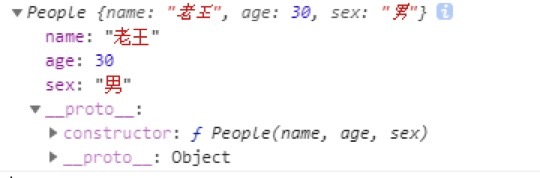
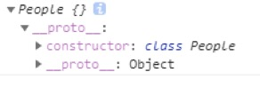
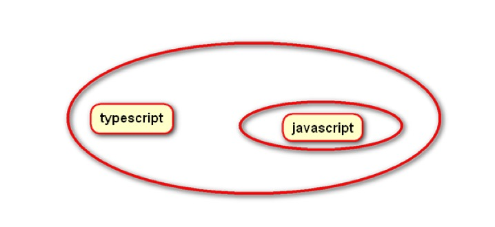

# 一、类  
在ES6中实现了类  
语法：  
&emsp;class 类名 {}  

在之前定义类的方式：  
```  
function People(name, age, sex) {  
	this.name = name;  
	this.age = age;  
	this.sex = sex;  
}  

// 实例化对象  
let p = new People('老王', 30, '男');  
console.log(p);  
```  

结果：  
  

ES6中定义类的方式：  
```  
// ES6中定义类的方式  
class People {  

}  

let p = new People();  
console.log(p);  
```  
结果：  
  

在类体中可以定义三类数据：  
&emsp;第一种自身属性数据：  
&emsp;&emsp;可以通过constructor构造函数定义自身属性或者是方法  
&emsp;这类数据会被每一个实例化对象所访问  

```  
// ES6中定义类的方式  
class People {  
	// 通过constructor构造函数定义自身数据  
	constructor(name, age, sex) {  
		this.name = name;  
		this.age = age;  
		this.sex = sex;  
		// 添加方法  
		this.sayHello = function() {  
			return 'hello'  
		}  
	}  
}  

let p = new People('王老五', 30, '男');  
let p1 = new People('王老六', 30, '男');  
console.log(p);  
console.log(p1);  
```  

第二种原型数据：  
&emsp;我们直接在类体中定义原型方法即可  
&emsp;但是，如果要定义原型属性数据，则必须要使用get、set设置特性的方式来定义  
&emsp;&emsp;get 取值器  
&emsp;&emsp;set 赋值器  
&emsp;由于对数据设置了特性，在查看对象的时候，这些数据将直接展示出来  
```  
// ES6中定义类的方式  
class People {  
	// 通过constructor构造函数定义自身数据  
	constructor(name, age, sex) {  
		this.name = name;  
		this.age = age;  
		this.sex = sex;  
	}  

	// 定义原型方法  
	getName() {  
		// console.log(this, arguments);  
		return this.name;  
	}  

	// 定义原型方法  
	getAge() {  
		return this.age;  
	}  


	// 定义静态属性  
	get color() {  
		return this._color;  
	}  

	set color(value) {  
		this._color = value;  
	}  
}  

// 实例化对象  
let p = new People('王老五', 30, '男');  
let p1 = new People('王老六', 30, '男');  
```  

第三种数据：静态数据  （通过类直接访问，而实例化对象是不能访问的）  
定义静态数据的方式有两种：  
&emsp;1 直接在类体中，在数据的前面加上static关键字即可  
&emsp;2 在类体的外部，直接为类添加数据  
&emsp;区别：  
&emsp;&emsp;在类体中添加的静态数据 	 设置了特性  
&emsp;&emsp;在类体外部添加的静态数据 没有设置特性  

```  
// ES6中定义类的方式  
class People {  
	// 通过constructor构造函数定义自身数据  
	constructor(name, age, sex) {  
		this.name = name;  
		this.age = age;  
		this.sex = sex;  
	}  

	// 定义原型方法  
	getName() {  
		// console.log(this, arguments);  
		return this.name;  
	}  

	// 定义原型方法  
	static getAge() {  
		return this.age;  
	}  


	// 定义静态属性  
	static get color() {  
		return this._color;  
	}  

	static set color(value) {  
		this._color = value;  
	}  
}  

// 在类体的外部添加静态数据  
People.title = 'nihao';  
People.sayHello = function() {  
	console.log('hello');  
}  

// 实例化对象  
let p = new People('王老五', 30, '男');  
console.log(p);  
```  


# 二、继承  
在ES6中实现了继承  
语法：  
&emsp;class child extends father {}  
&emsp;当继承了父类之后将得到父类中的所有内容  
&emsp;我们可以重写继承过来的属性和方法，此时，子类将会优先使用重写的属性和方法  
&emsp;如果要重写构造函数，必须在构造函数中使用super关键字实现继承  
&emsp;&emsp;并且还要传递必要的参数  
&emsp;&emsp;在函数中定义的其它属性，一定要在super关键字之后定义  

```  
// 定义父类  
class People {  
	// 定义自身数据  
	constructor(name, age, sex) {  
		this.name = name;  
		this.age = age;  
		this.sex = sex;  
	}  

	// 原型方法  
	getName() {  
		return this.name;  
	}  

	// 原型属性数据  
	get color() {  
		return this._color;  
	}  

	set color(val) {  
		this._color = val;  
	}  

	// 静态数据  
	static getAge() {  
		return this.age;  
	}  
}  

// 继承  
class Students extends People {  
	// 重写数据  
	constructor(name, age, sex, grade) {  
		// 通过super关键字 实现继承  
		super(name, age, sex);  
		// 子类特有的数据要定义在super之下  
		this.grade = grade;  
	}  

	// 重写方法  
	getName() {  
		return this.name.toUpperCase()  
	}  

}  
```  

# 三、ES Module  
ES Module已经纳入ES2016(ES7)规范中  
引入模块通过import的方法  
暴露接口是通过export  
引入模块的方式有三种：  
&emsp;1 import * as 模块 from 模块路径  
&emsp;&emsp;实现将所有的接口共同引入  
&emsp;2 import { data } from 模块路径  
&emsp;&emsp;实现从模块中解构出某几个接口  
&emsp;3 import 模块 from 模块路径  
&emsp;&emsp;实现引入默认的接口  
暴露接口：  
&emsp;1 通过export向外暴露  
&emsp;2 通过export default 暴露默认接口  
高级写法：  
&emsp;可以通过逗号，实现同时引入默认接口以及解构出来的接口  
引入css文件有两种方式（要借助加载机的帮助 style-loader css-loader）：  
&emsp;1 可以当做模块文件来引入  
&emsp;2 可以直接引入样式文件 （常用）  

```  
引入全部接口  
import * as Demo from './common.es';  

解构出某几个接口  
import { num, color, obj } from './common.es';  

引入默认接口  
import Demo from './common.es';  

高级写法  
import Demo, { num, color } from './common.es';  

// 引入样式文件  
// 作为模块来引入  
// import Demo from './demo.css';  
// 直接引入样式文件  
import './demo.css';  
```  


# 四、Typescript  
typescript简称ts，是js语法的超集，很多js新的语法就借鉴了ts语法。ts是由微软团队维护的  
## 4.1 TS简介  
https://github.com/Microsoft/typescript  
在过去，js的出现是为了解决页面中的一些简单交互，因此js被设计非常简单，被很多开发者接受  
js特点  
&emsp;弱类型：定义变量没有具体的类型，可以存储任何类型的数据  
&emsp;动态的：变量存储的数据需要开辟多少内存空间，不是在定义时候说的算，而是运行时候动态开辟的  
&emsp;...  
由于js是弱类型的，因此变量存储的是什么样式的数据，需要多少的内存空间，我们在定义的时候无法获知，只能在js运行的时候，动态的分配，所以js运行的时候，一边处理业务逻辑，一边分配内存空间，对于小型项目来说，运行时临时分配空间的性能消耗是可以接受的，在大型项目中，这种消耗是无法接受的。所以在一些强类型语言中，为变量在定义的时候指明类型，这样运行前就可以针对变量的类型分配内存空间，这样在程序运行的时候就不需要分配空间了，可以减少不必要的资源消耗，所以ts是一个强类型语言  
在大型项目中，为了提高代码可维护性，我们通常采用面向对象编程方式，但是在面向对象编程中，我们势必要使用类，继承，接口，私有属性，共有属性等等，但是这些关键字，诸如：class，extends， implement， interface， private， public等等js都不支持，但是js为了实现这些功能，自身模拟了这些功能，但是为了模拟这些功能势必会产生一些不必要的开销，在大型项目中，这些开销是无法接受的。所以TS基于面向对象编程方式，实现了这些关键字。  
... ts语法着眼于未来与大型项目。  
遗憾的是，这些功能并没有一个浏览器实现，也没有一个浏览器宣称要实现（并且IE浏览器都没有实现），所以我们就要将其编译成js语言（ES3.1版本或者是ES5版本）。  
  

官网  
&emsp;http://www.typescriptlang.org/  
中文网站  
&emsp;https://www.tslang.cn/  

## 4.2编译ts  
浏览器不支持ts，所以要编译  
&emsp;ts文件的拓展名是.ts  
&emsp;我们定义ts加载机，要匹配.ts拓展名  
&emsp;加载机 ts-loader typescript  
注意：编译ts必须创建tsconfig.json配置文件  

## 4.3 数据类型  
在ts中所有的数据都要指明类型  
在js中的数据类型，ts中都支持  
并且还拓展了: any(任意类型)、void、never这些类型  

### 4.3.1 类型猜测  
如果定义的数据没有指定类型，此时程序运行的时候根据赋值的数据进行类型猜测  
但是，不要让ts去猜测类型：  
&emsp;1 程序执行的时候，会对数据进行猜测，会临时分配内存空间，造成消耗性能  
&emsp;2 类型猜测往往不是我们要的结果  
```  
// 类型猜测  
let data;  
data = 'abc';  
```  

### 4.3.2 类型推断  
当我们比程序更了解数据的时候，我们就可以指定数据类型  
&emsp;此时，程序在运行的时候就会按照我们指定的类型执行  
语法：  
&emsp;1 <type>数据  
&emsp;2 数据 as 类型  

```  
let data;  
data = 'abc';  
// 类型推断  
console.log(<string>data.length);  
console.log((data as string).length);  
```  

### 4.3.3 数组  
在ts中定义数组也要指定类型  
语法：  
&emsp;let arr:type[] = []  
此时：  
&emsp;我们传递数组中的数据，必须和初始化定义的数据类型是一致的  
&emsp;如果类型不确定，我们可以将type改变any  

```  
// 定义数组  
let arr:number[] = [1, 2, 3, 4];  
let arr1:string[] = ['a', 'b', 'c'];  
console.log(arr1);  
```  

### 4.3.4 元组  
定义元素的方式与定义数组很相像  
只不过在定义的时候，要指定类型以及指定个数  
语法：  
&emsp;let arr:[type1, type2] = [];  
此时：  
&emsp;1 传递数据的时候，必须和初始化的类型是一致的  
&emsp;2 传递数据的时候，必须和初始化的数据个数一致  
&emsp;3 在后面添加数组中成员的时候，必须在指定的类型范围之内  

```  
// 元素  
let arr:[number, string] = [1, 'abc'];  
let arr:[number, string] = ['abc', 1];  
```  


# 下午复习：  
&emsp;类： ES6中实现了类  
&emsp;语法：  
&emsp;&emsp;class 类名 {}  
&emsp;在类中可以定义三种数据类型：  
&emsp;&emsp;1 自身数据 通过constructor构造函数来定义  
&emsp;&emsp;2 原型数据  
&emsp;&emsp;&emsp;直接在类体中定义方法即可  原型属性数据 要通过设置特性的方式  
&emsp;&emsp;3 静态数据    
&emsp;&emsp;&emsp;在类体中，在数据的前面使用static关键字即可  在类的外部直接添加  
&emsp;继承：  
&emsp;&emsp;class child extends father {}  
&emsp;&emsp;将会得到父类中所有的数据  
&emsp;&emsp;我们还可以重写继承过来的属性和方法，此时子类将优先使用重写的数据  
&emsp;&emsp;我们还可以通过constructor重写构造函数，但是必须传递super关键字实现继承  

&emsp;Es Module：已经纳入es7中  
&emsp;引入模块的方式：  
&emsp;&emsp;1 import * as 模块 from 模块文件  
&emsp;&emsp;2 import { data } from 模块文件  
&emsp;&emsp;3 import Data from 模块文件  
&emsp;暴露接口：  
&emsp;&emsp;1 export 暴露接口  
&emsp;&emsp;2 export default 暴露默认接口  
&emsp;引入css样式文件：  
&emsp;&emsp;直接引入样式文件  
&emsp;&emsp;&emsp;通过import 样式文件  
&emsp;TS: ts是js的超集  
&emsp;数据类型： 在ts中为所有的数据指定类型  
&emsp;类型猜测： 如果定义的数据没有指明类型，此时将会进行类型猜测  
&emsp;类型推断： 语法 1 <type>数据  2 数据 as 类型  
&emsp;数组：	   let arr:type[] = []  
&emsp;元组：	   let arr:[type1, type2] = []  

### 4.3.5 类型级联  
如果定义的数据没有指明类型，我们可以将数据的类型改为any  
但是，any类型表示的数据范围太大了，为了缩小数据类型的范围，要使用类型级联技术  
语法：  
&emsp;type1 | type2 | type3  
&emsp;&emsp;此时，定义的数据类型 只能在该范围之内  
```  
// 使用类型级联  
let data:number | string | boolean = true;  
```  

### 4.3.6 枚举类型  
枚举类型是基于对象和数组之间的数据类型  
语法：  
&emsp;enum 枚举类型 {}  
特点：  
&emsp;既可以像数组那样，通过索引值获取属性名  
&emsp;又可以像对象那样，通过点语法获取索引值  
注意：  
&emsp;1 枚举类型数据的首字母要大写  
&emsp;2 每一个成员之间用逗号分隔  
&emsp;3 我们可以为某个成员改变索引值  
&emsp;&emsp;此时，后面的成员索引值要递增，前面的不变  

```  
// 枚举类型  
enum Color {  
	red,  
	green = 10,  
	blue  
}  

// 既可以像数组那样，通过索引值获取属性名  
console.log(Color[0]);  
// console.log(Color[1]);  
// console.log(Color[2]);  
console.log(Color[10]);  
console.log(Color[11]);  

// 既可以像对象那样，通过点语法获取索引值  
console.log(Color.red);  
console.log(Color.green);  
console.log(Color.blue);  
```  


## 4.4 函数  
在js中定义函数的方式有： 1 构造函数式  2 函数定义式  3 函数表达式 4 箭头函数  
只有函数定义式，不需要定义var或者是变量来接收  
在ts中要为每一个函数指明类型  
语法：  
&emsp;function demo(arg:type, arg1?:type):type {}  
传递参数：  
&emsp;1 传递的数据类型要一致  
&emsp;2 传递的数据个数要一致  
注意：  
&emsp;1 函数中参数以及返回值要定义类型  
&emsp;2 如果参数可有可无，后面加上问号即可  

函数的返回值通常有三类结果：  
&emsp;1 返回数据，此时函数的返回值类型就是数据类型  
&emsp;2 没有返回数据，函数的类型是void  
&emsp;3 如果函数中出现了错误，此时函数的类型是never  

```  
// 定义函数  
function demo(num1:number, num2?:number):number {  
// function demo(num1:number, num2:number):number {  
	// 如果传递了num2返回 num1 + num2结果  
	if (num2 != undefined) {  
		return num1 + num2;  
	} else {  
		// 如果没有传递num1 则返回 num1 + 10的结果  
		return num1 + 10;  
	}  
}  

// 执行demo  
// 传递1个参数  
console.log(demo(1));  
// 传递2个参数  
// console.log(demo(1, 2));  
```  

函数的返回结果：  
```  
// 没有返回值  
function demo():void {  
	console.log('demo');  
}  

// 执行demo  
// console.log(demo());  

// 函数中出现了错误  
function demo():never {  
	// 抛出错误  
	throw new Error('出错了');  
}  

demo();  
```  

## 4.5 泛型  
如果参数是任意类型，那么函数的返回值可能任意的结果，我们可以将参数的类型定义为any即可  
如果我们希望函数的参数以及返回值的类型是一致，此时any将不再适用，要使用泛型技术  
语法：  
&emsp;funciton demo<T>(arg: T):T {}  
&emsp;&emsp;此时，返回值就是一致的，都是T变量表示的类型  

```  
// 使用泛型  
function demo<T>(data:T):T {  
	return  data;  
}  

console.log(demo(10), typeof demo(10));  
console.log(demo('ickt'), typeof demo('ickt'));  
```  

## 4.6 类  
语法：  
&emsp;class ClassName {}  
### 4.6.1 构造函数  
在ts中也是通过constructor定义构造函数  
只不过在构造函数数中的参数要定义类型，返回值不需要定义类型  
在构造函数中可以定义数据  

### 4.6.2 属性  
在ts中，属性要在类体中声明出来  
声明的属性要设置数据类型  
如果没有设置数据类型，将会做类型猜测  
声明的属性还可以赋值  
&emsp;我们在构造函数体中可以为声明的属性赋值  
&emsp;如果没有声明的属性，在构造函数体中不能使用  
没有声明的属性，在编译的时候，将会直接移除  

### 4.6.3 方法  
与ES6中定义方法的方式是一致的  
只不过方法的参数以及返回值要定义类型  
如果没有设置数据类型，会进行类型猜测  

### 4.6.4 关键字  
在ts中支持private、protected、public、static这些关键字  
在js中private、protected、public是不支持的，或者说实现起来成本太高了，因此在编译的时候就直接移除了，但是static关键字在js中实现了，用来定义静态数据的  
在ES6中定义静态数据的方式，可以在类体中定义，还可以在类的外部定义，但是在ts中只能在类体中通过static定义静态数据，在类体的外部只能用于修改  

### 4.6.5 实例化对象  
在实例化对象的时候要定义变量，要为变量设置类型  
&emsp;变量的类型就是类  
&emsp;传递的数据类型和数据的个数都要一致  

```  
// 定义类  
class People {  
	// 声明属性  
	private name:string;  
	protected age:number;  
	// 类型猜测  
	public sex;  
	num:number = 100;  
	static color:string = 'red';  
	// 声明title属性 避免保存  
	static title;  
	// 定义构造函数  
	constructor(name:string, age:number, sex?:string) {  
		this.name = name;  
		this.age = age;  
		this.sex = sex;  
		// 没有声明的数据不能使用  
		// this.aaa = 123;  
	}  

	// 定义方法  
	private getName():string {  
		// console.log(111, this);  
		return this.name;  
	}  

	protected getAge():number {  
		return this.age;  
	}  

	// 类型猜测  
	public getSex() {  
		return this.sex;  
	}  

	// 静态方法  
	static getColor() {  
		return this.color;  
	}  
}  

// 在类体外部定义静态数据  
People.title = 'nihao';  

// 实例化对象  
let p:People = new People('wanglaowu', 30, '男');  
```  

## 4.7 继承  
语法： class child extends father {}  
继承之后将会得到父类中的所有内容  
我们还可以重写构造函数，还可以重写继承过来的属性以及方法，此时将会优先使用重写的数据  
&emsp;必须传递super关键字，还要传递必要的参数  
&emsp;子类中特有的属性要定义在super关键字之下  

```  
// 引入模块  
import { People } from './04';  
// console.log(People);  

// 继承  
class Student extends People {  
	// 声明数据  
	grade:number = 12;  
	// 重写构造函数  
	constructor(name:string, age:number, grade:number, sex?:string) {  
		// 使用super关键字 实现继承  
		super(name, age, sex);  
		// 子类中特有的数据要单独定义并且必须在super关键字之下  
		this.grade = grade;  
	}  
}  

// 实例化对象  
let s:Student = new Student('xiaoming', 12, 6, '男');  
```  


### 4.7.1 webpack拓展  
在ts中引入文件的时候不允许带有文件的后缀名称  
需要在webpack中传递resolve属性，处理一些功能  
&emsp;值是一个对象  
&emsp;&emsp;传递extension属性 值是一个数组  
&emsp;&emsp;&emsp;数组中可以定义每个文件的拓展名  
在引入文件的时候，会默认去匹配这些文件  

```  
// 处理功能  
resolve: {  
	extensions: ['.js', '.ts'],  
},  
```  

## 4.8 模块  
在ts中允许在模块内部定义模块  
语法：  
&emsp;module 模块名称 {}  
暴露接口通过export  

```  
// 定义模块  
module Ickt {  
	export let num:number = 100;  
	export let color:string = 'red';  
	export let add = function(num1:number, num2:number):number {  
		return num1 + num2;  
	}  
}  
```  

## 4.9 接口  
接口在ts中指的是一种数据结构，通过interface定义接口  
语法：  
&emsp;interface 接口名称 {  
&emsp;&emsp;只定义结构 不要去实现  
&emsp;}  

### 4.9.1函数接口  
当我们使用函数表达式的时候，出现了变量，为了说明变量的结构，要为其定义数据类型  
在函数中，函数的参数以及返回值属于结构，所以要为其定义数据类型  
语法：  
&emsp;interface 函数接口 {  
&emsp;&emsp;(arg:type, arg1?:tupe):type  
&emsp;}  
&emsp;参数可有可无 后面加上?  

```  
// 定义函数接口  
interface Add {  
	(num1:number, num2?:number):number;  
}  

// 使用  
let add:Add = function(num1:number, num2?:number):number {  
	return num1 + num2;  
}  
```  

### 4.9.2 对象接口  
在对象中，定义的属性或者方法的参数以及返回值都属于结构，要定义类型  
语法：  
&emsp;interface 接口名称 {  
&emsp;&emsp;key:type,  
&emsp;&emsp;key?：type,  
&emsp;&emsp;(arg:type, arg1?:type):type  
&emsp;}  
&emsp;如果属性可有可无在后面添加问号  
&emsp;如果方法中参数可有可无后面加上问号  

```  
// 定义对象接口  
interface Star {  
	name:string,  
	grilFriend:string,  
	getName():string  
}  

// 使用接口  
let s:Star = {  
	name: '尼古拉斯赵四',  
	grilFriend: '谢大脚',  
	getName() {  
		return this.name;  
	}  
}  
```  

### 4.9.3 类接口  
定义类接口与定义对象接口是一样的  
在类中，定义方法中的参数以及返回值都属于结构，所以要定义类型  
语法：  
&emsp;interface 接口名称 {  
&emsp;&emsp;key:type,  
&emsp;&emsp;key?：type,  
&emsp;&emsp;(arg:type, arg1?:type):type  
&emsp;}  
&emsp;如果属性可有可无在后面添加问号  
&emsp;如果方法中参数可有可无后面加上问号  

注意：  
&emsp;实现类的时候，要通过implements关键字实现  
实例化对象的时候要出现变量，变量的类型：  
&emsp;1 变量的类型就是类的类型  
&emsp;&emsp;此时可以使用类中所有的数据  
&emsp;2 变量的类型是接口的类型  
&emsp;&emsp;此时可以只能使用接口中的数据  

```  
// 类接口  
class Demo implements Star {  
	name = '刘能';  
	girlFriend = '范冰冰';  
	getName() {  
		return this.name;  
	}  
	getGirlFriend() {  
		return '范冰冰';  
	}  
}  

// 实例化对象  
// let d:Star = new Demo();  
let d:Demo = new Demo();  
console.log(d.getGirlFriend());  
```  
