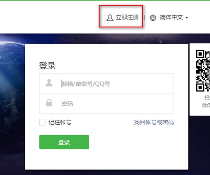
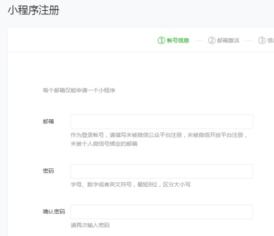
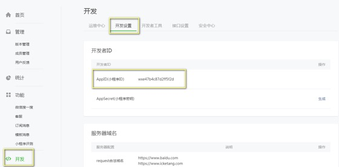
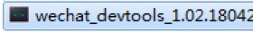
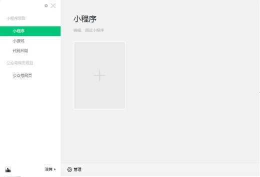
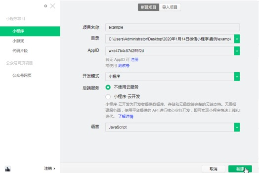
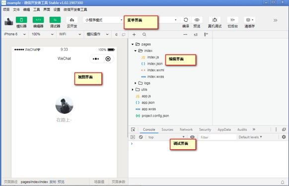
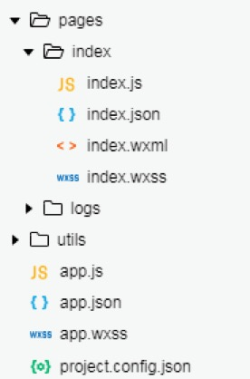
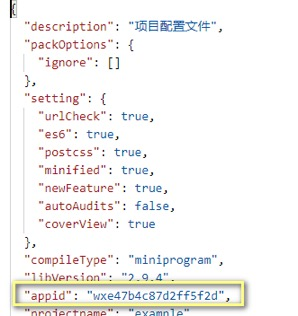
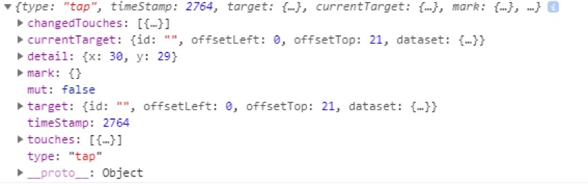

# 一、微信小程序  
## 1.1小程序简介  
微信小程序是嵌入在微信中的一种程序，只有2m的空间，因此称之为小程序，是轻量级的  
小程序也属于混合开发  
&emsp;一处开发，可以在多端使用的开发技术  

### 1.1.1注册账号  
进入https://mp.weixin.qq.com/，点击立即注册按钮，选择小程序  

  

输入相关信息， 在信息登记中，选择个人账户，输入身份信息  

  

注册完成，进入设置页面，选择开发设置，获取appid  

例如：  
  


开发文档  
&emsp;https://developers.weixin.qq.com/miniprogram/dev/reference/  

### 1.1.2安装开发工具  

  
下载地址  
&emsp;https://developers.weixin.qq.com/miniprogram/dev/devtools/devtools.html  
点击安装程序，一直点击下一步安装，安装完成进入首页  
  
  
  


## 1.2 目录部署  
pages:              用于配置页面的  
&emsp;index               是首页 每一个文件里面都有四个文件  
&emsp;&emsp;index.js            脚本文件  
&emsp;&emsp;index.json          配置文件  
&emsp;&emsp;index.wxml          模板文件  
&emsp;&emsp;index.wxss          样式文件  
&emsp;logs                      日志页面  
utils               工具插件  
app.js   			应用程序脚本文件  
app.json			应用程序配置文件  
app.wxss			全局样式配置文件  
project.config.json 全局项目配置文件  

  


### 1.2.1 应用配置  
app.json 是全局的应用配置文件  
在该文件下要严格遵守json语法(逗号，单引号，双引号都需要注意)  
&emsp;pages  用于配置页面 值是一个数组  
&emsp;&emsp;数组中的每一项都是一个页面 数组中的第一项表示首页  
&emsp;"window"： 用于配置窗口的  
&emsp;&emsp;"backgroundTextStyle": 				字体样式  
&emsp;&emsp;"navigationBarBackgroundColor":  	背景颜色  
&emsp;&emsp;"navigationBarTitleText": 			提示文字  
&emsp;&emsp;"navigationBarTextStyle": 			导航栏文字样式  
&emsp;"tabBar": 	用于配置页面下方的icon  
&emsp;&emsp;list： 用于配置icon  值是一个数组 数组中的每一项都是一个对象 通常 2-5  
&emsp;&emsp;"pagePath":  			对应的是一个页面  
&emsp;&emsp;"text":  				文字  
&emsp;&emsp;"iconPath":  			图标的路径  
&emsp;&emsp;"selectedIconPath":   选中时候图标的路径  
&emsp;"networkTimeout":     配置网络请求时间  
&emsp;&emsp;"request": 			请求时间  
&emsp;&emsp;"connectSocket": 		socket时间,  
&emsp;&emsp;"uploadFile":    		上传时间  
&emsp;&emsp;"downloadFile": 		下载时间  
### 1.2.2 项目配置  
&emsp;project.config.json 全局项目配置文件  
&emsp;在内部提供了大量信息：  
&emsp;&emsp;例如： appid就在其中  
&emsp;&emsp;类似于npm 中的package.json  
&emsp;  

## 1.3 应用程序  
app.wxss    是全局样式配置文件  
app.js      是应用程序脚本文件  
&emsp;在应用程序中提供了一套周期方法  
&emsp;&emsp;onLaunch:   初始化的时候执行的方法  
&emsp;&emsp;onShow:     进入前台时候执行的方法  
&emsp;&emsp;onHide:     进入后台时候执行的方法  
&emsp;&emsp;onError:    出错时候执行的方法  

### 1.3.1 内置方法  
wx.login: 登录成功之后执行的方法  
&emsp;参数是一个对象， 对象中有一个success方法  
wx.getSetting： 获取授权的方法  
&emsp;参数是一个对象， 对象中有一个success方法  
wx.getUserInfo: 获取用户信息  
&emsp;参数是一个对象， 对象中有一个success方法  

### 1.3.2 全局方法  
APP:  				创建应用程序的方法  
getAPP:				获取应用程序的方法  
Page:  				创建页面的方法  
getCurrentPages:	获取当前页面的方法  

### 1.3.3 页面周期方法  
onLoad：				页面加载方法  
onReady： 			页面渲染方法  
onShow：				监听页面显示的方法  
onHide：             页面隐藏方法  
onUnload：			页面卸载方法  
onPullDownRefresh：	监听用户下拉动作  
onReachBottom：		监听页面触底方法  
onShareAppMessage：	监听分享方法  
```  
Page({  

  /**  
   * 页面的初始数据  
   */  
  data: {  

  },  

  /**  
   * 生命周期函数--监听页面加载  
   */  
  onLoad: function (options) {  

  },  

  /**  
   * 生命周期函数--监听页面初次渲染完成  
   */  
  onReady: function () {  

  },  

  /**  
   * 生命周期函数--监听页面显示  
   */  
  onShow: function () {  

  },  

  /**  
   * 生命周期函数--监听页面隐藏  
   */  
  onHide: function () {  

  },  

  /**  
   * 生命周期函数--监听页面卸载  
   */  
  onUnload: function () {  

  },  

  /**  
   * 页面相关事件处理函数--监听用户下拉动作  
   */  
  onPullDownRefresh: function () {  

  },  

  /**  
   * 页面上拉触底事件的处理函数  
   */  
  onReachBottom: function () {  

  },  

  /**  
   * 用户点击右上角分享  
   */  
  onShareAppMessage: function () {  

  }  
})  
```  

## 1.4  页面渲染  
### 1.4.1 数据渲染原理  
在小程序中，视图与脚本是在不同的线程中执行的  
&emsp;视图： 通过WebView渲染  
&emsp;脚本： 通过另一个线程执行的  

### 1.4.2 数据驱动  
小程序中实现了数据驱动，定义什么数据就渲染什么数据  
使用方式：  
&emsp;1 在脚本文件中通过data属性定义数据  
&emsp;2 在页面中通过插值语法渲染数据  
### 1.4.3 插值语法  
语法： {{数据}}  
小程序提供的插值语法是一个伪js环境，内部只能使用一些简单的操作  
例如：加减乘除、对象的点语法、数组中括号语法都支持，但是对于一些方法就不支持  

```  
<view>{{num}}</view>  
<view>{{title}}</view>  
<!-- 对象点语法 -->  
<view>{{obj.color}}</view>  
<!-- 加减乘除 -->  
<view>{{num + 10}}</view>  
<!-- 不支持方法 -->  
<view>{{obj.name.toUpperCase() + 'hello'}}</view>  
```  

### 1.4.4 更新数据  
在脚本文件中提供了一个setData方法用于更新数据的，  
参数是一个对象  
&emsp;key： 是要更新的数据名称  
&emsp;&emsp;可以是直接属性，也可以间接属性  
&emsp;&emsp;例如：let obj = { a: { b: { c: 123 } } }  
&emsp;&emsp;a是obj的直接属性，而b、c都是obj的间接属性  
&emsp;&emsp;更新数据的时候：  
&emsp;&emsp;&emsp;更新a  key就是a  
&emsp;&emsp;&emsp;更新b  key就是obj.b  
&emsp;&emsp;&emsp;更新c  key就是obj.a.b.c  
&emsp;value: 表示新的数据值  
&emsp;工作中：尽量只更新需要更新的数据  


### 1.4.5 数据丢失  
脚本文件中的data属性用于定义数据的  
如果数据更新了，但是视图没有更新，此时我们就说数据丢失了  
所以，我们不要直接修改data中的数据，为了避免数据丢失，要通过setData方法去修改  
```  
this.setData({  
  // obj: {  
  //   color: 'blue'  
  // }  
  // 只更新需要更新的数据即可  
  // 'obj.color': 'blue'  
  num: 500  
})  
```  


## 1.5 wxml  
wxml是模仿html创建的一种文件格式  
&emsp;html是可以被浏览器识别的  
&emsp;但是wxml是小程序封装之后的，称为组件  
&emsp;所以，wxml中的组件是不适用于浏览器中使用的，例如web端的一些框架：jQuery框架就不适用去操作wxml中的组件  

### 1.5.1 属性  
html中可以为每一个元素添加属性  
wxml中也是可以为每一个组件添加属性，一共分为两种：  
&emsp;第一种 可以为所有组件添加的属性 ，称为共有属性  
&emsp;第二种 可以为指定的组件添加的属性，称为特有属性  
&emsp;&emsp;共有属性：  
&emsp;&emsp;&emsp;id:	 		添加id  
&emsp;&emsp;&emsp;class:		添加类名  
&emsp;&emsp;&emsp;style:		添加样式  
&emsp;&emsp;&emsp;hidden:		隐藏组件  
&emsp;&emsp;&emsp;data-name:	添加自定义数据  
&emsp;&emsp;&emsp;bind|catch：	添加事件  
```  
<view id="box">Hello World</view>  
<view class="box1">Hello World</view>  
<view style="color: orange; font-size: 50px;">Hello World</view>  
<!-- 隐藏组件 -->  
<view hidden="{{isShow}}">你好，明天</view>  
```  

### 1.5.2 事件  
在wxml中可以为每一个组件添加事件，一共分为两种：  
&emsp;第一种 为每一个组件添加的事件，称为共有事件  
&emsp;&emsp;共有事件：touchstart、touchmove、touchend、touchcancel、tap、longTap(350ms)  
&emsp;第二种 为了特定的组件添加的事件，称为特有事件  
按照冒泡和非冒泡事件，又分为两种：  
&emsp;冒泡：事件执行的时候，从子组件传递到父组件的过程  
&emsp;第一种冒泡事件：  
&emsp;&emsp;touchstart：			触摸开始  
&emsp;&emsp;touchmove：			触摸中  
&emsp;&emsp;touchend：   		触摸结束  
&emsp;&emsp;touchcancel：			手指触摸动作被打断，如来电提醒，弹窗  
&emsp;&emsp;tap：				轻拍  
&emsp;&emsp;longpress：			替代了longTap事件  
&emsp;&emsp;transitionend：		过度结束事件  
&emsp;&emsp;animationstart: 	 	动画开始  
&emsp;&emsp;animationend: 		动画结束  
&emsp;&emsp;animationiteration： 迭代一次之后触发  
&emsp;&emsp;touchforcechange：	强制touch  
&emsp;除了以上事件都是非冒泡事件  
&emsp;我们可以通过bind或者是catch为组件绑定事件  
&emsp;&emsp;bind绑定的事件	会冒泡  
&emsp;&emsp;catch绑定的事件	不会冒泡  
&emsp;在wxml中设置的事件，要在脚本文件中定义出来  

```  
<!-- 事件 -->  
<!-- bind  冒泡 -->  
<!-- <view data-root="root" bindtap="root">  
  root  
  <view data-parent="parent" bindtap="parent">  
    parent  
    <view data-child="child" bindtap="child">child</view>  
  </view>  
</view> -->  


<!-- catch  不会冒泡 -->  
<view data-root="root" catchtap="root">  
  root  
  <view data-parent="parent" catchtap="parent">  
    parent  
    <view data-child="child" catchtap="child">child</view>  
  </view>  
</view>  
```  

#### 1.5.2.1 事件对象  
changedTouches:	手指离开时候的相关信息  
currentTarget:  绑定事件的元素  
detail:			手指的信息  
target:			目标元素  
&emsp;dataset属性用于获取自定义数据  
touches:        手指信息  
  

## 1.6 组件  
### 1.6.1 view组件  
view组件是视图组件  
类似于html中的div元素，是容器元素，会独占一行  
在view组件中有几组特定的属性：  
&emsp;hover-class: 				添加类的  
&emsp;hover-start-time:   		延迟类的添加时间  
&emsp;hover-stay-time:			类停留的时间  
&emsp;hover-stop-propagation: 		阻止冒泡  
```  
<view data-root="root" bindtap="root">  
  root  
  <view data-parent="parent" bindtap="parent" hover-class="demo" hover-start-time="2000" hover-stay-time="2000">  
&emsp;parent  
&emsp;<view data-child="child" bindtap="child" hover-stop-propagation="true">child1111</view>  
  </view>  
</view>  
```  

### 1.6.2 text  
text是文本组件，不会独占一行  
 	通过space设置空格模块 如果没有设置该属性 则默认是空白折叠  
&emsp;ensp:       中文字符空格一半的大小  
&emsp;emsp:       中文字符空格大小  
&emsp;nbsp:	 	根据字体设置空白大小  
&emsp;selectable: 选中文本  
&emsp;decode:	  	转码  

```  
<view>  
  <text>爱创课堂</text>  
</view>  
<view>  
  <text space="emsp">  爱创课堂</text>  
</view>  
<view>  
  <text space="ensp">   爱创课堂</text>  
</view>  
<view>  
  <text space="nbsp" selectable>   爱创课堂</text>  
</view>  
<view>  
  <text space="nbsp" decode>  &gt; &lt; 爱创课堂</text>  
</view>  
```  

### 1.6.3 rich-text  
rich-text是text组件的拓展  
用于定义富文本组件，渲染html的（受到限制）  
通过nodes定义渲染的内容，有三种方式：  
&emsp;第一种 渲染html标签  
&emsp;第二种 渲染node节点  
&emsp;&emsp;值是一个数组，数组中的每一项是一个对象  
&emsp;&emsp;&emsp;name:	    节点名称  
&emsp;&emsp;&emsp;attrs:		设置属性  
&emsp;&emsp;&emsp;children:	设置子节点的 值是一个数组，数组中的每一项是对象  
&emsp;&emsp;&emsp;&emsp;text:		定义内容的  
&emsp;&emsp;&emsp;&emsp;type:		定义类型  
&emsp;第三种  渲染字符实体  

```  
<rich-text nodes="{{html}}"></rich-text>  
<rich-text nodes="{{node}}"></rich-text>  
<rich-text nodes="{{str}}"></rich-text>  
```  

```  
  data: {  
    html: '<div style="color: pink; font-size:30px;">Hello World</div>',  
    node: [  
      {  
        name: 'div',  
        attrs: {  
          id: 'box',  
          style: 'color: red'  
        },  
        children: [  
          {  
            type: 'text',  
            text: 'Hello World',  
          }  
        ]  
      }  
    ],  
    str: '&gt; &lt; &nbsp;'  
  },  
```  

### 1.6.4 image  
类似于html中的img标签  
通过src定位图片的资源  
&emsp;支持本地图片，也支持线上的图片（必须支持HTTPS）  
通过mode属性，定义裁剪、缩放模式：  
&emsp;left:       裁剪模式	显示图片的左边部分  
&emsp;right:      裁剪模式	显示图片的右边部分  
&emsp;top:        裁剪模式	显示图片的上边部分  
&emsp;bottom:	    裁剪模式	显示图片的底部部分  
&emsp;scaleToFill:缩放模式	拉伸图片  
&emsp;aspectFit:  缩放模式 	完整的显示图片  
&emsp;aspectFill: 缩放模式	在一个方向显示完整的图片 另一个方向会截取图片  
&emsp;widthFix:   缩放模式	保持原图宽高比不变  

```  
<image mode="scaleToFill" src="https://www.icketang.com/static/img/banner_news.jpg"></image>  
<image mode="aspectFit" src="https://www.icketang.com/static/img/banner_news.jpg"></image>  
<image mode="aspectFill" src="https://www.icketang.com/static/img/banner_news.jpg"></image>  
<image mode="widthFix" src="https://www.icketang.com/static/img/banner_news.jpg"></image>  
```  


### 1.6.4 icon  
用于定义图标的组件  
图片的资源可能很大，在小程序中提供了icon组件，用于代理图片引入  
&emsp;type 定义图标的类型  
&emsp;&emsp;success, success_no_circle, info, warn, waiting, cancel, download, search, clear  
&emsp;size：	定义图标的大小  
&emsp;color:	定义图标的颜色  
```  
<icon type="success" size="40" color="red"></icon>  
<icon type="info" size="40" color="blue"></icon>  
<icon type="warn" size="40" color="orange"></icon>  
<icon type="waiting" size="40" color="pink"></icon>  
```  

### 1.6.5 canvas  
在小程序中提供了canvas组件，用于定义画布  
&emsp;通过canvas-id定义canvas组件的名称  
&emsp;canvas组件的默认宽高是 300px  150px  
在js文件中我们通过wx.createCanvasContext来获取对应画布  
```  
<canvas style="width: 300px; height: 200px;" canvas-id="firstCanvas"></canvas>  
```  

```  
// 获取对应的画布  
let ctx = wx.createCameraContext('firstCanvas');  
var context = wx.createCanvasContext('firstCanvas')  

context.setStrokeStyle("#00ff00")  
context.setLineWidth(5)  
context.rect(0, 0, 200, 200)  
context.stroke()  
context.setStrokeStyle("#ff0000")  
context.setLineWidth(2)  
context.moveTo(160, 100)  
context.arc(100, 100, 60, 0, 2 * Math.PI, true)  
context.moveTo(140, 100)  
context.arc(100, 100, 40, 0, Math.PI, false)  
context.moveTo(85, 80)  
context.arc(80, 80, 5, 0, 2 * Math.PI, true)  
context.moveTo(125, 80)  
context.arc(120, 80, 5, 0, 2 * Math.PI, true)  
context.stroke()  
context.draw()  
```  

### 1.6.6 map  
map组件是用于定义地图的  
&emsp;longitude: 	设置经度  
&emsp;latitude:		设置纬度  
```  
<map latitude="39.90469" longitude="116.40717"></map>  
```  

### 1.6.7 媒体组件  
定义视频组件  
&emsp;通过src定义视频资源路径  
camera:	开启摄像头  
&emsp;device-postioin:	开启摄像头朝向  
live-player:	直播组件  
live-pusher： 推送组件  
```  
<video src="https://www.icketang.com/static/video/shipin2.mp4"></video>  
<!-- <camera style="width: 100%; height: 300px;"></camera> -->  
<!-- 直播组件 -->  
<live-player></live-player>  
<!-- 托送组件 -->  
<live-pusher></live-pusher>  
```  

## 1.7 指令  
指令：一种特殊的属性，为了实现某种功能  
&emsp;在小程序中使用的语法： wx：来使用  

### 1.7.1 条件指令  
指令名称：  
&emsp;wx:if=“statements”  
&emsp;&emsp;如果在条件中出现了变量，我们要使用插值语法  
&emsp;&emsp;是真正的创建与删除，不是控制元素的显隐  

```  
<view bindtap="toggle">切换显隐</view>  
<view wx:if="{{isShow}}">Hello World</view>  
```  

### 1.7.2 循环指令  
指令名称：  
&emsp;wx:for=”data”  
&emsp;data表示要遍历的数据：可以是数字可以是数组  
&emsp;但是在遍历的时候，一定要设置wx:key 保证数据的唯一性，通常我们可以设置id或者是this  
&emsp;在循环指令中:  
&emsp;&emsp;默认的成员变量名称       item  
&emsp;&emsp;默认的索引值变量名称      index  
&emsp;我们可以通过指令改变默认的成员以及索引值变量名称：  
&emsp;wx:for-item		要改变的成员名称  
&emsp;wx:for-index		要改变的索引值名称  

```  
<!-- 循环指令 -->  
<!-- 遍历数字 -->  
<view wx:for="{{num}}" wx:key="this">{{item}}---{{index}}</view> -->  
<!-- 遍历数组 -->  
<view wx:for="{{colors}}" wx:key="this">{{item}}---{{index}}</view>  
```  

### 1.7.3 block  
block用于定义模板组件  
&emsp;在该组件中可以添加样式、添加指令，但是就是不会渲染出来（可以作为模板使用）  

```  
<!-- 模板组件 -->  
<view wx:for="{{9}}" wx:key="this" wx:for-item="i">  
<block wx:for="{{9}}" wx:key="this" wx:for-item="j" wx:if="{{i >= j}}">|{{i + 1}} * {{j + 1}} = {{(i + 1) * (j + 1)}}|</block>  
</view>  
```  
