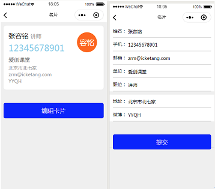

# 一、视图组件  
## 1.1 scroll-view  
用于定义可移动视图区域  
&emsp;scroll-x scroll-y 用于定义方向  
&emsp;scroll-into-view 定义初始化的滚动位置 值是某个子组件的id（id不能是以数字开头）  

```  
<!-- 定义滚动视图区域 -->  
<scroll-view class="demo" scroll-y scroll-into-view="a10">  
  <view wx:for="{{30}}" wx:key="this" id="a{{index}}">{{item}}</view>  
</scroll-view>  
```  

## 1.2 swiper  
是用于制作轮播图的  
子组件：  
&emsp;swiper-item  
&emsp;&emsp;indicator-dots:			开启小圆点  
&emsp;&emsp;indicator-color:		小圆点的颜色  
&emsp;&emsp;indicator-avtive-color:	选中时候小圆点的颜色  
&emsp;&emsp;autoplay：			自动播放  
&emsp;&emsp;interval：			定义间隔时间  
&emsp;&emsp;circular：			是否衔接  

```  
<!-- 制作轮播图 -->  
<swiper indicator-dots="true" indicator-color="red" indicator-active-color="blue" autoplay circular interval="1000">  
  <swiper-item>  
    <image src="https://www.baidu.com/img/bd_logo1.png"></image>  
  </swiper-item>  
  <swiper-item>  
    <image src="https://www.baidu.com/img/bd_logo1.png"></image>  
  </swiper-item>  
  <swiper-item>  
    <image src="https://www.baidu.com/img/bd_logo1.png"></image>  
  </swiper-item>  
  <swiper-item>  
    <image src="https://www.baidu.com/img/bd_logo1.png"></image>  
  </swiper-item>  
</swiper>  
```  

## 1.3 movable-area  
用于定义可移动的区域  
子组件：  
&emsp;movable-view  
&emsp;&emsp;direction:  定义移动的方向  
&emsp;&emsp;&emsp;all&emsp;&emsp; 任意方向  
&emsp;&emsp;&emsp;hrizontal   水平移动  
&emsp;&emsp;&emsp;vertical&emsp;垂直方向  
&emsp;&emsp;&emsp;none&emsp;&emsp;不移动  

```  
<movable-area class="parent">  
  <movable-view class="child" direction="all" inertia></movable-view>  
</movable-area>  
```  

## 1.4 cover-view  
覆盖在原生组件之上的文本视图  
可覆盖的原生组件包括 map、video、canvas、camera、live-player、live-pusher  
只支持嵌套 cover-view、cover-image  
```  
<map>  
  <cover-view>  
    <cover-image src="/images/logo.png"></cover-image>  
  </cover-view>  
</map>  
```  

## 1.5 引入文件  
在小程序中的脚本文件中使用的是commonjs规范  
引入文件通过require方法  
&emsp;引入文件的时候建议使用相对路径  
暴露接口：  
&emsp;exports  
&emsp;module.exports  

# 二、表单组件  
input   定义输入框的  
&emsp;placeholder:&emsp;定义显示的内容  
&emsp;password:   以密码的形式展示  
label   定义标题的  
&emsp;for 关联控件的  
form&emsp;定义表单组件  
&emsp;可以为form添加submit事件&emsp;
&emsp;具体的数据在事件对象中的detail.value中获取  
checkbox&emsp;定义多选框  
&emsp;每一组多选框必须放入checkbox-group中  
radio   定义单选框  
&emsp;每一组单选框必须放入radio-group中  
textarea&emsp;定义文本域  
button  定义按钮的  
&emsp;type&emsp;定义按钮的类型  
&emsp;&emsp;primary 绿色  
&emsp;&emsp;wran&emsp;红色  
&emsp;form-type   定义按钮提交的方式  
&emsp;&emsp;submit  提交  
&emsp;&emsp;reset   重置  

# 三、路由  
在小程序中切换页面的方式有两种：  
&emsp;第一种通过navigator组件实现页面的切换  
&emsp;&emsp;通过url属性定义要切换的页面  使用绝对路径  
&emsp;&emsp;通过open-type 定义打开页面的方式  
&emsp;&emsp;&emsp;navigate是默认值  
&emsp;第二种通过navigator方法实现页面的切换  

## 3.1 页面类型  
在小程序中的页面分为两种：  
&emsp;1 普通页面  
&emsp;&emsp;在pages中定义  
&emsp;2 tab页面  
&emsp;&emsp;在tabbar中定义的  
打开页面的方式是不同的，有四种方式：  
&emsp;1 open-type=”navigate”&emsp;  用于打开普通页面  
&emsp;2 open-type=”switchTab”&emsp; 用于打开tab页面  
&emsp;3 open-type=“navigateBack”  用于返回上一个页面  
&emsp;4 open-type=”redirect”&emsp;  用于重定向到一个页面  


## 3.2 堆栈  
小程序中也是通过堆栈管理页面  
navigate：  
&emsp;保证原有的堆栈不变，新页面进入堆栈中  
&emsp;&emsp;当前页面hide, 新页面show和load  
switchTab:  
&emsp;清空原有堆栈，新页面进入堆栈中  
&emsp;&emsp;当前页面hide, 新页面show和load  
navigateBack：  
&emsp;保证原有的堆栈不变，新页面从堆栈中弹出  
&emsp;&emsp;当前页面unload，新页面执行show  
redirect:  
&emsp;保证原有的堆栈不变，新页面从堆栈中弹出  
&emsp;&emsp;当前页面unload，新页面show和load  

```  
<!-- 默认值 -->  
<navigator url="/pages/form/form" open-type="navigate">跳转到form</navigator>  
<!-- 跳转tab页面 -->  
<navigator url="/pages/index/index" open-type="switchTab">跳转到index</navigator>  
```  

# 四、模板组件  
template 用于定义模板组件  
&emsp;name 定义模板组件的名称  
&emsp;is	  使用模板  
与block组件相比 template是可以复用的  

```  
<!-- 定义模板 -->  
<template name="header">  
  <view>Hello World</view>  
</template>  

<!-- 定义模板 -->  
<!-- <template name="footer">  
  <view>你好，世界</view>  
</template>  

<!-- 使用模板 -->  
<template is="header"></template>  
<template is="header"></template>  
<template is="header"></template>  
<template is="footer"></template>  
```  

## 4.1 引入文件  
在小程序的脚本文件中引入文件的方式是通过require方法  
而在小程序中的wxml文件中引入文件的方式通过两种组件：  
&emsp;1 import 组件  	引入文件  
&emsp;2 include组件 	引入文件  
&emsp;&emsp;通过src指定引入文件的路径 使用相对路径  
&emsp;区别：  
&emsp;&emsp;import  引入的是模板中的内容  
&emsp;&emsp;include	引入的元素内容  

```  
<!-- 引入文件 -->  
<!-- import引入 -->  
<!-- <import src="./common.wxml"></import> -->  
<!-- 使用模板 -->  
<!-- <template is="ickt"></template> -->  

<!-- 使用include组件 -->  
<include src="./common.wxml"></include>  
```  

# 五、wxss  
wxss中的样式是支持CSS3.0的规范，所以在wxss中同样适用CSS3中的特性  

## 5.1 rpx  
rpx是一个像素单位，是px单位的升级，可以实现响应式  
在小程序中分辨率是750px，因此1rpx 代表1份  
例如：  
&emsp;在iphone6中的分辨率是375px, 但是真实分辨率是750px  
&emsp;&emsp;在iphone6中 1rpx = 1px  
&emsp;&emsp;但是，在iphone6中的Dpr(设备像素比)是2,因此1px = 2rpx;  

```  
<view class="demo-px"></view>  
<view class="demo-rpx"></view>  
```  

## 5.2 flex  
flex布局也可以实现响应式  
但是，需要给容器添加display: flex;  
flex-direction: 布局方向  
&emsp;row:&emsp;&emsp;&emsp;从主轴的起点到终点渲染  
&emsp;row-reverse:&emsp;从主轴的终点到起点渲染  
&emsp;column:&emsp;&emsp; 从侧轴的起点到终点渲染  
&emsp;column-reverse: 从侧轴的终点到起点渲染  
justify-content: 决定成员在主轴上对齐方式  
&emsp;flex-statr:&emsp; 从主轴的起点到终点渲染  
&emsp;flex-end:&emsp;   从主轴的终点到起点渲染  
&emsp;center:&emsp;&emsp; 居中  
&emsp;space-around:	成员之间均分空白，两侧贴边  
&emsp;space-between:	成员之间均分空白，两侧空白减半  
&emsp;space-evenly:	成员之间均分空白  
align-items:&emsp;决定成员在侧轴上对齐方式  
&emsp;flex-statr:		从侧轴的起点到终点渲染  
&emsp;flex-end:		从侧轴的终点到起点渲染  
&emsp;center:			居中  
align-content:  设置多行  
&emsp;flex-start:		从侧轴的起点到终点渲染  
&emsp;flex-end:		从侧轴的终点到起点渲染  
&emsp;center:			居中  
&emsp;space-around:	成员之间均分空白，两侧成员空白减半  
&emsp;space-between:	成员之间均分空白, 两侧成员贴边  
&emsp;space-evenly:	成员之间均分空白  


# 六、open-data  
open-data是用于定义开放组件  开放用户的信息  
在当前我们可以通过wx.getUserInfo获取用户的信息  
但是，小程序中建议我们使用open-data组件  
&emsp;type:  获取用户的信息  
&emsp;语法：  
&emsp;&emsp;user + userInfo  
```  
<open-data type="userAvatarUrl"></open-data>  
<open-data type="userNickName"></open-data>  
```  

# 七、web-view  
小程序是在js、css、html基础之上衍生出的一个框架是通过webView来渲染页面  
所以，在小程序中提供了web-view组件用来引入一个html页面  
使用方式：  
&emsp;1 通过src定义引入的页面路径（必须支持https协议）  
&emsp;2 要在后台进行配置  
&emsp;&emsp;开发 -> 开发设置 -> 服务器域名  
&emsp;3 要关闭证书检验  

搭建https服务器：  
&emsp;http没有对请求的数据进行加密，可能在传递的过程中会被拦截或者注入广告，于是HTTPS就出现了，相比于http来更加安全  
&emsp;&emsp;http协议  默认端口号   80  
&emsp;&emsp;https协议	默认端口号   443  
```  
<!-- <web-view src="https://www.baidu.com/"></web-view> -->  
<!-- 引入自己搭建的https服务器 -->  
<web-view src="https://localhost/web/index.html"></web-view>  
```  


# 八、wxs组件  
wxs组件用于定义一个执行代码空间  
使用方式：  
&emsp;1 要创建一个.wxs后缀名称的文件  
&emsp;&emsp;在该文件中，不支持es6语法  
&emsp;2 在wxml页面中通过wxs组件引入wxs文件  
&emsp;&emsp;通过src属性进入文件  
&emsp;3 在wxs组件上通过module属性定义代码空间模块名称  
&emsp;4 使用插值语法调用wxs模块中暴露的功能（通过module属性值来调用）  

```  
<!-- 使用wxs组件 -->  
<wxs src="./demo.wxs" module="ickt"></wxs>  

<!-- 使用插值语法 -->  
<view>{{ickt.num}}</view>  
<view>{{ickt.getMax([2, 5, 8])}}</view>  
```  


作业：  
&emsp;如图：  
&emsp;  

&emsp;小程序实现名片功能  
&emsp;&emsp;首页展示名片，包含（姓名、手机、邮箱、单位、职位、地址、微博）信息 点击‘编辑卡片’按钮，跳转到卡片管理页面可以修改名片信息 点击‘提交’按钮提交修改  
