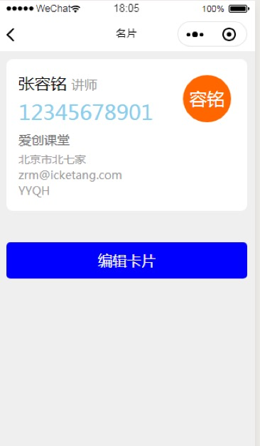

  

# 一、微信小程序  
## 1.1 路由  
在当前我们可以通过navigator组件实现页面的跳转  
在小程序中也提供了一套跳转页面的方法  
&emsp;navigateTo方法		用于跳转一个普通页面  
&emsp;&emsp;在跳转页面的时候，可以传递query数据，在跳转到的目标页面中的load事件中获取  
&emsp;switchTab方法		用于跳转一个tab页面  
&emsp;navigateBack方法		用于返回上一个页面  
&emsp;redirect方法			重定向方法  
&emsp;&emsp;它们的使用方式都是一样的  
&emsp;&emsp;&emsp;通过url定义跳转的页面  

```  
// 跳转页面  
wx.navigateTo({  
url: '/pages/index/index' + this.dealQuery(e.detail.value)  
})  
```  

## 1.2 同步和异步  
在小程序中为很多异步操作提供了两种使用方式：  
&emsp;异步方法的同步写法：  
&emsp;&emsp;标志：会在所有的方法后面添加一个Sync名称  
&emsp;&emsp;特点：可以顺序书写，将结果保存在变量中，供后文使用，是一个阻塞的方法  
&emsp;异步方法的异步写法：  
&emsp;&emsp;特点：将所有的逻辑放入回调函数中，是一个非阻塞的方法  
&emsp;例如：  
&emsp;&emsp;获取用户设置信息的方法  
&emsp;&emsp;&emsp;同步方法：  
&emsp;&emsp;&emsp;	getSystemInfoSync  
&emsp;&emsp;&emsp;&emsp;&emsp;为了保证防止错误出现让代码正常执行，要将语句放入到try catch中  
&emsp;&emsp;&emsp;异步方法：  
&emsp;&emsp;&emsp;&emsp;getSystemInfo  
&emsp;本地存储是一个异步操作的读取过程  

## 1.3 本地存储  
在小程序中使用的H5中本地存储技术  
特点：  
&emsp;1 本地存储空间是受到限制的，大约10M  
&emsp;2 不同用户之间的数据是不能共享  
&emsp;3 如果超出了该存储空间，小程序会删除最近未使用的内存  
设置数据：  
&emsp;同步写法：  
&emsp;&emsp;setStroageSync(key, value)  
&emsp;&emsp;&emsp;key:		数据名称  
&emsp;&emsp;&emsp;value:	数据  
&emsp;异步写法：  
&emsp;&emsp;setStroage({ key, data, success, fail, complate })  
&emsp;&emsp;&emsp;key: 			数据名称  
&emsp;&emsp;&emsp;data:			设置的数据  
&emsp;&emsp;&emsp;success:		成功时候执行的回调函数  
&emsp;&emsp;&emsp;fail:			失败时候执行的会得到函数  
&emsp;&emsp;&emsp;complate:		完成时候执行的回调函数  
&emsp;获取数据：  
&emsp;&emsp;同步写法：  
&emsp;&emsp;&emsp;getStroageSync(key, value)  
&emsp;&emsp;异步写法：  
&emsp;&emsp;&emsp;gettStroage({ key, data, success, fail, complate })  
&emsp;删除数据：  
&emsp;&emsp;同步写法：  
&emsp;&emsp;&emsp;removeStroageSync(key, value)  
&emsp;&emsp;异步写法：  
&emsp;&emsp;&emsp;removeStroage({ key, data, success, fail, complate })  
&emsp;清空数据：  
&emsp;&emsp;同步写法：  
&emsp;&emsp;&emsp;clearStroageSync(key, value)  
&emsp;&emsp;异步写法：  
&emsp;&emsp;&emsp;clearStroage({ key, data, success, fail, complate })  
&emsp;获取存储数据信息：  
&emsp;&emsp;同步写法：  
&emsp;&emsp;&emsp;getStorageInfoSync(key, value)  
&emsp;&emsp;异步写法：  
&emsp;&emsp;&emsp;getStorageInfo({ key, data, success, fail, complate })  

```  
 // 同步操作  
  try {  
    // 设置数据  
    wx.setStorageSync('aaa',123);  
    // 获取数据  
    console.log(wx.getStorageSync('aaa'))  
  } catch(e) {}  

  // 异步操作  
  wx.setStorage({  
    key: 'bbb',  
    data: 111,  
    success() {  
        // 获取数据  
        wx.getStorage({  
            key: 'bbb',  
            success: function(res) {  
                console.log(32, res)  
                },  
                })  
            }  
  })  
```  

## 1.4  组件  
在小程序中的内置组件是有限的，有些时候为了实现更多的功能，可以自定义组件  
自定义组件的使用方式分为四步：  
&emsp;1 创建自定义组件文件 右键选择component  
&emsp;&emsp;  
&emsp;2 在该文件中有四个文件js、json、wxml、wxss  
&emsp;&emsp;在该文件我们可以定义模板、定义样式等等  
&emsp;&emsp;在自定义组件中的构造器是Component 	  
&emsp;&emsp;properties		用于来接收传递的数据	值是一个对象  
&emsp;&emsp;&emsp;key&emsp;&emsp; 表示数据名称  
&emsp;&emsp;&emsp;value		值是一个对象  
&emsp;&emsp;&emsp;	type		数据类型  
&emsp;&emsp;&emsp;&emsp;value		默认的属性值  
&emsp;&emsp;&emsp;&emsp;observer:	监听数据的变化  
&emsp;&emsp;data			定义组件数据的  
&emsp;&emsp;&emsp;定义的数据 会直接赋值在data中， 因此可以使用setData更新数据  
&emsp;&emsp;methods			定义组件方法  

&emsp;3 在页面中的json文件中配置自定义组件  
&emsp;&emsp;通过usingComponents属性配置  
&emsp;&emsp;&emsp;key   	自定义组件名称  
&emsp;&emsp;&emsp;value	对应的自定义组件的地址  使用绝对路径  
&emsp;4 在页面中使用组件  

```  
<!-- 自定义组件 -->  
<ickt color="red" hide="{{isHide}}"></ickt>  
```  


### 1.4.1 slot  
用于在组件中定义显示的内容  
使用方式：  
&emsp;1 在自定义组件中定义要显示的内容  
&emsp;&emsp;通过slot属性 定义内容组件的名称  
&emsp;2 在组件的脚本文件中传递options配置属性，传递multipleSlots属性  
&emsp;3 在组件页面中通过slot组件使用内容组件  
&emsp;&emsp;通过name属性 指定内容组件  
```  
<!-- 自定义组件 -->  
<ickt color="red" hide="{{isHide}}">  
  <!-- 定义内容 -->  
  <view slot="header">header</view>  
  <view slot="footer">footer</view>  
</ickt>  

<view class="demo" wx:if="{{hide}}">  
  <!-- 使用solt组件 -->  
  <slot name="header"></slot>  
  <text>Hello World</text>  
  <slot name="footer"></slot>  
</view>  
```  

### 1.4.2 组件间通信  
组件间的通信有三个方向：  
&emsp;1 父组件（页面）向子组件通信  
&emsp;&emsp;通过传递属性数据的方式，子组件在properties中接收  
&emsp;2 子组件向父组件(页面)通信  
&emsp;&emsp;通过自定义事件：（观察者模式）  
&emsp;&emsp;&emsp;父组件要为子组件设置自定义事件，通过bind*  
&emsp;&emsp;&emsp;在子组件中通过triggerEvent触发自定义事件并且可以传递数据  
&emsp;&emsp;&emsp;&emsp;在父组件的自定义方法中 通过事件对象中的e.detail来接收数据  
&emsp;&emsp;&emsp;&emsp;注意：  
&emsp;&emsp;&emsp;&emsp;&emsp;只能接收一条数据  
&emsp;&emsp;&emsp;&emsp;&emsp;如果想要接收多条数据，可以传递数组  
&emsp;3 兄弟间的通信  
&emsp;&emsp;综合以上两个技术  
&emsp;&emsp;&emsp;子组件向父组件传递数据 由父组件将数据传递给两一个子组件  

```  
<!-- 兄弟间通信 -->  
<first bindfirst="receiveFirstMsg"></first>  
<second msg="{{msg}}"></second>  
```  

## 1.5 指南针  
我们可以通过onCompassChange方法监听手机移动方向的改变  
&emsp;参数是一个对象  
&emsp;&emsp;direction 指示手机角度的变化  

```  
<view class="compass">  
  <view class="angle">{{angle}}°</view>  
  <view class="direction">{{direction}}</view>  
  <view>  
    <image src="/images/compass.png" style="transform: rotate(-{{angle}}deg);"></image>  
  </view>  
</view>  
```  

## 1.6 打卡小程序  
在小程序中为了获取位置信息提供了三个方法：  
&emsp;getLocation		获取位置  
&emsp;chooseLocation	选择位置  
&emsp;openLocation		打开位置  
```  
// 获取当前位置  
// wx.getLocation({  
//   success: res => {  
//    console.log(res);  
//   },  
// })  

// 选择位置  
// wx.chooseLocation({  
//   success: (res) => {  
//    console.log(res);  
//   },  
// })  

// 打开所在位置  
// wx.openLocation({  
//   latitude: 40.102115631,  
//   longitude: 116.383537292,  
// })  
```  

## 1.7 其它api  
wx.request	 用于请求数据的  
&emsp;url		定义请求的地址 (必须支持https协议)  
&emsp;method	定义请求的方式  
&emsp;data		携带的数据  
&emsp;success	成功时候执行的回调函数  

选择图片：	chooseImage  
下载文件：	donwloadFile  
支付API:  
&emsp;wx.requestPayment({  
&emsp;&emsp;timeStamp: '',  
&emsp;&emsp;nonceStr: '',  
&emsp;&emsp;package: '',  
&emsp;&emsp;signType: '',  
&emsp;&emsp;paySign: '',  
&emsp;})  

获取步数： getWeRunData  


# 二、项目实现  
## 1.1效果图  
  
  
  
