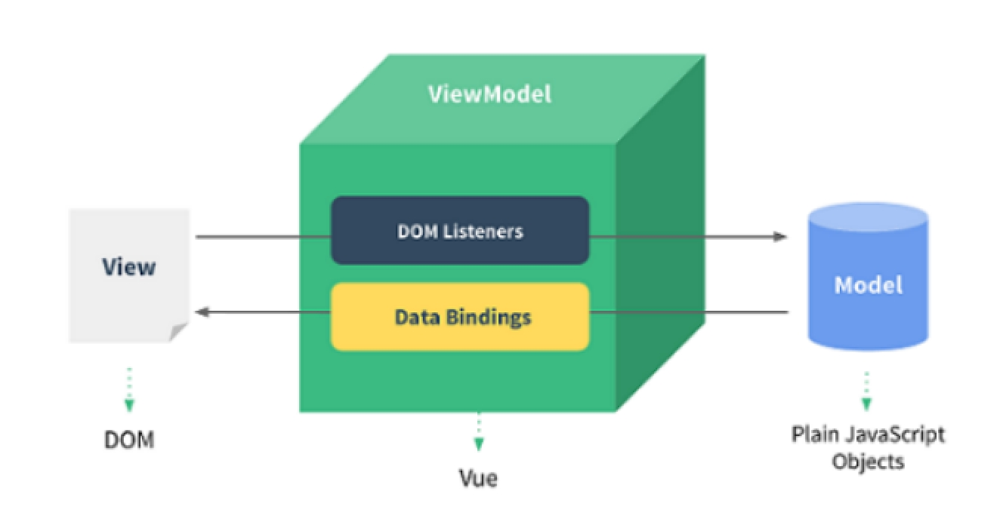

# 一、 VUE

## 1.1 MVVM

M： 数据模型

V:	 页面视图

VM:	 视图模型 （实现了对M和V的处理）

数据的流向有两个方向：

​	1 数据由模型流入视图

​		通过数据绑定的方式实现的

​		2 数据由视图流入模型

​			通过数据监听的方式实现的

 

### 1.1.1 MVVM的出现

早期js被设计的非常难简单，就是用来处理一些简单的交互，在当时最重要的问题就是浏览器兼容性的问题， 所以jQuery就出现了

后来，随着富客户端（有着复杂的UI界面和很强的交互性）、单页面应用程序的出现，后来js的逻辑交互性越来越复杂，所以就要考虑代码的可维护性、以及可拓展性变成了首要的问题，所以类MVC一类的框架就出现了，比如Backbone， 开发起来非常慢

​	如今，基于MVVM的模式衍生的框架就出现了，例如：Vue、angular、react实现了数据双向绑定，极大的提供了我们的开发效率

## 1.2 体验Vue

vue就是基于MVVM模式实现的一个框架。

### 1.2.1 github地址

https://github.com/vuejs/vue

### 1.2.2 官网

https://vuejs.org/

### 1.2.3 中文官网

https://cn.vuejs.org/

### 1.2.4 安装

在ES5中安装Vue的时候要通过bower来安装

​	Npm install bower -g

​		提供了bower 指令 

​		我们可以通过bower -v来查看版本号

​			获取vue:

​				bower install vue 之后获取相关的文件		

​		在ES6中安装vue:

​			npm install vue 

### 1.2.5 vue实例化对象

vue就是基于MVVM模式，产生的一个框架

M: 模型对象

V:  页面视图

VM:	vue实例化对象

​		传递的是一个配置对象

​			通过el属性 定义模板元素

​				Css选择器

​				通过data绑定数据模型

​				

​	

```
<!-- 2页面视图 -->
<div id="app">
	<!-- 插值语法 -->
	<h1>{{title}}</h1>
</div>
<script type="text/javascript" src="js/vue.js"></script>
<script type="text/javascript">
// 1 数据模型
let data = {
	title: 'hello'
}

// 3 实例化vue对象
let app = new Vue({
	// 定义模板
	el: '#app',
	// 绑定数据
	data
})
```

 

 

 

### 1.2.6 vue实例化对象的属性

$el: 			模板所在的元素

​	  $data、_data:  对模型中数据的备份

定义的数据会直接添加到vue实例化对象自身 并且还设置了特性

 

 

## 1.2 数据绑定的实现

Vue是基于MVVM模式的，因此实现了数据双向绑定，数据的改变，会同步更新到视图中

​	数据绑定是通过ES5中设置特性的方式来实现的

```
		<!-- 2页面视图 -->
<div id="app">
	<!-- 插值语法 -->
	<h1>{{title}}</h1>
</div>
<script type="text/javascript">
// 1 数据模型
let data = {
	title: 'hello',
	_data: {}
}

// 设置特性
Object.defineProperty(data, 'title', {
	// 设置特性属性或者是特性方法
	// 取值器
	get() {
		// 千万不要在方法中返回自身数据 否则会递归死循环
		// console.log('get', this, arguments);
		// return this.title;
		// 返回备份数据
		return this._data.title;
	},
	// 赋值器
	set(value) {
		// 千万不要在方法中设置自身数据 否则会递归死循环
		// console.log('set', this, arguments);
		// 设置备份数据
		this._data.title = value;
		// 执行updateView方法
		updateView(this._data);
	}
})

// 获取模板
let html = document.getElementById('app').innerHTML;
// console.log(html);
// 定义方法
function updateView(obj) {
	// 修改模板中的数据
	let result = html.replace(/{{(\w+)}}/g, (match, $1) => {
		// console.log($1);
		return obj[$1] || ''
	})
	// console.log(result);
	// 更新视图
	document.getElementById('app').innerHTML = result;
}


	// 修改数据
	data.title = 'ickt';
	// 获取数据
	// console.log(data.title);
```

 

## 1.4webpack编译

浏览器不支持ES6语法，因此需要编译，可以将ES6语法编译为ES5或者是ES3.1

Webpack编译： 需要创建一个webpack.config.js配置文件

​	遵循是commonjs规范

​	在ES6中，遵循是ES Module规范

​		引入模块：

​			

​			1 import 模块 from 模块地址

​			2 import * as 模块 from 模块地址

​			3 import { data } from 模块地址

​		暴漏接口：

​			export暴漏接口

​				通过后两种方式引入		

​			export default 暴漏接口

​				通过第一种方式引入	

​		引入css样式模块文件：

​			直接通过import引入样式模块地址即可	

​		es文件：

​			1 为了区分与js文件

​			2 为了可以让编辑器识别插件

### 1.4.1 webpack拓展

文件拓展名：

如果在引入模块文件的时候不想要添加后缀名称，此时可以通过resolve属性传递extensions定义默认拓展名称

​	入口文件：

如果想要修改入口文件的时候，我们可以通过alias进行配置

 

 

## 1.5 数据丢失

​	Vue实现了数据绑定，模型中的数据的改变，同步更新到视图中

​		如果数据改变了，而视图没有改变，我们就说数据丢失了	

​	Vue中的数据绑定是通过ES5中的属性特性的方式来实现了，因此没有设置特性的数据，也会丢失

​		数据丢失是框架的Bug

​	常见的数据丢失有四类：

​		第一类数组中的值类型

​			解决：定义新数组覆盖原数组		

​		第二类数组中的新成员

​			解决：定义新数组覆盖原数组

​		第三类对象中的新属性

​			解决： 定义新的对象覆盖原有对象

​		第四类未在模型中声明的数据

​			解决：声明这些数据	

​	作者提供了一种辅助方式用于避免数据丢失： 提供了$set方法

​		$set(target, key, value)

​			Target: 目标对象 （可以是vue实例化对象）

​			Key:	 属性名

​			Value:	属性值

​	

```
<div id="app">
	<!-- 数据绑定 -->
	<h1>{{msg}}</h1>
	<!-- 数组中 -->
	<!-- <h1>{{colors[0]}}---{{colors[3].num}}</h1> -->
	<!-- <h1>{{colors[0]}}---{{colors[4]}}</h1> -->
	<h1>{{colors[0]}}</h1>
	<!-- 对象中 -->
	<!-- <h1>{{obj.num}}--{{obj.size}}</h1> -->
	<!-- 未声明的数据 -->
	<h1>{{abc}}</h1>
</div>
```

 

```
// 引入Vue 
import Vue from 'vue';

// 实例化对象
let app = new Vue({
	// 定义模板
	el: '#app',
	// 定义数据
	data: {
		msg: 'hello',
		// 定义数组
		// colors: ['red', 'green', 'blue', { num: 111 }],
		colors: ['red', 'green', 'blue'],
		// 定义对象
		obj: {
			num: 100
		},
		// 声明数据
		abc: ''
	}
})


// 数据绑定
// app.msg = 'ickt';

// 数组中的值类型
// app.colors[0] = 'pink';
// 定义新数组覆盖原有数组
// app.colors = ['orange', 'green', 'blue'];
// $set 修改器
app.$set(app.colors, 0, 'pink');

// 数组中的新成员
// app.colors[4] = 'yellow';
// 定义新数组覆盖原数组
// app.colors = ['red', 'green', 'blue', , 'yellow'];

// 对象中的新属性
// app.obj.size = 200;
// 定义新对象覆盖原有对象
// app.obj = {
// 	num: 100,
// 	size: 200
// }

// app.obj.size = 300;

// 修改声明的数据
// app.abc = 'nihao';
```

 

## 1.6 插值

插值的目的是将模型中的数据渲染到页面中（视图中）

小程序中的插值语法提供的是一个伪js环境

在vue中提供的插值语法是真正的js环境，因此可以使用表达式

 

### 1.6.1 数据绑定

在vue2.0中，不允许对属性值进行插值

如果想要动态的为元素设置属性值，需要使用v-bind指令

指令：是对元素的拓展，使其具有一定的特征（功能）

​		v-bind的功能： 可以动态的设置元素属性值

​		v-bind的语法糖是冒号语法糖	

​			语法糖：对一些行为操作的简化，可以提高我们的开发效率

​			因此我们可以使用：代替v-bind

​	

​		例如：

​			v-bind:key=value

​			语法糖：

​				:key=value	

​		注意： 在vue中 所有的指令的属性值都是js环境

```
<div id="app">
	<!-- 数据绑定 -->
	<h1>{{msg}}</h1>
	<!-- 插值语法中是js环境 -->
	<!-- <h1>{{msg + 'ickt'}}</h1> -->
	<!-- 调用方法 -->
	<!-- <h1>{{msg.toUpperCase()}}</h1> -->
	<!-- 在2.0中不允许对属性使用插值 -->
	<!-- <h1 title="{{msg}}">Hello World</h1> -->
	<!-- <h1 title="title">Hello World</h1> -->
	<!-- 使用v-bind指令 动态设置元素属性值 -->
	<!-- <h1 v-bind:title="msg">Hello World</h1> -->
	<!-- v-bind语法糖 -->
	<h1 :title="msg">Hello World</h1>
</div>
```

 

### 1.6.2 v-text

v-text指令用于定义元素的内容的

与插值符号相比较：

​	1 避免插值符号的闪烁

​	2 插值语法中只能设置元素一部分内容，而v-text设置元素的全部内容

注意：v-text与插值符号一样都不能渲染html标签

### 1.6.3 v-html

v-html指令用于设置元素的内容

​	避免插值符号的闪烁，并且可以设置元素的全部内容	

​	注意：在工作中，渲染的内容要可靠

### 1.6.4 v-once

v-once指定用于将渲染的内容只渲染一次

​	当渲染一次之后，就算数据的改变也不会更新该指令所在的元素中的内容了

该指令对于后代元素仍然生效

该指令不需要属性值

该指令所在的元素（包括子元素）上的指令：例如 v-text、v-html、v-bind等等，都只会渲染一次

 

## 1.6 过滤器

在插值与指令中，提供了js环境，我们可以直接书写js表达式。如果表达式非常的复杂，会导致模板非常的臃肿。

为了复用这些表达式，简化模板，vue提供了插值过滤器技术

特点

1 可以复用js表达式

2 跨组件使用

3 简化模板

 

### 1.7.1使用过滤器

​	在vue2.0中，使用过滤器的方式：

​		{{ data | filter(arg1, arg2) | filter2(arg1, arg2) }}

​		当使用多个过滤器的时候，前一个过滤器的输出将作为下一个过滤器的输入

### 1.7.2 自定义过滤器

​	我们可以通过Vue.filter方法使用过滤器

​		第一个参数表示过滤器的名称

第二个参数表示过滤函数

第一个参数表示处理的数据

从第二个参数开始，表示传递的参数

必须有返回值，就是过滤的结果

​	注意：filter方法由vue提供，但是不能使用解构语法，并且要在实例化vue对象之前使用

 

```
// 使用过滤器
Vue.filter('dealMsg', (str, isFirsetData, ...arg) => {
	// 如果传递第一个参数 数据的首字母要大写
	if (isFirsetData) {
		str = str[0].toUpperCase() + str.slice(1);
	}
	// console.log(arg);
	// return str.replace(/[_-]([a-z])?/g, (match, $1 = '') => {
	// 	// console.log(111, $1);
	// 	// 变为大写字母
	// 	return $1.toUpperCase();
	// })
	// 合并为一条语句
	return str.replace(/[-_]([a-z])?/g, (match, $1 = '') => $1.toUpperCase());
});
```

 

 

## 1.8 计算属性数据

跟静态属性属性data是一样，用来存储数据的，但是在使用的时候可以修改数据

​	Vue中建议我们使用计算属性数据代替插值过滤器

静态数据属性：

​	用来存储数据的

​	如果想要修改数据，只能在渲染的时候，通过插值表达式、或者是插值过滤器来修改数据

​	存储的是什么样的数据，获取到的就是什么样的数据

​	 计算属性数据：

​		用来存储数据的 （通过computed属性定义）

​		属性值是一个对象

​			Key 数据名称

​			Value 是函数

​				返回值就是执行的结果

​				我们可以方法中对数据进行处理

​				参数和this都指向vue实例化对象

​					因此访问其它属性数据和方法的时候，可以通过this或者是参数对象来获取	

​			计算属性数据跟data一样，定义的数据都会添加到vue实例化对象自身

 

```
// 定义computed属性
computed: {
	dealTitle(vue) {
		// console.log(this, arguments);
		// 返回内容
		// return this.title.toUpperCase();
		// 通过参数对象使用数据
		return vue.title.toUpperCase();
	}
```

 

## 1.9 数据双向绑定

MVVM模式最大的特征是实现了数据双向绑定

​	一个方向：数据由模型流向视图

​		通过数据绑定（插值和指令）的技术实现了

​	另一个方法：数据由视图流向模型

​		通过事件监听的方式实现的

​	Vue为了简化这样的操作，提供了一个v-model指令	

​		作用：

​			实现数据由模型流入视图

​		实现数据由视图流向模型

 

注意：

​		1 绑定的数据必须在data中定义出来

​		2 绑定的数据的属性值不能使用表达式

 

### 1.9.1v-cloak

​	v-cloak是为了避免插值符号闪烁的问题

使用v-cloak分为两步：

​	第一步 在html页面中 为v-cloak属性选择器定义样式，隐藏元素： display: none

​	第二步 在需要避免插值符号闪烁的元素中，添加v-cloak指令

​	注意：

​		1 定义的样式要书写在页面最前面

​		2 v-cloak指令要添加到vue实例化对象中的模板元素内部中

```
<style type="text/css">
	/* 1 隐藏样式*/
	[v-cloak] {
		display: none;
	}
</style>
```

 

```
<div id="app" v-cloak>
	<!-- 数据双向绑定 绑定的数据的值不能使用表达式-->
	<!-- <input type="text" v-model="msg + 'ickt'"> -->
	<input type="text" v-model="msg">
	<h1>{{msg}}</h1>
	<!-- 第二次使用 -->
	<input type="text" v-model="title">
	<!-- 使用v-cloak -->
	<!-- <h1 v-cloak>{{title}}</h1> -->
	<h1>{{title}}</h1>
</div>
```

 

### 1.9.2 单选框的数据双向绑定

将type的类型改为radio就是单选框了

​		我们可以通过v-model指令实现数据双向绑定

​	特点：

​		1 一组单选框绑定的是同一份数据

​		2 选框的值通过value定义的

​		3 此时checked属性失效

​		4 默认值就是绑定的数据

 

 

### 1.9.3 多选框的数据双向绑定

将type的类型改为checkbox 就是多选框了

特点：

​	1 一组多选框的值，默认是布尔值，想要自定义其值，通过v-bind:true-value和v-bind:false-value定义

​	:true-value：	选中时候的值

​	:false-value:	未选中时候的值

2 一组多选框绑定的是不同的数据，为了访问数据方便，通常将数据放在同一个命名空间下

3 checked失去作用

4 默认值就是绑定的数据

 

### 1.9.4 下拉框的数据双向绑定

我们在html中通过select定义下拉框

​	通过options定义配置项

​				默认值是内容值，定义了value就是value值

​		通过multiple属性即可将单选下拉框变为多选下拉框

​		通过v-model指令，实现下拉框的数据双向绑定

​			单选下拉框的属性值是字符串

​			多选下拉框的属性值是数组

```
<!-- 定义下拉框 -->
<select v-model="color">
	<option value="isRed">red</option>
	<option value="isGreen">green</option>
	<option value="isBlue">blue</option>
</select>
<!-- 多选下拉框 -->
<select v-model="color" multiple>
	<option value="isRed">red</option>
	<option value="isGreen">green</option>
	<option value="isBlue">blue</option>
</select>
<!-- 显示结果 -->
<h1>result: {{color}}</h1>
```