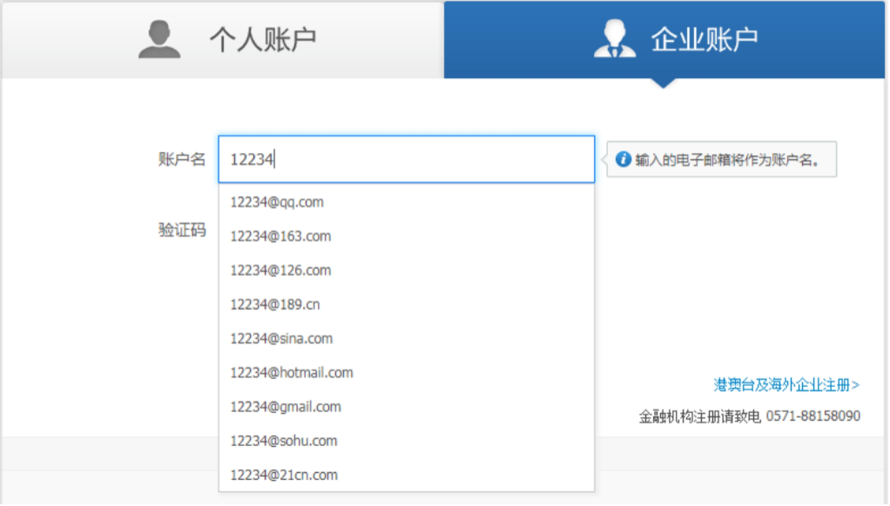

# 复习：

​	MVVM:  M 数据模型  V 页面视图  VM 实现了对M和V的处理

​	特点： 数据双向绑定  

​		1 由模型流向视图   2 由视图流向模型

​	

​	Vue实例化对象：

​		el	 确定容器元素

​		data 绑定数据

​		$el  模板容器元素

​		_data $data  对数据的备份

​	

Webpack配置：

​	将ES6编译为ES5或者是ES3.1  需要借助 babel-loader babel-preset-es2015

​	如果想要使用默认的拓展名的时候，可以传递resolve属性 

​		传递extensions	匹配默认的拓展名

​	修改入口文件：

​		传递alias 修改

数据绑定：

​	通过ES5中设置特性的方式 来实现的

 

动态设置属性值：

​	需要使用v-bind指令

​	语法糖： 冒号语法糖

​	Vue中所有的指令的属性值都是js环境

数据双向绑定：

​	v-model 实现数据双向绑定

v-cloak：

​	避免插值符号的闪烁问题

​	1 使用属性选择器 定义隐藏的样式

​	2 在需要避免插值符号闪烁的地方 添加该指令	

单选框：

​	v-model 

​	特点： 1 使用同一份数据  2 value定义选框的值 3 checked将会失效 4 默认值是绑定的数据

多选框：

​	v-model 

​	特点： 1 使用不同数据  2 默认是布尔值 自定义值 :true-value :false-value  3 checked将会失效 4 默认值是绑定的数据

下拉框：

​	v-model  multiple 定义多选下拉框

​	单选下拉框的值是字符串  多选下拉框的值是一个数组

 

v-text: 用于设置元素的内容  和插值语法一样  都不能渲染html标签

v-html: 用于设置元素的内容

v-once: 只会渲染一次内容

#  Vue

## 1.1 数据监听

​	模型中的数据更新的时候，vue可以检测到，并同步更新视图

​		如果想要监听js中的数据，我们可以使用数据监听的技术

​	我们通过watch属性，监听数据的变化

​		Key		监听的数据名称

​		Value	执行函数

​			第一个参数表示当前数据值

​			第二个参数表示上一个数据值

​			This指向vue实例化对象

​	Watch不仅可以监听模型中的数据，只要是在vue实例化对象中设置了特性的属性，都可以监听到

​	

### 1.1.1 状态过度

状态过度就是数据过度，我们可以实现平滑的过度数据

​	通过watch监听数据的变化

```
// watch
watch: {
	total(value, oldValue) {
		// 清除之前的定时器
		clearInterval(timer);
		// 开启定时器
		timer = setInterval(() => {
			// 判断
			if (this.num == value) {
				// 停止定时器
				clearInterval(timer);
				// 停止代码执行
				return;
			}
			this.num += this.num > value ? -1 : 1;
		}, 16)
	}
}
```

 

## 1.2 事件

通过v-on指令为DOM绑定事件

语法：v-on:click=”fn()”

​	参数集合可有可无

​	v-on指令的语法糖：是@ 因此

​		@click=”fn”

​	事件回调函数定义在methods方法中

​		methods是专门为vue实例化对象定义方法的地方（不局限于事件回调函数）

定义方法，会添加给vue实例化对象自身因此，能够访问vue实例化对象，就可以访问这些方法。

​	事件回调函数的参数：

​		如果没有添加参数集合，默认有一个参数，是事件对象

​		如果添加了参数集合，默认没有参数，使用什么数据就传递什么数据

​			如果想要使用事件对象 可以传递$event

​				是原生的事件对象，因此可以使用原生的DOM API操作它

​				Vue的事件没有实现事件委托，是直接绑定到元素身上的

​	

2 

### 1.2.1 事件修饰符

在js中，为了做某些事情（例如阻止冒泡，阻止默认行为，识别按键，识别鼠标按钮）我们要处理事件对象，在vue中简化了这些操作，提供了事件修饰符

​	语法：@click.修饰符=“fn”

### 1.2.2 常见的修饰符

stop		阻止冒泡

prevent 阻止默认行为

self		绑定的事件与触发的事件是同一个

once		单次触发

​	注意：修饰符可以互相组合在一起

 

### 1.2.3鼠标修饰符	

为了识别鼠标的按键，vue中提供了鼠标修饰符

​	Left 点击左按钮

​	Right  点击右按钮

​	Midle  点击中间键

```
<!-- 鼠标修饰符 -->
<!-- 默认就是鼠标左键 -->
<button @click="clickBtn">btn-1</button>
<button @click.left="clickBtn">btn-2</button>
<button @click.right="clickBtn">btn-3</button>
<button @click.middle="clickBtn">btn-4</button>
```

 

### 1.2.4 系统修饰符

Vue中为系统键提供了修饰符

​	shift、ctrl、 alt、 meta

​	我们可以通过组合键，使用这些修饰符  当按下按键 再次触发该事件

​			

```
<!-- 系统键修饰符 -->
<button @click.shift="clickBtn">btn-1</button>
<button @click.ctrl="clickBtn">btn-2</button>
<button @click.alt="clickBtn">btn-3</button>
<button @click.meta="clickBtn">btn-4</button>
```

 

### 1.2.5 键盘修饰符

当我们添加键盘事件的时候（keyup、keydown、keyprsee），为了获取某个按键的时候，需要处理事件对象的， 获取某个键值 要判断 e.keyCode

​	Vue中提供了键盘修饰符

​		esc、 tab 、space、 ente、r delete、up、down、 left、 right 所有的字母

```
<!-- 键盘修饰符 -->
<input type="text" @keyup.esc="clickBtn">
<input type="text" @keyup.space="clickBtn">
<input type="text" @keyup.delete="clickBtn">
<input type="text" @keyup.enter="clickBtn">
<input type="text" @keyup="clickBtn">
<!-- 所有的字母 -->
<input type="text" @keyup.z="clickBtn">
```

 

## 1.3 类的绑定

为了动态的为元素设置属性值，我们可以通过v-bind指令，为了元素添加类，有三种方式：

​	第一种 :class=”{}”

​		Key	 表示样式名称 （包含空格）

​		Value 是否保留这组类

​			true:	 保留类

​			false: 删除类

​		第二种 :class=”[]”

​			数组中的每一项代表一组类（包含空格）		

​		第三种 :class=”str”

​			代表一组类  

可以使用字符串拼接的形式

```
<!-- 类的绑定  对象 -->
<!-- <div :class="{
	blog: true,
	show: cls
}" @mouseenter="showBlog" @mouseleave="hideBlog"> -->
<!-- 数组 -->
<!-- <div :class="['blog', cls]" @mouseenter="showBlog" @mouseleave="hideBlog"> -->
<!-- 字符串 -->
<div :class="'blog ' + cls" @mouseenter="showBlog" @mouseleave="hideBlog">
	<span>博客</span>
	<ul>
		<li>博客评论</li>
		<li>未读提示</li>
	</ul>
</div>
```

## 1.4 样式绑定

样式绑定也有三种方式：

​	第一种 :style=”{}”

​		Key  表示样式名字

​			建议使用驼峰式命名

​		Value 样式属性值

​		第二种 :style=”[]”

​			数组中的每一项代表一组样式对象

​			Key  表示样式名字

​				建议使用驼峰式命名

​			Value 样式属性值

​		第三种 :style=”str”

​			行内式字符串 我们可以使用字符串拼接的技术

 

​				

```
<div class="goods">
	<p>
		<label for="">尺寸</label>
		<span :style="{ borderColor: span[0] }" @click="choose(37)">37</span>
		<span :style="{ borderColor: span[1] }" @click="choose(38)">38</span>
		<span :style="{ borderColor: span[2] }" @click="choose(39)">39</span>
	</p>
	<p>
		<label for="">颜色</label>
		
		
		
	</p>
</div>
```

 

##  	下午复习：

​		数据监听： 通过watch属性监听数据的变化

​		事件：v-on指令绑定Dom事件  @语法糖

​		事件回调函数 定义在 methods方法中

​		参数集合： 1 添加的时候 默认有一个事件对象参数

​				  2 没有添加参数集合的时候， 默认是没有数据的， 可以传递$event

​		修饰符：

​			常见的： stop prevent self once 

​			鼠标修饰符： left right middle 

​			系统键修饰符：shift alt ctrl meta

​			键盘修饰符：esc tab space enter delete up down left right 以及所有的字母	

​		类的绑定：

​			3种： 1 :class=”{}”  2 :class=”[]”  3 :class=”str”

​		样式的绑定：

​			3种： 1 :class=”{}”  2 :class=”[]”  3 :class=”str”

 

​		

 

​				

​	

## 1.5  模板指令

模板指令就是用于控制元素创建的指令

### 1.5.1 条件模板指令

Vue中实现了if语句，控制元素的创建与删除

通过v-if指令定义，控制元素的创建和删除

​	属性值是true  创建元素

​	属性值是false 删除元素

​	是真正的创建和删除，不是控制元素的显示和隐藏

​	与v-if组合的指令有：v-else 、v-else-if

 

### 1.5.2 显隐指令

通过v-show指令控制元素的显示和隐藏

​	不是模板指令，没有创建和删除元素

​	v-show的实现原理，切换元素的样式， display:none

​	与v-if区别：

​		1 实现原理

​			v-if: 	控制元素的创建和删除

​			v-show: 切换元素的显示和隐藏，没有创建和删除元素

​		2 组合指令

​			v-if可以组合的指令有：v-else、 v-else-if

​			v-show不能

​		注意：v-show性能更高，因此通常我们使用v-show指令就可以了

```
<!-- <h1 v-if="isShow === true">爱创课堂</h1> -->
<!-- v-else-if -->
<!-- <h1 v-else-if="isShow === 'hello'">Hello World</h1>
<h1 v-else>专业前端培训学校</h1> -->

<!-- 显隐指令 -->
<h1 v-show="isShow">Hello World</h1>
<!-- 不能与v-else一起使用 -->
<!-- <h1 v-else>你好</h1> -->
```

 

### 1.5.3 模板循环指令

Vue模仿了for in循环，可以循环创建模板元素，使用方式有两种：

​	第一种 v-for=”item in data”

​	第二种 v-for=”(item, index) in data”

​		in  	表示关键字

​		item 表示成员值

​		index 表示索引值

​	data 表示vue中的数据 有三种类型数据：

​		1 数组

​			item 表示成员值

​			index 索引值

​		2 对象

​			item 表示属性值 value

​			index 表示属性名 key

​		3 数字 表示循环data次

​			Item从1开始计数

​			Index从0开始计数

​		注意：在使用v-for指令的时候，要为元素设置key属性，保证属性值的唯一性

​		通常我们可以设置元素的索引值（index）或者是唯一的属性，例如id

​		后面vue cli中如果不设置key属性的时候 会报错

​			

### 1.5.4 模板元素

如果想要同时控制多个兄弟元素，我们可以将指令委托给父元素中，但是这样做会引入多余的元素

想要避免多余元素的引入，我们要使用模板元素

​	Vue中建议我们使用模板元素

在html中，定义模板有两种方式:

​	第一种 通过script模板标签

		<script type="text/template"></script>

​	第二种 html5中提供的模板元素 template

​		Vue建议我们使用template模板元素

template元素的特点：

​	1 在模板中可以添加属性、样式、指令等等，但是就是不会渲染出来

​	2 在模板元素中，不要设置key属性

```
<!-- 避免引入多余的元素 -->
<!-- 删除key属性 -->
<template v-for="(item, index) in news">
	<li>{{item}}--{{index}}</li>
	<hr>
</template>
```

 

## 1.6支付宝注册

https://memberprod.alipay.com/account/reg/enterpriseIndex.htm

 