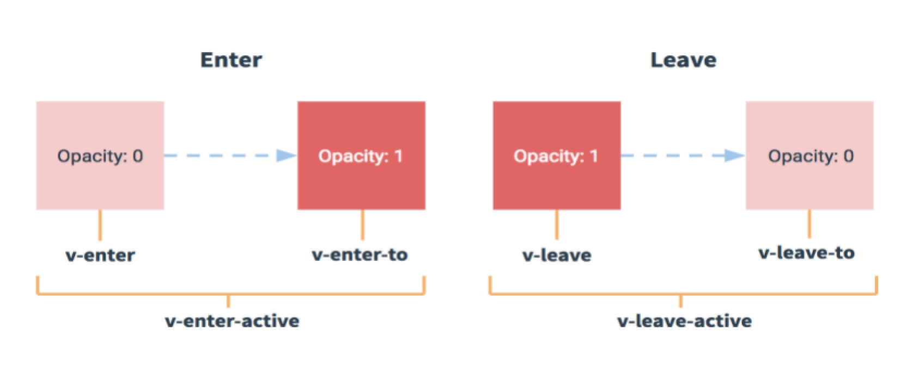
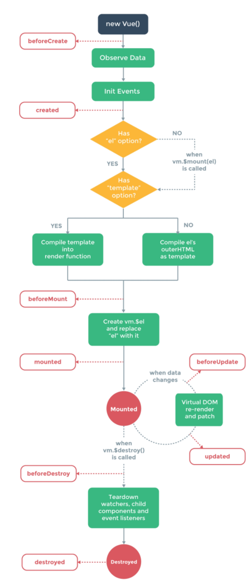
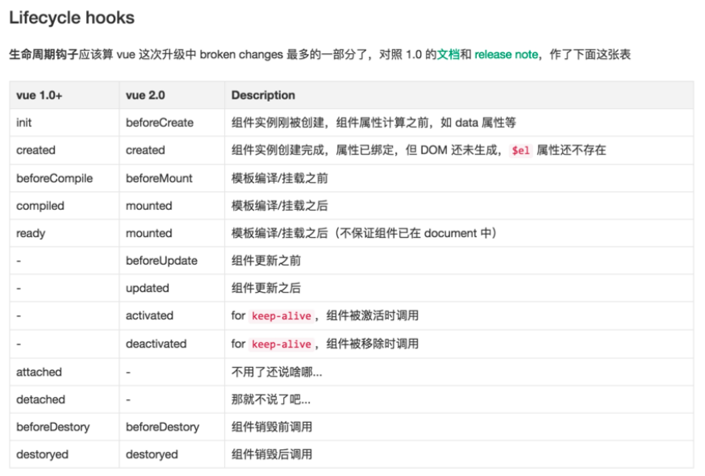

## 复习：

​	事件： v-on  @  methods 参数集合可有可无

​	修饰符： 语法： @click.修饰符=“fn”

常见： stop prevent  self  once

​	鼠标： left right middle 

​	系统键：shift alt ctrl  meta

​	键盘：esc tab space enter delete up down left right 以及所有的字母 

​		

​	类的绑定： :class={} | [] | str

样式的绑定：:class={} | [] | str

 

模板指令

v-if	v-else， v-else-if

v-show

v-for=”item in data” v-for=”(item, index) in data”		数组， 对象， 数字		key

template

 

 

# 一、 Vue

## 1.1过度

我们可以通过v-show指令，控制元素的显示与隐藏

我们可以通过v-if指令，控制元素的创建删除

Vue中允许我们在显示和隐藏的元素，创建和删除元素的过程中，添加动画

​	这里的动画是通过CSS3实现的，因此要定义样式

我们通过transition元素（组件）为内部的元素添加动画

通过name属性定义过度动画的名称

例如：name=”ickt” 

​	此时，在显示和隐藏，创建和删除的过程中，会出现六个类：
​		显示过程中：ickt-enter、ickt-enter-to、ickt-enter-active

​		隐藏过程中：ickt-leave、ickt-leave-to、ickt-leave-active

注意：

​		在显示过程中，类包含enter

​			元素由隐藏的状态变为显示的状态

​		在隐藏的过程中，类包含leave

​	 	 元素由显示的状态变为隐藏的状态

​		我们可以基于这些类，定义过度动画

 

### 1.2动画事件

在js中，我们可以通过事件监听动画

​	webkitTransitionStart  webkitTransitionEnd

​	webkitAnimationStart  webkitAnimationEnd

vue中允许为transition元素（组件）绑定事件，监听动画

​	显示过程中：

​		before-enter	显示动画开始

​		enter			显示动画中

​		after-enter	显示动画结束

​	隐藏过程中：

​		before-leave	隐藏动画开始

​		leave		隐藏动画中

​		after-leave	隐藏动画结束

​		我们可以通过@语法糖绑定事件

 

### 1.3进场动画

当我们希望刷新页面的时候（第一次渲染的时候）可以添加动画

​	只需要在transition中添加appear属性即可

 

### 1.4多元素过度

当给多个元素添加过度的时候，我们想要设置key属性，并且保证属性值是唯一的

### 1.5动画模式

通过mode属性定义动画的模式

​	out-in	当前元素的动画执行，在执行新元素动画

​	in-out	先执行新元素动画，再执行当前元素的动画，

### 1.6列表过度

当我们对v-for指令创建的列表元素添加过度的时候，要使用transition-group元素（组件）

​	它最终会渲染成真实的元素，默认是span元素，我们通过tag属性定义渲染元素的类型

​	此时，一定要为元素设置key属性，保证属性值是唯一的

```
<!-- 列表过度 -->
<transition-group tag="div" class="list2">
	<span v-for="obj in nums" :key="obj.index">{{obj.item}}</span>
</transiton-group>
```

 

## 1.2自定义指令

我们学过的指令有：v-bind v-model v-on v-text v-html v-once v-cloak v-if v-else v-else-if v-show v-for…

指令是对元素的拓展，使其具有一定的行为特征（功能）

内置的指令是有限的，为了给元素拓展更多的功能，我们要自定义指令

### 1.2.1使用自定义指令

共分为两步：

​	第一步：在页面中使用指令

​		指令都是以v-开头

​		要遵循html的规范，字母小写，横线分割单词

​		指令的属性值都是js环境

第二步：在js中，通过Vue.directive方法使用自定义指令

​	第一个参数表示指令名称

​		省略v-前缀，并且转为驼峰式命名

​	第二个参数，可以是指令对象或者是指令函数

​		如果是指令对象

​			bind					绑定的时候执行的方法

​			update				更新的时候执行额方法

​			unbind				解绑时候执行的方法

​			inserted				插入到页面时候执行的方法

​			componentUpdate		组件更新时候执行的 方法

​		如果是指令函数

​			就是用指令函数代替了上面的方法

​		无论是指令对象还是指令函数，参数常见的有四个：

​			第一个参数是指令所在的DOM元素（原生的DOM元素）

​			第二个参数是指令对象，包含各种信息

​			第三个参数是当前的虚拟DOM对象

​			第四个参数是上一个虚拟DOM对象

​			注意：

​				当一个指令的属性值发生改变的时候，所有指令的方法都会执行

​					我们可以判断当前指令的属性值和上一次指令的属性值是否相等

​						如果相等，表示数据没有改变，不需要执行

​						如果不想等，表示数据更新，需要执行了	

​			Directive方法跟filter方法一样不要解构，并且要在实例化vue对象之前使用

### 1.2.2自定义指令

我们通过v-ickt-html, 模拟v-html指令

我们通过v-ickt-once, 模拟v-once指令

我们通过v-ickt-show，模式v-show指令

 

```
<!-- 控制元素的显隐 -->
<button @click="toggle">切换</button>
<h1 v-show="isShow">{{msg}}</h1>
<!-- 模拟v-show -->
<h1 v-ickt-show="isShow">{{msg}}</h1>
<!-- <input type="text" v-model="msg">
<h1>{{msg}}</h1 -->
<!-- 1 模拟v-html -->
<!-- <h1 v-ickt-html="msg">{{msg}}</h1> -->
<!-- 再次使用指令 -->
<!-- <h1 v-ickt-html="title"></h1> -->
<!-- 模拟v-once -->
<!-- <h1 v-ickt-once="msg">{{msg}}</h1> -->
```

 

## 1.3组件

在html中，组件是一段可以复用的结构代码

在css中，组件是一段可以复用的样式代码

在js中，组件是一段可以复用的功能代码

Vue中也有组件，组件是一段可以复用的包含结构、样式、功能的代码

在vue中组件是一个完整体

 

###1.3.1使用自定义组件

​	使用自定义组件分为三步：

​		第一步：在页面中使用组件

​			要遵守html规范：字母小写，横线分割单词

​			首字母不区分大小写		

​		第二步：在js中，定义组件类，通过Vue.extend方法定义

​			extend方法是继承方法，说明继承了vue实例化对象

​				因此我们可以把vue实例化对象看成是一个组件		

​			extend接受一个参数对象，和实例化vue参数是相同的

​				method 	定义方法的

​				watch		监听数据

​				computed		计算属性数据

​				…

​			还有一些特殊的属性

​				data 		定义模型数据的 是一个方法

​					返回值是一个对象，对象中属性才是真正绑定的数据

​					This指向组件实例化对象

​				template		定义的模板的，与el属性类似

​					el属性：	获取该选择器中的内容作为模板

​					template:	属性值就是模板

​					属性值分为两种：

​						第一种： 模板字符串（定义在了js中）

​						第二种： 选择器，与el属性类似 

​							通过获取选择器的内容作为模板

​						在html中，有两种定义模板的方式：

​							1 模板脚本标签： <script type=”text/template”></script>

​							2  html5中提供的模板标签： template

​								Vue中建议我们使用模板标签

​							注意：在定义的模板中，最外层有且只有一个根元素

​		第三步：注册组件

​			注册组件就是为了将组件渲染到页面中

​			注册的方式有两种：

​				第一种： 全局注册

​					通过Vue.component注册

​						第一个参数是组件名称

​							转为驼峰式命名，首字母不区分大小写			

​						第二个参数是对应的组件类

​					所有的组件模板中，都是可以使用该组件

​				第二种：局部注册

​					通过组件的components属性注册

​						Key 	表示组件名称

​							转为驼峰式命名，首字母不区分大小写

​						Value	组件类

​					只有在该组件中可以使用，其它组件不可以使用

​			注意：

​				Vue中的组件是一个完整的个体，数据、事件、方法等都不会彼此共享	

​	父子关系

​		Vue实例化对象可以看成是一个组件，在vue实例化对象中使用的组件称为vue实例化对象的子组件

​			因此Vue实例化对象可以看成父组件

 

###1.3.2动态组件

​	在使用组件的时候，一类元素对应的一个组件

​		如果想要一个元素对应多个组件，要使用动态组件元素：component

​			通过is属性定义渲染的组件

​				如果想要传递变量，要使用v-bind指令

```
<button @click="togglePage('home')">home</button>
<button @click="togglePage('list')">list</button>
<!-- 传递变量 -->
<component :is="page"></component>
```

 

## 1.4组件的生命周期

为了说明组件创建、存在、销毁的过程，vue提供了组件声明周期技术

​	共分为3大周期： 1 创建期  2 存在期  3 销毁期

### 1.4.1创建期

当组件需要在页面中渲染的时候，此时组件将进入创建期，共分为四个阶段：

​		beforeCreate		组件即将创建： 此时组件中的数据、自定义事件都没有绑定

​		created			组件创建完成： 此时组件中具有了数据和自定义事件，但是没有渲染

​		beforeMount		组件即将渲染： 此时要确定容器元素以及编译模板

​		monted			组件创建完成： 此时组件已经渲染到页面中（上树）

### 1.4.2存在期

当组件中的数据发生变化的时候，此时组件进入存在期，共分为两个阶段：

​		beforeUpdate		组件即将更新：此时数据更新了，视图尚未更新

​		updated			组件更新完毕：此时数据和视图都已经更新了

​	一次数据更新的数据，存在期仍然存在，等待下一次数据的更新

 

### 1.4.3销毁期

当组件从页面中删除的时候，此时组件进入销毁期，共分为两个阶段：

​		beforeDestroy		组件即将销毁：此时组件中的数据、自定义事件、子组件仍然存储

​		destroyed			组件销毁完毕：此时组件已经在页面中删除

当组件被销毁之后，就再也无法访问到了

 

 

### 1.4.4keep-alive

当组件从页面中删除的时候，此时组件进入销毁期, 如果不想让组件被销毁，在外部通过keep-alive组件包裹

​	此时，虽然组件被删除了，但是它仍然缓存在内存中，需要使用的时候，从内存中取出

​	注意：隐藏的时候，保留的是最后一个状态，再次显示的时候会将最后一个状态展示

​	为了说明组件的隐藏和显示，又为组件拓展了两个方法：

​		activated		组件被激活，显示出来了

​		deactivated	组件被禁用	消失不存在了

以上所有的生命周期方法中的this指向组件实例化对象，没有参数的

创建期和销毁期，在组件的一生中，只会执行一次

而存在期中的方法，会执行多次



 

 

## 1.5组件间通信

Vue中的组件都是独立的，数据、方法之间不会共享

想要实现组件的数据共享，要使用组件间通信技术

组件间的通信具有方向性：

​		父组件向子组件通信

​		子组件向父组件通信

​		兄弟组件间的通信

### 1.5.1父组件向子组件通信

共分为两步：

​		第一步：为子组件添加属性数据

​			遵守html规范: 字母小写，横线分割单词

​			默认是一个字符串，如果想要使用变量，要使用v-bind指令

​		第二步：在子组件中通过props属性来接收数据

​			命名规范：转为驼峰式命名

​			属性值分为两种情况：

​				第一种：简单接收数据

​					值是一个数组，每一项表示接收的数据

​				第二种：对接收的数据进行校验

​					值是一个对象

​						Key 接收的数据名称

​						Value	

​								可以是构造函数，表示数据类型

​								可以是数组，数组中的每一项都是构造函数，起到类型限制的作用

​								可以是对象

​									type		数据类型

​									required	数据是否是必填的

​									default	定义默认值

可以是字符串

还可以是方法，返回值就是默认值

​										validator: 对数据进行校验	

​											返回值是布尔值

​												true 校验通过

​												false 校验不通过	

​	props中接收的数据和data中定义的数据都会添加给组件实例化对象，并且设置了特性，因此，可以在组件中或者是模板中来使用这些数据

 

###1.5.2$parent

​	在子组件中有一个$parent属性，代表了父组件

​	因此我们还可以通过$parent访问父组件中的数据

​		注意：这种方式在工作中不推荐使用，具有耦合的问题	

 

```
// 2 定义组件类
let Home = Vue.extend({
	// 接收数据
	// props: ['color', 'parentMessage'],
	// 数据校验
	props: {
		color: String,
		// 多个数据限制
		// num: [String, Number],
		num: {
			type: Number,
			// 是否是必填
			// required: true,
			// 默认值
			// default: 10
			// 默认值是一个方法
			// default() {
			// 	return 100;
			// }
		},
		parentMessage: {
			type: String,
			validator(value) {
				// console.log(111, this, arguments);
				return value.length > 4;
			}
		}
	},
	// 选择器
	template: `
		<div>
			<h1>child: {{color}}--{{parentMessage}}--{{num}}</h1>
			<!-- 通过$parent属性获取父组件中的数据 -->
			<h1>{{$parent.msg}}</h1>
		</div>
	`,
	// 组件创建完成
	created() {
		console.log('home', this);
	}

})

// 实例化
new Vue({
	// 局部注册
	components: { Home },
	// 容器
	el: '#app',
	// 数据
	data: {
		msg: 'hello'
	},
	// 组件创建完成
	created() {
		console.log('vue', this);
	}
})
```

 

 

###1.5.3自定义事件

Vue中也实现了观察者模式，可以注册事件、发布事件、注销事件等等，并且为vue的原型拓展了这些方法

​	$on(type, fn)		订阅事件

​		type 消息类型

​		fn		消息回调函数

​	$emit(type, fn)		发布事件

​		type 消息类型

​		fn		消息回调函数

​	$once		单次绑定事件

​	$off(type, fn)		注销事件

​		type 消息类型

​		fn		消息回调函数

注意：

​	Vue中的组件都是完整体，数据、事件、方法都不会共享

​	所以在当前组件中订阅的事件，只有当前组件发布

但是，子组件可以通过$parent访问父组件，所以可以通过$parent来向父组件发布消息。

注意：工作中不常用，因为具有耦合问题。

```
// 2 定义组件类
let Home = Vue.extend({
	// 选择器
	template: `
		<div>
			<h1>home component</h1>
		</div>
	`,
	// 组件创建完成
	created() {
		// 在子组件中发布父组件中的事件  经过测试没有作用
		// this.$emit('ickt', 100, true);
		// 可以通过$parent发布父组件中的事件
		this.$parent.$emit('ickt', 100, true)
	}

})

// 实例化
new Vue({
	// 局部注册
	components: { Home },
	// 容器
	el: '#app',
	// 数据
	data: {
		msg: 'hello'
	},
	// 组件创建完成
	created() {
		// 订阅事件
		this.$on('ickt', (...arg) => {
			console.log(arg);
		});

		// 在父组件中发布事件
		// setTimeout(() => {
		// 	// 通过$emit
		// 	this.$emit('ickt', 100, true, 'abc');
		// }, 3000)
	}
})
```