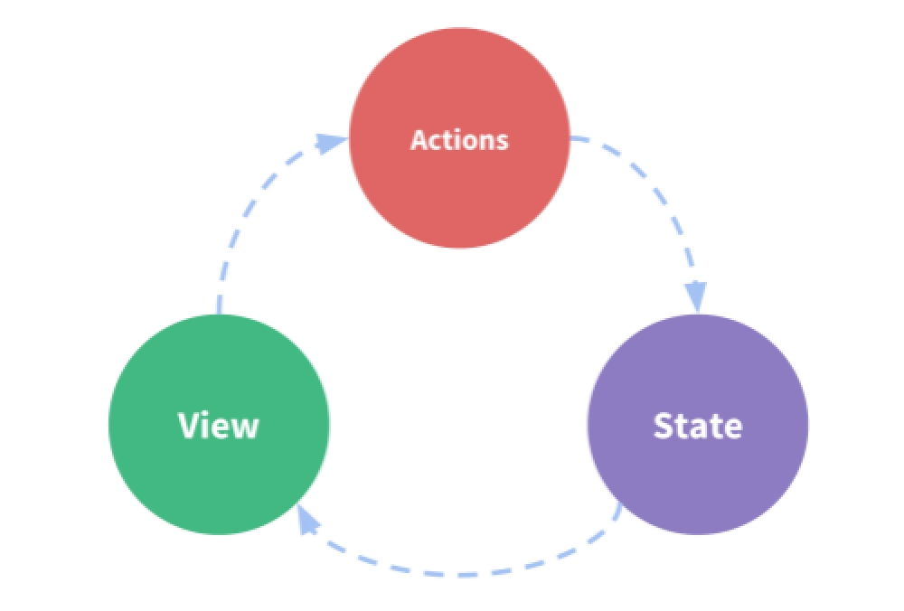

## 复习：

​	自定义指令：

​		v-ickt-html  Vue.directive(name, { bind, update, unbind, inserted, componentUpdated } | fn)

​		优化 : obj.value != obj.oldValue 

​	自定义组件：

​		1 home  2 Vue.extend({ methods, computed, watch…  data, template }) 3 Vue.component(name, 类) components 

 

​	动态组件： component  is属性  动态传递 使用v-bind

​	

​	组件生命周期：

​		创建期： beforeCreate  created  beforeMount	mounted	

​		存在期： beforeUpdate	 updated	

​		销毁期： beforeDestroy  destroyed	

​		Keep-alive 

​			activated		deactivated		

​		this指向组件实例化对象	没有参数

​	

​	组件通信：

​		父向子通信：

​			1 为子组件传递数据

​			2 在子组件中通过props接受数据 

​				1 简单接收数据 值是数组

​				2 对接收的数据进行校验

​					Key 数据名称

​					Value

​						构造函数

​						数组

​						对象

​							type required default validator

# 一、  Vue

## 1.1 子组件向父组件通信

作用： 将子组件中的数据，传递给父组件中使用

有两种方式：1 模拟DOM事件  2 传递方法

 

### 1.1.1 模拟DOM事件

定义DOM事件

​		@click=”fn”

模拟DOM事件

​		@ickt-demo

实现通信分为四步：

​		第一步：在父组件中，为子组件绑定虚拟的DOM事件

​			@ickt-demo=“fn”

​			注意：

1建议横线分割单词，字母小写

​				  2 不要添加参数集合

​						如果没有添加参数集合，是可以接收所有的数据

​						如果添加了参数集合，默认是无法接收通信数据，即使传递$event,只能接收一个参数数据而已，其它数据就丢失了

​			第二步：在父组件中，定义事件回调函数

​			第三步：在子组件中，通过$emit执行事件，并传递子组件中的数据

​				注意：消息名称必须一致 （唯一一个不需要转化为驼峰命名）

​			第四步：在父组件中，接收数据，并存储数据

 

```
<h1>parent: {{msg}}</h1>
<!-- 使用组件 -->
<!-- 1 绑定虚拟的DOM事件 -->
<home @ickt-demo="fn"></home>
<!-- 不要添加参数集合 -->
<home @ickt-demo="fn()"></home>

// 定义组件类
let Home = Vue.extend({
	// 定义模板
	template: `
		<div>
			<input type="text" v-model="msg"/>
			<h1>child: {{msg}}</h1>
		</div>
	`,
	// 定义模型属性
	data() {
		return {
			msg: 'hello'
		}
	},
	// 监听数据
	watch: {
		msg(value, oldValue) {
			// console.log(111, arguments);
			this.$emit('ickt-demo', value, 100, true);
		}
	},
	// 组件创建完成之后
	created() {
		// 不要转换为驼峰式命名
		this.$emit('ickt-demo', this.msg, 100, true);
	}
})

// 实例化vue
new Vue({
	// 注册组件
	components: { Home },
	// 容器
	el: '#app',
	// 数据
	data: {
		msg: ''
	},
	// 定义方法
	methods: {
		// 2 定义事件回调函数
		fn(msg){
			console.log('fn', arguments);
			// 4 接收并存储数据
			this.msg = msg;
		}
	}
})
```

 

### 1.1.2 传递方法

还可以通过传递方法的方式实现通信

共分为四步：

​		第一步：为子组件传递父组件的方法

​		第二步：在子组件中通过props接收数据

​			转为驼峰式命名规范

​		第三步：在子组件中执行接收的事件方法

​		第四步：在父组件中接收并存储数据

​	

```
<h1>parent: {{msg}}</h1>
<!-- 使用组件 -->
<!-- 1 传递方法 -->
<home :parent-Msg="receiveMsg"></home>

// 定义组件类
let Home = Vue.extend({
	// 2 通过props接收数据
	props: ['parentMsg'],
	// 定义模板
	template: `
		<div>
			<input type="text" v-model="msg"/>
			<h1>child: {{msg}}</h1>
		</div>
	`,
	// 定义模型属性
	data() {
		return {
			msg: 'hello'
		}
	},
	// 监听数据
	watch: {
		msg() {
			this.parentMsg(this.msg);
		}
	},
	// 组件创建完成之后
	created() {
		// 3 执行接收的方法 并传递数据
		// console.log(this);
		this.parentMsg(this.msg);
	}
})

// 实例化vue
new Vue({
	// 注册组件
	components: { Home },
	// 容器
	el: '#app',
	// 数据
	data: {
		msg: ''
	},
	// 定义方法
	methods: {
		//  定义事件回调函数
		receiveMsg(msg) {
			// console.log('receiveMsg', arguments);
			// 接收并存储数据
			this.msg = msg;
		}
	}
})
```


## 1.2 兄弟组件间通信

同一个父组件中的两个子组件，互为兄弟组件

想要实现兄弟组件间通信，只需要两步：

​	1 在子组件中，向父组件通信

​	2 在父组件中，向另一个子组件通信

兄弟组件之间没有关系，而他们都与父组件有关系

 

```
<h1>parent: {{msg}}</h1>
<!-- 第一个组件 -->
<!-- 传递方法 -->
<!-- <child :send-msg="receiveMsg"></child> -->
<!-- 模拟DOM事件 -->
<child @ickt-demo="receiveMsg"></child>
<!-- 第二个组件 -->
<!-- 传递属性数据 -->
<other :parent-msg="msg"></other>

// 定义child组件
// let Child = Vue.extend({
// 	// 接收数据
// 	props: ['sendMsg'],
// 	// 模板
// 	template: `<input type="text" v-model="msg"/>`,
// 	// 定义数据
// 	data() {
// 		return {
// 			msg: 'hello'
// 		}
// 	},
// 	// 监听数据
// 	watch: {
// 		msg(value) {
// 			this.sendMsg(value);
// 		}
// 	},
// 	// 创建期方法
// 	created() {
// 		// 执行方法
// 		this.sendMsg(this.msg);
// 	}
// }) 

let Child = Vue.extend({
		// 模板
	template: `<input type="text" v-model="msg"/>`,
	// 定义数据
	data() {
		return {
			msg: 'hello'
		}
	},
	// 监听数据
	watch: {
		msg(value) {
			this.$emit('ickt-demo', this.msg);
		}
	},
	// 创建期方法
	created() {
		// 通过$emit执行方法
		this.$emit('ickt-demo', this.msg);
	}
}) 


// 定义other组件
let Other = Vue.extend({
	// 接收数据
	props: ['parentMsg'],
	// 模板
	template: `<h1>other: {{parentMsg}}</h1>`,
})

// 实例化vue
new Vue({
	// 注册组件
	components: { Child,  Other},
	// 容器
	el: '#app',
	// 数据
	data: {
		msg: ''
	},
	// 定义方法
	methods: {
		receiveMsg(msg) {
			// 接收数据
			this.msg = msg;
		}
	}
})
```

 

## 1.3 插槽

插槽就是在组件的模板中，允许我们访问组件元素中的其它内部元素

### 1.3.1 使用插槽

使用插槽分为两步：

​		第一步：在组件的元素中，为其它元素定义插槽的名称

​			通过slot属性设置

​		第二步：在组件的模板中，通过slot组件使用这些元素

​			通过name属性指定插槽的名称

​		如果没有传递name属性，默认使用的是剩余的元素

​	使用插槽的时候，默认会引入slot属性所在的元素

​	不想引入该元素，就可以使用template元素

​		当我们使用template元素的时候，在新版中，建议我们使用v-slot代替slot属性

​			因此此时定义插槽名称的语法是冒号语法

​				v-slot:header

​			注意：

​				v-slot指令，普通元素是不能使用: div  h1  span…

​				只能是组件或者是template中使用

### 1.3.2 插槽作用域

插槽作用域指的是数据存储在哪里

在插槽中，默认使用的父组件中数据

如果想要使用子组件中的数据分为两步：

​		第一步：在slot组件中，传递子组件中的数据

​			想要动态传递使用v-bind指令

​		第二步：为v-slot指令赋值，定义接收数据的命名空间（作用域名称）

​			接收的数据，转为驼峰式命名

​			此时，在元素中我们可以通过命名空间使用这些数据

​		v-slot的语法糖： #

​		目前我们学过的语法糖：

​			@  => 	v-on

​			：  => v-bind

​			#  =>  v-slot

​	

```
<div id="app">
	<h1>parent: {{msg}}</h1>
	<home>
		<!-- 替换为template -->
		<!-- 为v-slot指令赋值 -->
		<!-- <template v-slot:header="childScope"> -->
		<!-- 使用语法糖 -->
		<template #header="childScope">
			<h1>header--{{msg}}</h1>
			<h1>{{childScope}}</h1>
			<!-- 使用数据 -->
			<h1>color: {{childScope.color}} msg: {{childScope.sendMsg}}</h1>
		</template>
	</home>
</div>
<!-- 使用模板标签 -->
<template id="tpl">
	<div>
		<slot name="header" color="red" :send-msg="msg"></slot>
	</div>
</template>
```


# 二、vuex

组件的通信成本很高，所以为了简化组件间通信（共享数据），vue提供了vuex插件。是基于flux思想实现的。

## 2.1 flux

是由react团队提供的数据通信架构思想。解决网状通信的问题。实现了数据单向流动。

 

### 2.1.1组成部分

由四部分组成

action 		消息对象

dispatcher	用来捕获消息对象，并处理数据

store 		存储数据

view 		组件视图

### 2.1.2通信流程

一个组件或者用户发布一个action消息

消息被dispatcher捕获，并根据消息类型，处理数据

并将新的数据传递给store去存储，

store中的数据发生改变，将数据传递给另一个组件。

## 2.2 vuex

vuex就是基于flux思想实现的，实现了单一数据源，数据单向流动等特征。

 

### 2.2.1组成部分

简化了flux，是由三个部分

action 		消息模块

state 		存储数据

view 		组件视图

### 2.2.2通信流程

一个组件发布消息，

消息被action模块捕获，

并根据消息类型，处理数据

action将新的数据传递给state去存储。

state中的数据发生了改变，将新的数据传递给另一个组件。

### 2.2.3 action分类

在vuex中，将action分成两类

一类是同步消息：mutation

为了可测试

一类是异步消息：action

为了异步操作

## 2.3 store组成

下图中，绿色虚线部分就是vuex，在代码中用store表示。

由于vuex实现了单一数据源的特征，所以整个应用程序中，只能有且只有一个store对象

在store中，由五部分组成：

state 		存储组件间共享的数据

getters 		存储组件间共享的计算属性数据

getters与state的关系与data与computed关系是一样的。

mutations		订阅同步消息的模块（相当于观察者模式中的on方法）

通过commit方法来提交同步消息（相当于观察者模式中的trigger方法）

actions		订阅异步消息的模块（相当于观察者模式中的on方法）

通过dispatch方法来提交异步消息（相当于观察者模式中的trigger方法）

modules		用来切割模块的。

注意：如果没有异步消息，可以直接发布同步消息

## 2.4安装vuex

在es5开发中，通过bower安装

bower install vuex

在es6开发中，通过npm安装

npm install vuex

 

## 2.5使用vuex

​	使用Vuex分为五步：

​		第一步： 安装Vuex

​			只有在模块化开发中，需要安装（除了seajs）

​			通过Vue.use(Vuex)

​				Use是专门用来安装插件的

​		第二步：实例化store, 通过Vuex.Store类创建

​			Store类接收一个对象，可以传递store中的各个模块：mutation、actions……

​		第三步： 注册store

​			通过store属性为vue实例化对象注册store

​				一旦注册完毕，所有的组件都可以访问$store对象

​					因此可以访问$store中的state对象中的数据

​		第四步：在一个组件中使用数据

​		第五步：在一个组件中发布消息

1 

 

 

## 2.6 同步消息	

​	通过mutations 定义同步消息

​		Key	 消息名称

​		Value 消息回调函数

​			第一个参数state对象

​			第二个参数 接收的数据

### 2.6.1 commit

​	通过commit发布同步消息

​		第一个参数消息名称

​		从第二个参数 表示传递的数据

​			所有参数只能传递第二个参数

​				如果想要传递多个参数，可以将多个数据放入数组或者对象中

 

```
// 同步消息
mutations: {
	// 增加数字
	addNum(state, num) {
		// console.log('addNum', arguments);
		state.num += num;
	},
	// 减少数字
	reduceNum(state, num) {
		// console.log('reduceNum', arguments);
		state.num -= num;
	}
}
<!-- 5 发布消息 -->
<button @click="$store.commit('addNum', 5)">增加5</button>
```

 

## 2.7 异步消息

​	通过actions定义异步消息

​		Key	 消息名称

​		Value 消息回调函数

​			第一个参数store对象

​			第二个参数是接收的数据

### 2.7.1 dispatch

​	通过dispach发布异步消息

​		第一个参数 表示消息名称

​		从第二个参数 表示传递的数据	

​			所有参数只能传递第二个参数

​				如果想要传递多个参数，可以将多个数据放入数组或者对象中

​		注意：

​			我们虽然可以通过参数store对象来访问state中的数据，但是不要直接修改它，一定要通过commit发布同步消息，在同步消息中改变state中的数据，（否则不能测试）

 

​			

```
// 异步消息
actions: {
	clear(store, num) {
		// console.log('clear', arguments);
		// 2s之后发布同步消息
		setTimeout(() => {
			store.commit('clearNum', num)
		}, 2000)
	}
}
```

 

## 2.8 计算属性数据

​	我们通过getters定义计算属性数据

​		Key 数据名称

​		Value 计算方法	

​			第一个参数state对象

​			第二个参数getter对象	

​		返回值就是获取到的数据

​	

```
// 计算属性数据
getters: {
	doubleNum(state, getter) {
		// console.log('doubleNum', arguments);
		// 返回2 * num
		return state.num * 2;
	}
},
```

 

## 2.9 modules

​	我们可以通过modules切割模块

​	解决问题： 当应用程序很大的时候，如果将数据都放入state中, 会造成数据命名冲突的问题，因此我们可以通过modules切割store, 分类存储state中的数据

​	切割模块，本质上就是对Store的切割，因此切割出来的Store还可以传递Store中的各个模块：actions, mutations，getters, state……

​	切割store的本质，就是在切割state中的数据，因此只有state中的数据需要添加命名空间，其它数据正常使用

​	Modules的属性值是对象

​		Key  表示命名空间名称

​		Value 切割出来的子store对象，可以传递store中的各个部分

​	此时就有了全局store和局部store对象了, 可以使用相同的数据名称

​		data		使用数据的时候 要添加命名空间了

​		mutaions actions 中的数据可以正常使用

​			局部消息由局部修改

​			全局消息由全局修改

​			 如果是同名的消息，方法都会执行

​		getters  不允许定义同名数据

```
modules: {
	//命名空间名称
	ickt: {
		// 数据
		state: {
			num: 0,
			color: 'red'
		},
		// 计算属性数据
		getters: {
			doubleNum(state, getter) {
				// console.log('doubleNum', arguments);
				// 返回2 * num
				return state.num * 2;
			}
		},
		// 同步消息
		mutations: {
			// 增加数字
			addNum(state, num) {
				// console.log('addNum', arguments);
				state.num += num;
			},
			// 减少数字
			reduceNum(state, num) {
				// console.log('reduceNum', arguments);
				state.num -= num;
			},
			// 清空数字
			clearNum(state, num) {
				state.num = num;
			}
		}
}
})
```

 

##  下午复习：

​	组件通信：

​		子向父通信：  1 模拟DOM事件  2 传递方法

​		兄弟间：1 先向父组件通信  2 由父组间向另一个子组件通信

​	插槽：

​		1 slot 属性  2 slot组件  name 

​	作用域：	

​		1 为slot组件传递数据  2 为v-slot:header=scope 

 

Vuex:

1 安装Vue.use(Vuex)	 2实例化store类  3注册store 4 一个组件中使用数据 5 一个组件中发布消息

同步消息：Mutations  commit(name, arg, arg1…)

异步消息：actions   dispatch(name, arg, arg1…)

计算属性数据： getters 

Modules:	切割模块  使用的时候要加上命令空间

 

​	 

​		

##  2.10 插件	

​	Vuex允许我们通过引入插件的方式，为其拓展

​	通过plugins属性引入插件：值是一个数组，可以引入多个插件

Vuex中内置了一个插件：vue/dist/logger.js

​		检测到mutations的消息

​		不能检测actions消息

 

```
// 引入插件
plugins: [logger() ],
```

 

### 2.10.1 检测mutations的变化

在Store对象中提供了subscribe方法用于监听mutations数据的变化

​	参数是回调函数

​		第一个参数mutations消息对象

​		第二个参数state对象

```
store.subscribe((mutation, state) => console.log(mutation.type, state.num));
```

 

### 2.10.2 自定义插件

Vuex中提供了插件是一个函数，参数是Store对象

​	在方法中，我们可以对Store对象做拓展

```
// 定义插件
function myPlugin(Store) {
	// console.log(111, arguments);
	Store.subscribe((mutation, state) => console.log(mutation.type, state.num))
}
```

 


# 三、路由

一个完整的URL由几部分组成？

https://www.icketang.com/static/img/banner_news.jpg?num=10&color=red#title

协议 		https://

域名 		www.icketang.com

端口号 		:443

路径 		/static/img/

文件		banner_news.jpg

搜索词		?num=10&color=red

哈希		#title

前三个部分的改变会导致跨域的问题。

前六个部分的改变会导致浏览器端向服务器端发送新的请求。

只有hash的改变不会导致浏览器端向服务器端发送新的请求。

所以前端路由就是基于hash实现的，

例如：单页面应用程序SPA（Single Page Application）就是基于hash路由实现的

特点：快

 

## 3.1 前端路由的实现

​	前端路由基于hash实现的

​		我们可以通过haschange事件，监听hash的改变

​		我们可以通过location对象，获取hash中的数据

​			Location可以获取url上的所有数据

​		所以我们可以基于动态组件和hash事件实现前端路由的切换

 

```
<!-- 动态组件 -->
<component :is="page"></component>

// 监听haschange事件
window.addEventListener('hashchange', router);

// 定义方法
function router() {
	// 获取hash
	let hash = location.hash.slice(2);
	// console.log(hash);
	// 更新数据
	app.page = hash;
}

// 执行router
router();
```

## 3.2 vue路由

​	我们实现的路由太脆弱了，因此vue中提供了vue路由插件

​	

### 3.2.1 安装路由

​	在ES5中，通过bower安装

​		bower install vue-router

​	在ES6中，通过npm安装

​		npm install vue-router

 

### 3.2.2 使用路由

​	使用路由分为六步：

​		第一步：在模块化开发中，安装路由

​			通过Vue.use方法安装插件

​		第二步：定义路由渲染的位置

​			通过router-view组件定义

​		第三步：定义页面组件

​			路由简化了页面组件

​			只需要传递extend的参数集合即可

​		第四步：定义路由规则 

​			是一个数组，每一项都是一条规则，是一个对象

​				path  定义规则

​					以/切割路径，默认是静态路由

​						静态路由： 是一对一的路由规则

​							例如：/ickt/list  只对应： /ickt/list

​					在路径的前面加上：就是动态路由

​						动态路由： 是一对多的路由规则

​							例如：/ickt/:page

​								匹配： 	/ickt:/10  /ickt/100  /ickt/abc

​								不匹配	/ickt /ickt/10/20  /list/10

​				Component	定义渲染组件

​				Name:		组件的名称

​				…

​		第五步： 实例化路由对象，并且传递路由规则routes

​		第六步： 注册路由 通过router属性注册

 

```
import Router from 'vue-router';
// 1 安装
Vue.use(Router);
<!-- 2 路由渲染的位置 -->
<router-view></router-view>

// 3 定义页面组件
let Home = { template: '<h1>home Page</h1>' };
let List = { template: '<h1>list Page</h1>' };
let Detail = { template: '<h1>detail Page</h1>' };

// 4 定义路由规则
let routes = [
	{ path: '/home', component: Home, name: 'home' },
	{ path: '/list/:page', component: List, name: 'list' },
	{ path: '/detail/:id', component: Detail, name: 'detail' },
]

// 5 实例化路由
let router = new Router({ routes });

// 实例化vue
let app = new Vue({
	// 6 注册路由
	router,
	// 容器
	el: '#app',
	// 数据
	data: {
		page: ''
	}
})
```

 

### 3.2.3 路由参数	

​	我们在vue实例化对象中注册了router之后，此时所有的组件都将继承两个属性：$router $route

​		都添加到了组件实例化对象中，并且设置了特性，因此可以在模板中或者是组件来使用

​			$router路由实例化对象，用来管理路由，提供了一些操作路由的方法

​				例如：replace push 	

​					类似于js中的history

 

1 

​	

​	$route 存储路由信息

​		fullPath		完整的路径

​		path			路径

​		hash			路由上的hash(是第二个#后面的)

​		query			search数据（解析为对象了）

​		params:			动态路由数据（解析为对象）

​		

 1 

 

### 3.2.4 props

​	我们在定义路由规则的时候，可以设置props属性，为渲染的组件，传递数据

​		此时，需要在组件模板中通过props来接收传递的数据

​			props: true		直接将动态路由传递过去

​			props: fn

​				函数中参数route对象

​					返回值是一个对象，可以将对象中的数据传递到组件中

```
// props: true
props(route) {
	// console.log(this, arguments);
	return {
		page: route.params.page,
		color: route.query.color,
		num: route.query.num
	}

// props: ['page'],
props: ['page', 'color', 'num'],
```

 

### 3.2.5 默认路由

​	当我们没有匹配路径的时候，希望渲染默认的页面，此时需要使用默认路由

​		直接给page匹配*即可

​	默认路由匹配的路径很广泛，因此通常我们放在最下面配置

```
// 默认路由
{ path: '*', component: Home }
```
 

### 3.2.6 路由重定向

​	当我们输入一个地址的时候，希望渲染的是另一个页面的时候，使用路由重定向技术

​		使用path匹配路径

​		使用redirect配置重定向地址

```
// 默认路由
{ path: '*', component: Home }
```