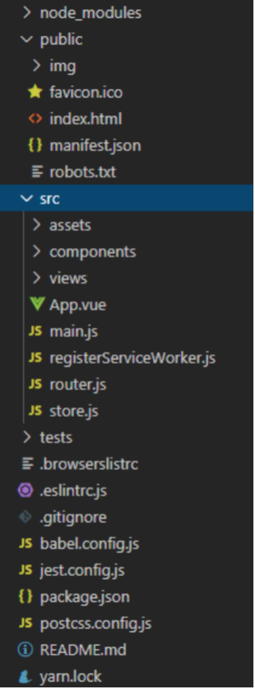
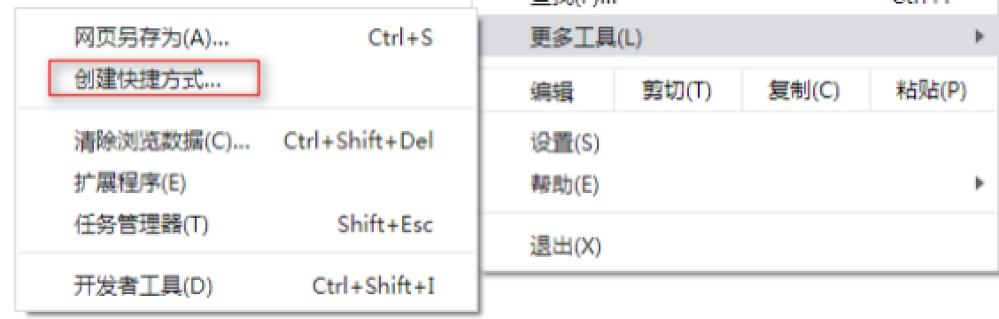

# 一、Vue Cli

我们开发项目的是时候，要做目录部署，定义webpack配置，引入各种插件，初始化vue等等，为了简化这些操作，vue提供了cli工具。提高开发效率。

## 1.1安装

我们通过npm来安装

npm install -g @vue/cli

此时提供了vue指令，通过vue -V查看版本号

cli项目也是通过yarn来管理和维护的，因此要安装yarn

npm install -g yarn

通过yarn -v查看版本号

## 1.2创建项目

我们通过 vue create指令创建项目

vue create 项目名称

此时要连网下载模块，并且要输入一些配置项

## 1.3目录部署

node_modules 	依赖模块

public 			静态资源

img 				图片

favicon.ico 		浏览器logo

index.html 		入口模板

manifest.json 		离线缓存配置

robots.txt 		搜索引擎检索配置

src 				开发目录

assets 			静态资源

components 		通用组件

views 			页面组件

App.vue			应用程序组件

router.js 			路由文件

store.js 			共享数据文件

main.js 			入口文件

registerServiceWorkers.js 	web workers

tests 			单元测试目录

.browserlistrc 		浏览器配置

.eslintrc 			es6语法校验配置

.gitignore			git提交的配置

babel.config.js 	babel配置

jest.config.js 		单元测试配置

package.json		模块配置

postcss.config.js	css预编译配置

README.md 	git说明文档

yarn.lock 			yarn锁文件

 

## 1.4启动项目

我们通过yarn serve 或者 npm run serve来启动项目

默认服务器的端口号是8080

## 1.5发布项目

我们通过yarn build或者npm run build来发布项目

默认向./dist目录下发布

## 1.6配置

我们可以通过“vue inspect > 发布文件名称”指令来发查看已有的配置。

我们还可以在vue.config.js中重写配置

例如：

通过outputDir定义资源发布的位置

通过indexPath定义模板资源发布的位置

通过publicPath定义模板引入静态资源的相对位置

通过configureWebpack定义webpack的配置

实现功能：

将静态资源发布到../dist目录下

将模板资源发布到../views目录下

cli中有两类环境：开发环境，发布环境

我们可以通过process.env.NODE_ENV变量判断环境

开发环境：development

发布环境：production

## 1.7 pwa应用

让我们可以将页面应用作为桌面应用去使用。
	pwa应用是基于离线缓存等技术实现的。

离线缓存配置：manifest.json

校验是否链接网络：registerServiceWorkers.js

我们可以在浏览器中，创建桌面快捷方式。

 

1 yarn serve

 

# 二、单元测试

为了保证项目的质量，我们要对项目做测试，基于文件（模块，组件等）的测试称之为单元测试。

我们在cli中使用的单元测试框架是jest框架

测试就是说一句话，判断是否是真的。

## 2.1测试结果

测试成功：每一次单元测试都成功

测试失败：有一次单元测试失败

## 2.2测试文件

在单元测试中，通常有三类文件可以被测试

1 放在__test__目录中的文件

2 以.test.为后缀的文件

3 以.spec.为后缀的文件（cli默认测试文件）

注意：测试文件的名字通常与被测试的文件名字同名。

## 2.3启动测试

我们通过 yarn test:unit 或者 npm run test:unit启动测试

## 2.4测试语句

describe 		对测试的整体描述

第一个参数	表示整体描述

第二个参数 	测试体

it 				单次测试

第一个参数	本次测试的描述

第二个参数	本次测试体

expect 		用来描述一句话（运行语句）

## 2.5判断结果

单元测试提供了大量的断言语句

toBe 		表示===

toEqual 	表示是否字面量相等

toMath 		是否正则匹配

toContain 	数组是否包含

toBeTruthy 是否为真

toBeFalsy 	是否为假

...

## 2.6周期方法

beforeAll 		所有it语句执行前

afterAll 		所有it语句执行后

beforeEach 	每一个it语句执行前

afterEach 		每一个it语句执行后

参数都是回调函数。

 

```
// 引入文件
import { obj, arr, add } from '@/hello';

describe('本次测试的整体描述', () => {
    // 周期方法
    // 每一个语句执行前
    // beforeEach(() => {
    //     console.log(111, 'beforeEach')
    // })
    // // 每一个it语句执行后
    // afterEach(() => {
    //     console.log(222, 'afterEach')
    // })
    // // 所有it语句执行前
    // beforeAll(() => {
    //     console.log(333, 'beforeAll')
    // })
    // // 所有的it语句执行后
    // afterAll(() => {
    //     console.log(444, 'afterAll')
    // })

    // 测试add方法
    it('测试add方法的结果', () => {
        // 断言
        expect(add(1, 2))
            // 断言结果
            .toBe(3)
            // .toBe(2)
    })
    it('测试obj对象字面量', () => {
        // 判断
        expect(obj)
            // 断言结果
            .toEqual({ color: 'red' })
            // .toEqual({ color: 'green' })
    })
    it('测试数组包含成员', () => {
        // 判断
        expect(arr)
            // 断言结果
            .toContain(2)
            // .toContain('2')
    })
})
```

 

## 2.7测试组件

我们要测试组件就要在测试文件中，引入组件。引入的组件只是Vue.extend方法的参数对象。并不是一个组件实例化对象。

转化成组件实例化对象有两种方式：

1 通过new Vue创建实例化对象

2 借助组件类创建，需要两步

第一步： let DemoComp = Vue.extend(Demo)

第二步：new DemoComp();

默认创建的组件实例化对象是没有容器元素的（$el），想获取容器元素，就要让组件上树。

通过$mount方法让组件上树。

## 2.8 $nextTick

该方法可以监听视图的更新。

实现了promise规范。我们可以通过then方法监听视图更新完毕。

## 2.9 shallowMount

vue为了方便我们测试组件，在test-utils模块中，拓展了一个方法shallowMount方法，可以帮助我们将组件实例化并上树。

第一个参数表示组件对象

第二个参数表示配置对象

propsData 	为组件传递属性数据。

得到的结果可以通过text方法获取内容。

注意：工作中，如果有很多复杂的逻辑，使用单元测试收益很大。但是如果项目只是一些静态的活动页面，我们使用单元测试收益不大。

```
// 引入vue
import Vue from 'vue';
// 引入组件
import Demo from '@/components/Demo';
// 引入创建组件的方法
import { shallowMount } from '@vue/test-utils';

describe('测试Demo组件', () => {
    // 组件实例化变量
    let demo = null;
    // 测试前
    beforeEach(() => {
        // 创建组件类
        let DemoComp = Vue.extend(Demo);
        // 实例化
        demo = new DemoComp();
        // 将组件上树
        demo.$mount();
    })
    // 测试后
    afterEach(() => {
        // 销毁组件
        demo.$destroy();
    })
    // 测试数据
    it('测试实例化对象中的数据', () => {
        // console.log(Demo)
        // 第一种方式
        // let demo = new Vue(Demo);
        // 第二种方式
        // let DemoComp = Vue.extend(Demo);
        // // 实例化
        // let demo = new DemoComp();
        // 判断
        expect(demo.msg)
            // 断言结果
            .toBe('hello')
            // .toBe('hello1')
        // 上树
        // demo.$mount()
        // console.log(demo, 111, demo.$el)
    })
    it('测试元素内容', () => {
        // 创建组件实例化对象
        // 测试元素内容
        expect(demo.$el.textContent)
            // 判断包含
            .toMatch('hello')
            // .toMatch('hello 1')
        // 修改数据
        demo.msg = 'ickt';
        // 测试结果
        // expect(demo.$el.textContent)
        //     // 断言
        //     .toMatch('ickt')
        // 监听视图更新
        demo.$nextTick()
            // 监听更新完毕
            .then(() => {
                // 测试结果
                expect(demo.$el.textContent)
                    // 断言
                    .toMatch('ickt')
            })
    })
    // 测试组件
    it('测试组件', () => {
        // 创建组件
        let wrapper = shallowMount(Demo, {
            // 属性数据
            propsData: {
                title: 'icketang'
            }
        })
        // 测试
        expect(wrapper.text())
            // 断言
            .toMatch('icketang');
    })
})
```

 

# 三、实现vue cli

通过webpack工具，实现vue cli的基本功能

## 3.1目录部署

遵守vue cli目录规范，部署目录

public 			静态资源目录

index.html		模板文件

src 			开发的目录

assets 			静态资源

components 	共享组件

views 			页面组件

App.vue 		应用程序组件

main.js 		入口文件

router.js 		路由文件

store.js 		共享数据文件

webpack.config.js 	webpack配置

## 3.2资源发布

我们将静态资源发布到../ickt/static目录下

我们将模板资源发布到../ickt/views/index.html文件中

## 3.3发布模板

发布模板要使用html-webpack-plugin插件

参数是一个对象

template 		定义模板存储位置

filename		定义模板发布位置

inject 			是否注入静态资源（默认注入）

hash 			注入的静态资源是否添加指纹

默认是以query形式，以md5算法加密的。

## 3.4拆分打包

我们将模块文件单独打包

我们将库文件单独打包

我们可以通过webpack提供了CommonsChunkPlugin插件，将库文件从模块文件中提取出来。

我们将样式文件单独打包

## 3.5拆分样式

我们通过extract-text-webpack-plugin插件拆分样式

拆分样式分成两步：

第一步 我们项目中有两类样式

一类是.vue文件中的样式文件

我们通过extractCSS配置定义

一类是.scss文件样式

我们通过extract方法引入样式

fallback定义style-loader加载机

通过use定义其余的加载机

如果是一个可以写成字符串

如果是多个，可以用数组，或者用!级联字符串

第二步 通过插件定义样式文件的发布位置。

## 3.6压缩资源

压缩js用UglifyJsPlugin插件，

注意：只能压缩ES5的语法

压缩css用optimize-css-assets-webpack-plugin插件。

```
// 引入path模块
let path = require('path');
// 引入插件
let HtmlWebpackPlugin = require('html-webpack-plugin');
// 引入插件
// let webpack = require('webpack')
// console.log(webpack)
let { CommonsChunkPlugin, UglifyJsPlugin } = require('webpack').optimize;
// 引入插件
let ExtractTextPlugin = require('extract-text-webpack-plugin');
// 压缩css
let OptimizeCssAssets = require('optimize-css-assets-webpack-plugin');
// 配置
module.exports = {
    // 解决问题
    resolve: {
        // 别名
        alias: {
            'vue$': 'vue/dist/vue.js',
            '@': path.join(process.cwd(), './src')
        },
        // 拓展名
        extensions: ['.js', '.vue', '.es']
    },
    // 入口文件
    // entry: './src/main.js',
    // 多个入口文件
    entry: {
        main: './src/main.js',
        // 库文件
        lib: ['vue', 'vuex', 'vue-router']
    },
    // 发布文件
    output: {
        // 发布相对位置
        path: path.join(process.cwd(), '../ickt/'),
        // 发布位置
        // filename: './static/main.js'
        // 设置指纹
        // filename: './static/main[hash:8].js'
        // 发布多个文件
        filename: './static/[name].js'
    },
    // 模块
    module: {
        // 加载机
        rules: [
            // es6
            {
                test: /\.js$/,
                // loader: 'babel-loader?presets[]=es2015'
                loader: 'babel-loader',
                // query
                options: {
                    presets: ['es2015']
                },
                // 包含目录
                include: path.join(process.cwd(), './src/'),
                // 排除目录
                exclude: '/node_modules/'
            },
            // vue
            {
                test: /\.vue$/,
                loader: 'vue-loader',
                // 配置
                options: {
                    // 拆分样式
                    extractCSS: true,
                    // 加载机
                    loaders: {
                        js: 'babel-loader?presets[]=es2015'
                    }
                }
            },
            // scss
            {
                test: /\.scss$/,
                // loader: 'style-loader!css-loader!sass-loader'
                // 加载机
                loader: ExtractTextPlugin.extract({
                    fallback: 'style-loader',
                    // use: 'css-loader!sass-loader'
                    use: ['css-loader', 'sass-loader']
                })
            }
        ]
    },
    // 插件
    plugins: [
        // 处理模板
        new HtmlWebpackPlugin({
            // 模板存储位置
            template: './public/index.html',
            // 模板发布位置
            filename: './views/index.html',
            // 设置hash
            hash: true
        }),
        // 拆分库文件
        new CommonsChunkPlugin('lib'),
        // 样式发布位置
        new ExtractTextPlugin('./static/style.css'),
        // 压缩js
        new UglifyJsPlugin(),
        // 压缩css
        new OptimizeCssAssets()
    ]
}
```