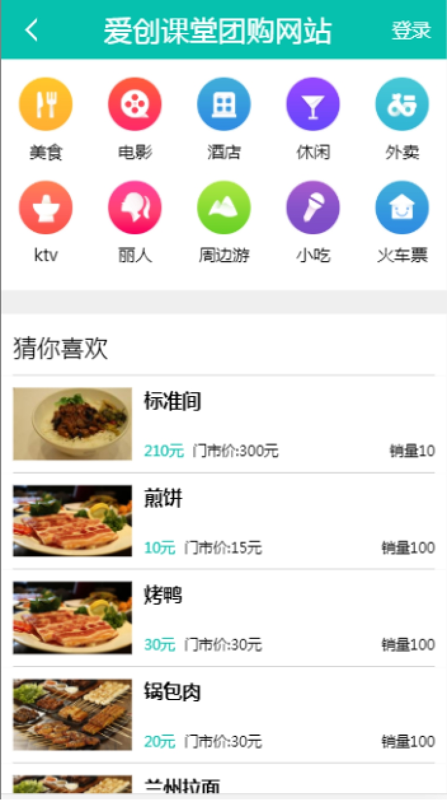
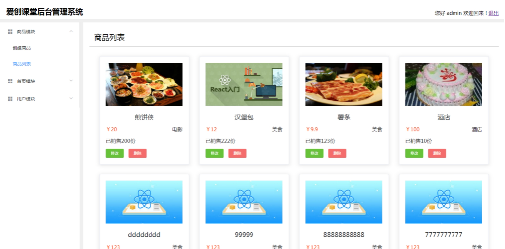
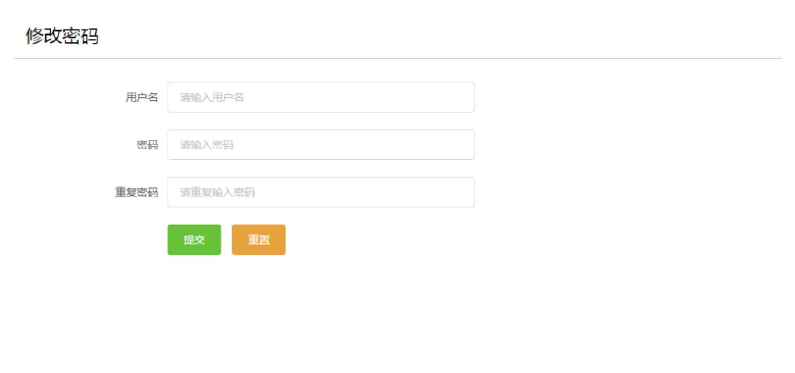
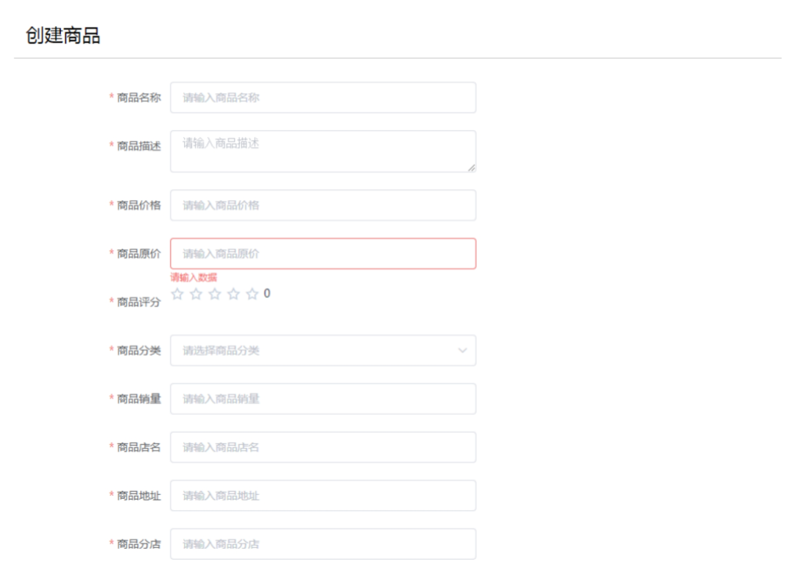
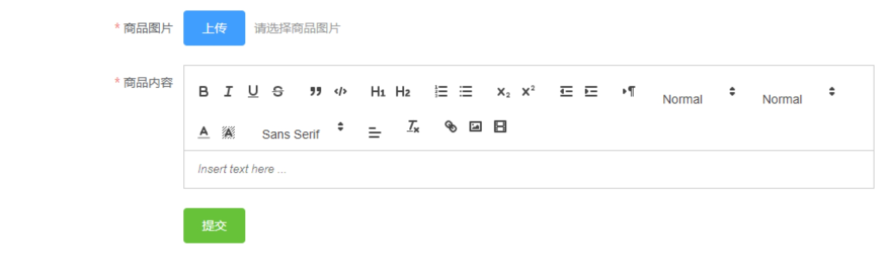
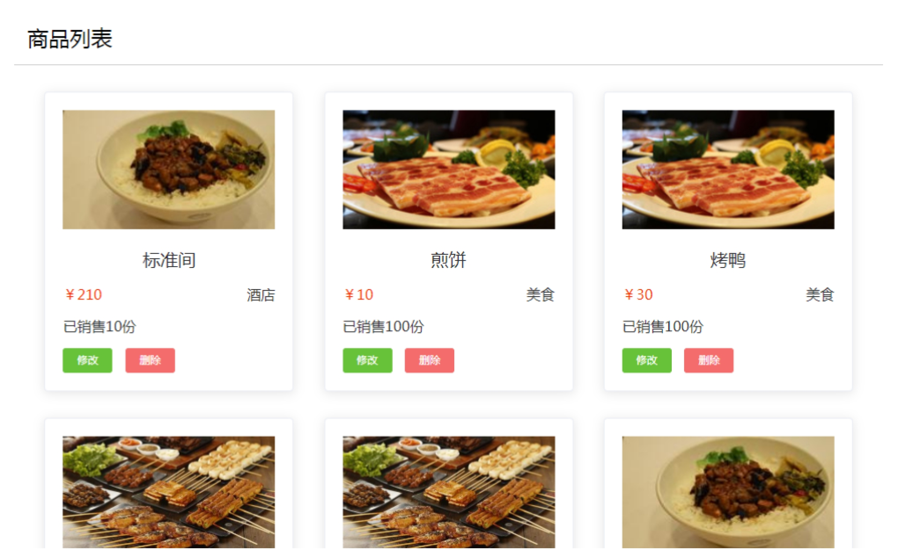
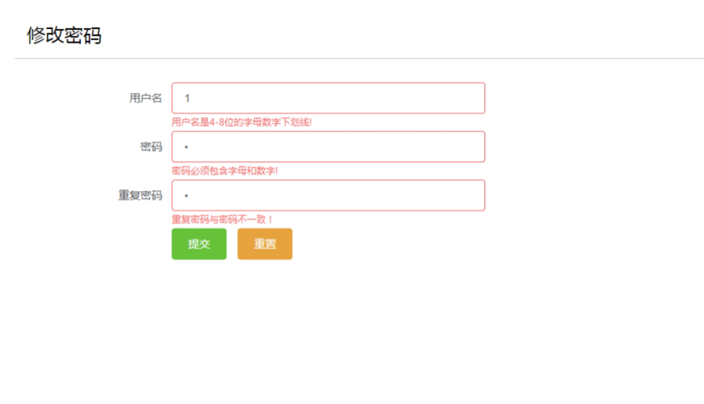

VueJS

# 一、项目实战

我们基于vue实现一个包含移动端，后台管理系统，以及服务器端与数据库的项目。

## 1.1效果图

​	

 

## 1.2目录部署

我们要开发三个模块：移动端，后台管理系统，服务器端，所以要创建三个目录。

home 		移动端

admin 		后台管理系统

server 		服务器端

## 1.3服务器

我们在server目录下简单的创建一个服务器，

实现的功能：可以在3000端口号下运行，静态化，渲染html模板，实现首页接口，可以模拟mock数据

```
// 引入express
let express = require('express');
// 引入ejs
let ejs = require('ejs');
// 引入服务器
let http = require('http')
let https = require('https')
// 引入fs
let fs = require('fs');
// 引入path
let path = require('path');

// 创建应用
let app = express();
// 修改拓展名
app.engine('.html', ejs.__express);

// 静态化
app.use('/static/', express.static(path.join(process.cwd(), './static/')))
// logo
app.use('/favicon.ico', express.static(path.join(process.cwd(), './static/favicon.ico')))

// 接口
app.get('/', (req, res) => {
    // 渲染页面
    res.render('home.html')
})

// mock数据
app.use('/data/', (req, res, next) => {
    // 添加投站吗
    // req.url += '.json'
    // console.log(req.url)
    // 切割路径
    let arr = req.url.split('?');
    // 添加拓展名
    arr[0] += '.json';
    // 拼接字符串
    req.url = arr.join('?')
    // 必须执行next
    next();
},  express.static(path.join(process.cwd(), './static/data/')))

// 端口号
let httpPort = 3000;
let httpsPort = 3001;
// 引入秘钥文件
let key = fs.readFileSync(path.join(process.cwd(), './ssl/private.pem'));
let cert = fs.readFileSync(path.join(process.cwd(), './ssl/file.crt'));

// 启动端口号
// app.listen(3000)
http.createServer(app)
    // 监听端口号
    .listen(httpPort, () => console.log('http port listen at ' + httpPort));
// https协议
https.createServer({ key, cert }, app)
    // 监听端口号
    .listen(httpsPort, () => console.log('https port listen at ' + httpsPort))
```

 

# 二、移动端

我们基于vue cli实现移动端的开发。

## 2.1技术架构

我们使用了vue, vue-rouoter, vuex, axios, vue cli, es6, ES Module, webpack, sass等技术实现移动端的开发。

## 2.2目录部署

我们基于vue cli的目录规范部署我们的项目

public 			静态资源

index.html 	模板入口文件

src 				开发目录

components 		共享组件

views 				页面组件

App.vue 			应用程序组件

main.js 			入口文件

router.js 			路由文件

store.js 			共享数据文件

## 2.3端口号

目前为止服务器端端口号是3000和3001

移动端开发时候的端口号是8080.

## 2.4资源发布

我们将静态资源发布到server/static/home

我们将模板资源发布到server/views/home.html

```
// 判断环境
// 如果是发布的环境
if (process.env.NODE_ENV === 'production') {
    // 配置
    module.exports = {
        // 静态资源发布位置
        outputDir: '../server/static/home',
        // 模板资源
        indexPath: '../../views/home.html',
        // 引入静态资源的相对位置
        publicPath: '/static/home/'
    }
} else {
    // 开发环境
    module.exports = {
        // 配置服务器
        devServer: {
            // 跨域请求代理
            proxy: {
                // 首页请求
                '/data/home': {
                    // 目标地址
                    target: 'http://localhost:3000'
                }
            }
        }
    }
}
```

 

## 2.5数据

工作中，通常有两类数据：同步数据与异步数据

### 2.5.1同步数据

同步数据就是与页面一起返回的数据，我们可以直接使用这些数据。

工作中，我们常常将一些不变的数据以及首屏的数据看成是同步的数据。

同步数据可以直接使用并渲染，因此可以让用户更快速的看到这些数据。

定义同步数据有两种方式

我们可以直接将数据打印到模板中（前后端同步渲染）

我们还可以直接写在js文件中。

### 2.5.2异步数据

对于页面首屏渲染来说，不是很重要的数据可以看成是异步数据。

异步数据需要发送异步请求获取，才能渲染，因此要晚一些渲染出来。

非首屏数据都可以看成是异步数据。

## 2.6开发流程

1 获取数据

2 分析结构写模板

3 根据效果图写样式

4 添加交互

注意：工作中，模拟数据，模拟图片等静态资源的时候，一定要与服务器端的目录层级结构相同。

```
export default {
    // 注册组件
    components: { Product },
    // 数据
    data() {
        return {
            types: [
                { id: 1, img: '01.png', text: '美食' },
                { id: 2, img: '02.png', text: '电影' },
                { id: 3, img: '03.png', text: '酒店' },
                { id: 4, img: '04.png', text: '休闲' },
                { id: 5, img: '05.png', text: '外卖' },
                { id: 6, img: '06.png', text: 'KTV' },
                { id: 7, img: '07.png', text: '丽人' },
                { id: 8, img: '08.png', text: '周边游' },
                { id: 9, img: '09.png', text: '小吃' },
                { id: 10, img: '10.png', text: '火车票' }
            ],
            // 避免数据丢失，将数据初始化。
            ad: [],
            list: []
        }
    },
    // 组件创建前
    created() {
        // 获取数据
        this.$http
            .get('/data/home')
            // 监听数据返回
            .then(({ data }) =>{
                // 存储数据
                this.ad = data.ad;
                this.list = data.list;
                // console.log(this)
            })
    }
}
```

 

## 2.7接口文档

接口文档可以保证前后端的数据的一致性。接口文档中通常包含三部分内容。

接口描述

例如：请求地址，请求方式，请求格式，编码方式等等

请求携带的数据

后端比较关注的。是后端定义的。

例如 post请求需要携带哪些数据，get请求需要携带哪些数据等等。

请求返回的数据

前端比较关注的，是前端定义的。

例如：数据的格式，类型等等。

通常文档名称就是接口地址。

注意：

工作中，大企业都有自己的接口文档平台。我们直接在平台上提交接口。

小公司没有接口文档平台，此时我们可以定义word, txt, md等格式的文档。

```
接口描述
    请求地址        /data/home
    请求方式        GET
    文档格式        application/json
    编码格式        ...
    ...
携带数据
    query数据
        num         数量
        id          id标识
    data数据
        color       颜色
        ...
返回数据
    {
        "ad": [      Array  广告数据
            {
                "title":        String  标题
                "description":  String  描述
                "_id":          String  id
                "product":      String  分类id
                "url":          String  图片地址
            }
        ],
        "list": [
            {
                "img":          String  商品图片
                "title":        String  商品标题
                "sales":        Number  商品数量
                "price":        Number  商品价格
                "originPrice":  Number  商品原价
                "_id":          String  商品id
            },
        ]
        ...
    }
```

 

## 2.8数据双向绑定

vue为了简化数据双向绑定，提供了v-model指令，我们可以将其看成是语法糖。

v-model指令简化了两个操作：

一个是数据由模型进入视图：通过绑定value属性实现的，

一个是数据由视图进入模型：通过绑定input事件实现的。

对组件实现数据双向绑定与元素是一样的：

我们通过为组件绑定value属性，实现数据由模型进入视图

我们通过为组件绑定input事件，实现数据由视图进入模型

组件的数据双向绑定也可以看成是父子组件通信模型：

父组件向子组件通信：通过绑定value属性。

子组件向父组件通信：通过绑定input事件。

```
<div class="page-list">
    <!-- <input type="text" v-model="msg"> -->
    <!-- 数据由模型进入视图，数据由视图进入模型 -->
    <!-- <input type="text" :value="msg" @input="demo"> -->
    <!-- 简化 -->
    <!-- <input type="text" :value="msg" @input="e => this.msg = e.target.value"> -->
    <!-- 防止数据丢失 -->
    <!-- <input type="text" :value="msg" @input="e => this.$set(this, 'msg', e.target.value)"> -->
    <!-- 对search组件实现数据双向绑定 -->
    <Search v-model="msg"></Search>
    <h1>list: {{msg}}</h1>
</div>
```

# 三、后台管理系统

​	我们基于vue的UI库，实现后台管理系统的开发。

## 3.1 技术架构

​	我们使用了vue，vue-router，vuex，axios，element-ui，sass，ES6，ES Module，webpack等技术实现后台管理系统的开发。

## 3.2 目录部署

​	我们参考vue cli的目录结构，来部署我们的项目。

​		public	  静态资源目录

​				index.html			模版入口文件

​		src			开发目录

​				components		共享组件

​				views					 页面组件

​				tools					  工具插件

​				App.vue				应用程序组件

​				main.js				  入口文件

​				router.js				路由文件

​				store.js				  共享数据

​		web pack.config	   webpack配置

## 3.3 资源发布

​		我们将静态资源发布到server/static/admain目录下。

​		我们将模版资源发布到server/static/admain.html文件中。

## 3.4 性能优化

​		我们将库文件打包中一起，模块文件打包在一起

​		我们将元素文件单独打包。

​		我们将静态资源添加指纹

​		我们将js与css资源压缩

​		...

## 3.5 效果图

 

 

 

 

 

```
// 引入path
let path = require('path');
// 模板
let HtmlWebpackPlugin = require('html-webpack-plugin');
// 拆分库文件
let { CommonsChunkPlugin, UglifyJsPlugin } = require('webpack').optimize;
// css拆分
let ExtractTextPlugin = require('extract-text-webpack-plugin')
// 引入vue-loader
let VueLoaderPlugin = require('vue-loader/lib/plugin')
// 压缩css
let OptimizeCssAssetsPlugin = require('optimize-css-assets-webpack-plugin');
// 配置
module.exports = {
    // 4.0
    // mode: 'development',
    // 解决问题
    resolve: {
        // 拓展名
        extensions: ['.js', '.vue', '.es'],
        // 别名
        alias: {
            'vue$': 'vue/dist/vue.js',
            '@v': path.join(process.cwd(), './src/views/'),
            '@c': path.join(process.cwd(), './src/components/'),
            '@t': path.join(process.cwd(), './src/tools/'),
        }
    },
    // 入口文件
    entry: {
        // 相对指令执行的目录
        main: './src/main.js',
        // 库文件
        lib: ['vue', 'element-ui', 'axios']
    },
    // 发布资源
    output: {
        // 发布资源的相对路径
        path: path.join(process.cwd(), '../server'),
        // 静态资源发布
        filename: './static/admin/[name].js',
        // 静态资源相对路径
        publicPath: '/'
    },
    // 模块
    module: {
        // 加载机
        rules: [
            // es6
            {
                test: /\.js$/,
                loader: 'babel-loader',
                options: {
                    // 插件, 4.0
                    presets: ['@babel/preset-env'],
                    plugins: ['syntax-dynamic-import']
                },
                include: path.join(process.cwd(), './src'),
                exclude: '/node_modules/'
            },
            // vue
            {
                test: /\.vue$/,
                loader: 'vue-loader',
                options: {
                    // 拆分样式
                    extractCSS: true
                }
            },
            // scss
            {
                test: /\.scss$/,
                // loader: 'style-loader!css-loader!sass-loader'
                loader: ExtractTextPlugin.extract({
                    fallback: 'style-loader',
                    use: ['css-loader', 'sass-loader']
                })
            }
            ,
            // css
            {
                test: /\.css$/,
                // loader: 'style-loader!css-loader'
                loader: ExtractTextPlugin.extract({
                    fallback: 'style-loader',
                    use: 'css-loader'
                })
            },
            // 字体图标
            {
                test: /\.(ttf|woff)$/,
                loader: 'url-loader'
            }
        ]
    },
    // 插件
    plugins: [
        // 模板
        new HtmlWebpackPlugin({
            // 模板
            template: './public/index.html',
            // 发布
            filename: './views/admin.html',
            // 添加指纹
            hash: true
        }),
        // 拆分库文件
        new CommonsChunkPlugin('lib'),
        // // css资源发布
        new ExtractTextPlugin('./static/admin/style.css'),
        // 使用插件
        new VueLoaderPlugin(),
        // 开发的时候不要压缩，发布的时候再压缩
        // // 压缩js
        // new UglifyJsPlugin(),
        // // 压缩css
        // new OptimizeCssAssetsPlugin()
    ]
}
```


# 四、服务器端

我们基于node和mongodb实现服务器与数据库的开发。

## 4.1技术架构

我们使用了express, https, mongodb, 文件上传，session登录等技术实现服务器端的开发。

## 4.2目录部署

ssl 			https秘钥文件

static 		静态资源

views 		模板资源

server		服务目录

cache 		缓存目录

consts 		配置

mock 		模拟数据

db 			数据库的封装

router 		路由目录

page 		页面相关路由

data 			移动端请求路由

admin 		后台管理系统请求路由

middleware 	中间件

app.js 		入口文件 

```
// 引入express
let express = require('express');
// 引入中间件
let middleware = require('./middleware');

// 创建应用
let app = express();

// 使用中间间
middleware(app)
```


# 五、数据库

## 5.1数据库导入导出数据

导出数据 mongoexport -d 数据库名称 -c 集合名称 -o 文件名称

导入数据 mongoimport -d 数据库名称 -c 集合名称 --file 文件名才能


# 六、作业

 