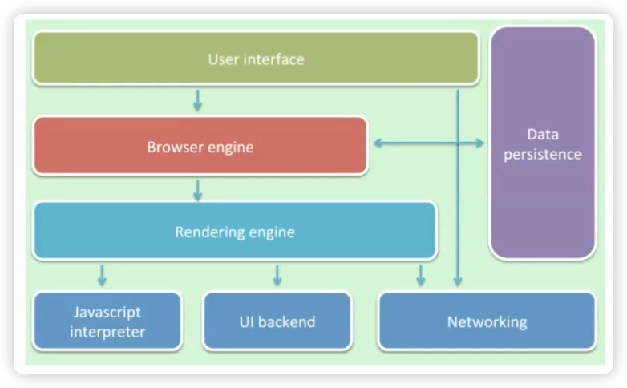
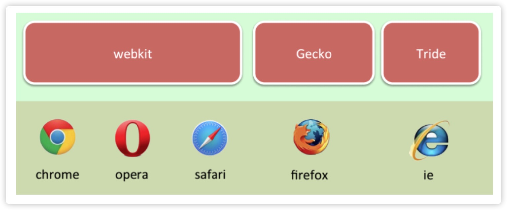
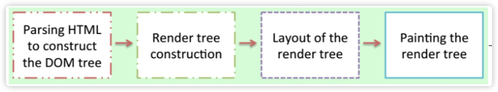
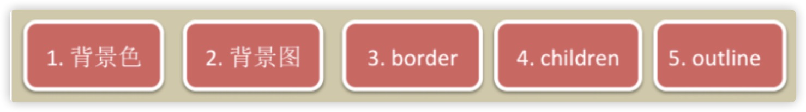
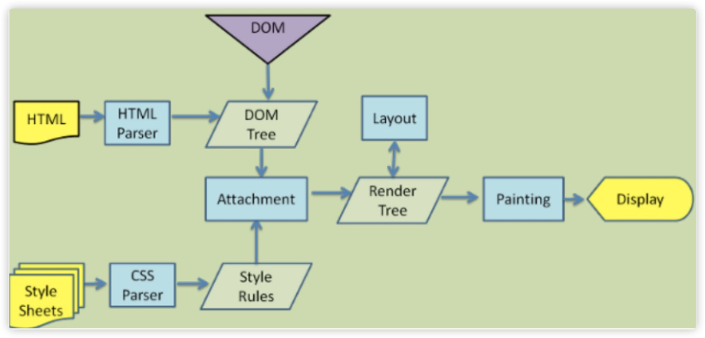
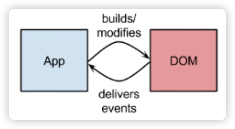
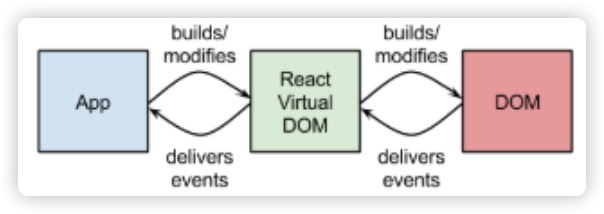
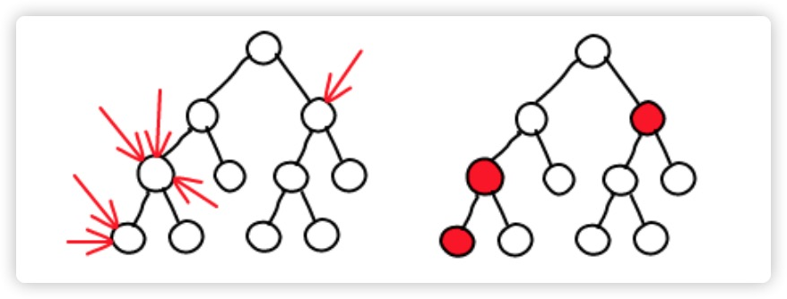
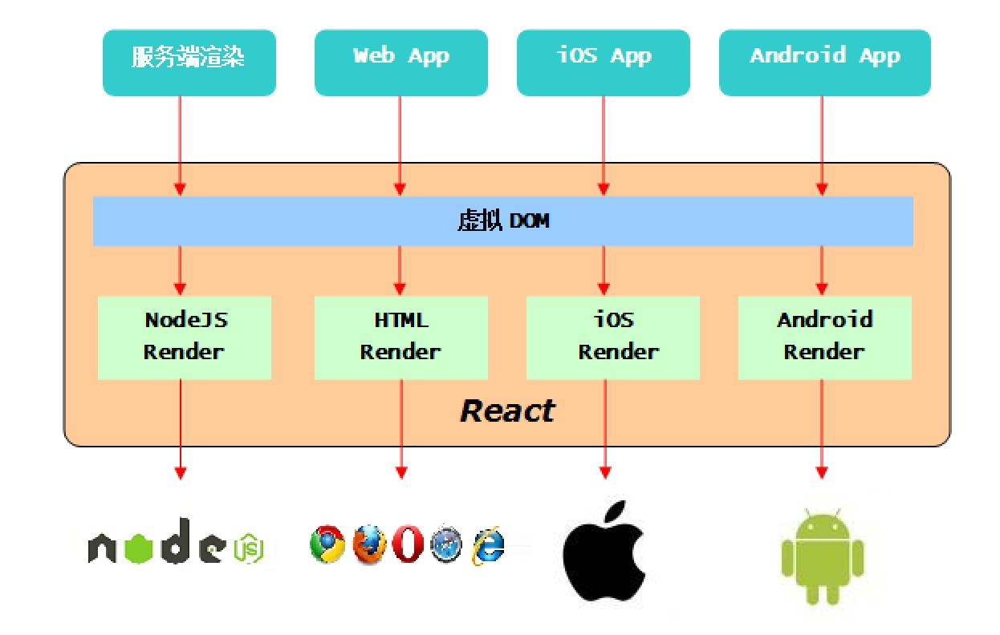
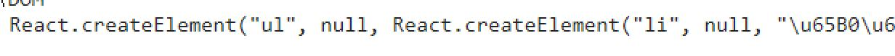

# 解析浏览器

## 浏览器主要功能


浏览器向服务发送请求，与服务器之间建立了http或https的链接

服务器端将html文档返回给浏览器端

浏览器端向服务器端发送请求，获取css资源、js资源、图片资源

css、js、jpg/pdf发送请求可以是并行的，低端浏览器（如IE6）能同时请求两个资源

高级浏览器（如chrome）能同时请求6～7个资源（大概是6个资源），这些资源是并行返回的，有了这些资源就可以在浏览器中把它们绘制出来了

**即：浏览器主要功能为把服务器的资源请求到浏览器端并将这些资源绘制在页面中让用户去浏览。**

## 浏览器主要组成部分



注意：每一个浏览器都有它自己的浏览器引擎，但是有可能是相同的渲染引擎


## 主要渲染引擎



## 渲染引擎



渲染引擎主要做了4件事：

将html文件构造成一个DOM tree -> 开始构建render tree，包含位置、大小、样式等信息 -> 为render tree 布局，确定位置、大小等信息 -> 根据位置、大小、样式等信息，绘制render tree

1 用户的请求资源通过浏览器的网络层到达渲染引擎后，渲染引擎开始工作。

2 每次渲染的文档不会超过8k的数据块。

3 渲染引擎的职责就是渲染，在浏览器窗口显示所有请求内容

## 两棵树

**DOM Tree** 全称 document object model，即我们所熟知的文档对象模型，我们可以把它看成 html 元素对外的接口，有了这些接口 Javascript开发人员才能实现复杂的页面功能，DOM 树的根节点就是 document 对象。DOM Tree 的基本单位是 node 节点，包含整个 html 文档的各个 tag，主要反应整个 webpage 情况，是对 webpage 的个写真。

**Render Tree** 由一些包含颜色大小等属性的矩形组成，他们将按照正确的顺序显示在屏幕上，Render Tree 最小单元是 RenderObject, Render Tree 每个单元都涉及页面中某块区域的布局和渲染，因此一些不涉及区域渲染的节点在 Render Tree 中是不存在的

##Layout布局

**布局** RenderObject 构造出来并没有立即添加在 Render Tree 上，它并没有位置跟大小的信息，为他确定这些信息的过程我们称之为布局。

*html 采取了一种流式布局的布局模型，从上到下，从左到右顺序布局，布局的起点是从 Render Treee 的根节点开始的，对应 DOM Tree 的根节点（document），初始位置坐标为（0,0)*

流程：每个 Renderobject 的宽度是由父节点的 Renderobject 确定，父节点遍历子节点，确定子节点的位置（x, y），调用子节点的 Layout 方法确定其高度，父节点根据子节点的 height, margin, padding 确定自身的高度

## 全局Layout和赠量Layout

**全局 Layout** 当 Layout在整棵渲染树上触发时。例如

​		一个全局样式改变影响所有渲染对象时，比如字号的改变		窗口 Resize

**增量 Layout** 只有标记为 dirty 的会重新布局（也将导致一些额外的布局）。增量 Layout 会在渲染对象 dirty 时异步触发。例如：当网络接收到新的内容并添加到 DOM 树后，新的渲染对象会添加到渲染树中。

**dirty bit 系统** 为了不因为每个小的变化都全部重新布局，浏览器使用了一个 dirty bit 系统，一个渲染对象发生了变化或者被添加了，就标记它及其子元素为dirty，一一需要 layout。存在两个标示，dirty 以及 children are dirty, children are dirty 说明即使这个渲染对象没有问题，但它至少有一个 childi需要 layout

## Painting

**绘制阶段** 遍历渲染树，并调用渲染对象的 paint 方法，将它们的内容显示在屏幕上，绘制使用 ui 基础组件

**css2 定义的渲染顺序** 一个块对象的渲染顺序是：



这个就是元素压入堆栈的顺序，这个顺序影响着绘制，堆栈从后向前进行绘制。

## 渲染引擎线程

渲染引擎是单线程的，除了网络操作外，几乎所有的事情都在单一的线程中处理，在 Firefox 和 Safari 中，就是浏览器主线程，chrome 中是 tab 的主线程。

网络操作由几个并行线程执行，并行的链接个数是受限制的（通常是 2-6 个）浏览器的主线程是一个事件循环，他被设计成无限循环以保持执行过程中可用，等待事件（例如 layout 和 paint 事件）并执行他们。

浏览器的主线程循环频率60次/秒 

flash动画 16次/秒 18次/秒

高清视频 30次/秒

使用 setInterval 时设置时间间隔不能低于浏览器的主线程循环频率每秒钟60次，即16.67ms（1s = 1000ms，浏览器主线程循环频率60次/s，1000ms/60 ≈ 16.67），否则会丢帧，因为不是等到时间就可以渲染，需要等浏览器渲染时才会渲染，一个循环中渲染两次，第一次不会被渲染，就会造成丢帧

setTimeout、setInterval渲染的时间要比结束的时间晚一点（需要等到浏览器渲染时才被渲染）

因此，html5提供了requestAnimationFrame方法，代替setTimeout和setInterval，该方法是基于浏览器的频率去绘制的

## Webkit详解渲染流程



以上步骤是一个渐进过程，为了提高用户体验，渲染引擎视图尽可能快的把结果显示给用户，他不会等待所有 html 都被解析完才创建并布局渲染树，它会从网络层获取文档内容的同时把已经接收到的局部内容先展示出来。

webkit渲染引擎工作流程：浏览器加载回来的html文件将html文件解析成一个DOM tree，这个DOM tree就可以使用DOM中的API（如innerHTML），浏览器加载回来css文件将css解析成样式规则表，样式规则表及DOM会匹配选择器最终构造出render tree，最早的render tree没有位置跟大小的信息，为了确定位置跟大小的信息进行layout布局，之后将它绘制在页面中，然后就可以在浏览器中看到页面了

## 高性能网站

减少HTTP连接请求

把部分内容压缩

避免CSS表达式

减少DMS查找

避免重定向连接

**避免大量DOM操作**

...

## 性能瓶颈之DOM操作开销

对 DM 操作的代价是高昂的，这在网页应用中的通常是一个性能瓶颈。在《高性能 Javascript》中这么比喻：“把 DOM 看成一个岛屿，把 Javascript (ECMAScript）看成另一个岛屿，两者之间以一座收费桥连接”。所以每次访问 DOM 都会交一个过桥费，而访问的次数越多，交的费用也就越多。所以一般建议**尽量减少**过桥次数。

## 减少DOM操作

对 DOM 元素的增删改查会造成页面的 **Repaint** 和 **Reflow**，循环对 DOM 操作更是罪恶的行为。所以合理的使用 Javascript 変量储存内容，在循环结束时一次性写入。

减少对 DOM 元素的查询和修改，查询时可将其赋值给局部变量。

## 革命性创新

由于 Reacte 的设计思想极其独特，性能出众，代码逻辑非常简单。被越来越多的人关注和使用，认为它将是未来 Web 开发的主流工具。

**特点：**

​		**高效：React 通过对 DOM 的模拟，最大限度地减少与 DOM 的交互**

​				虚拟DOM，有的人也翻译成react元素

​		**组件化：React 采取组件化开发，极大限度的使组件得到复用，便于开发管理与维护**

​		**适用多端：一处开发，多端适用，将颠覆整个互联网行业**

##Virtual DOM-虚拟DOM

传统的 web 应用，操作 DOM 一般是直接更新操作的，但是我们知道 DOM 更新通常是比较昂贵的。而 React 为了尽可能减少对 DOM 的操作，提供了一种不同的而又强大的方式来更新 DOM，避免直接操作 DOM。就是 Virtual DOM。一个轻量级的虚拟的 DOM，就是 React抽象出来的一个对象，用来描述 DOM 应该什么样子的，应该如何呈现。通过这个 Virtual DOM 去更新管理真实的 DOM。


##虚拟DOM实现原理



当 app 内部状态改变时，会直接修改 DOM，造成一定的操作开销，如果同时触发多个事件，事件就会不停的对 DOM 操作，而产生开销膨胀。



在 React 中，对虚拟 D0M 的操作，不会立刻映射到真实 DOM 上，这使得 React 能够等待，直至事件循环结束，在此之前完全不用操作真实的DOM。React会计算出虚拟DOM的变化（diff），并以尽少的操作将diff作用到真实的DOM上。批量DOM操作以及虚拟DOM变化检测将由React处理完成。

## 虚拟DOM变化检测



当修改虚拟DOM的时候，React会将修改的虚拟DOM节点标记为修改过（dirty），在事件循环结束时，会对所有修改过的虚拟DOM节点进行处理，并映射到真实DOM

## 我们举个例子


例如，在DOM处在左侧状态栏时，我们操作应用程序，为每一个容器设置内容，那么当虚拟DOM检测改变后不会重新创建9个容器，也不会将原来9个容器删除，因为这样开销很大，React会对比左右两种状态，发现只有容器内容发生变化了，因此它会将新的内容设置在9个容器中，减少其他操作，提高性能。


# React

**特点：**

​		高效：React 通过对 DOM 的模拟，最大限度地减少与 DOM 的交互

​				虚拟DOM，有的人也翻译成react元素

​		组件化：React 采取组件化开发，极大限度的使组件得到复用，便于开发管理与维护

​		适用多端：一处开发，多端适用，将颠覆整个互联网行业

​				为了实现多端适配的混合开发，React将拆分成两类库

​						一类是核心库：react

​						一类是渲染库：浏览器端使用react-dom



### 1.1.2 Git地址

​		[https://github.com/facebook/react](https://github.com/facebook/react)

### 1.1.3 获取React

​		npm install react react-dom

​		在ES5开发中，可以通过bower获取react.js和react-dom.js文件

​		我们使用最新版本，只能使用ES6开发。

## 1.2 创建虚拟DOM

核心库React提供了一个createElement方法来创建虚拟DOM：

​		第一个参数表示虚拟DOM名称（组件名称）

​		第二个参数表示虚拟DOM的属性对象

​		从第三个参数开始，表示子虚拟DOM

​		返回值就是一个虚拟DOM

##1.3 虚拟DOM

就是一个轻量级的js对象

type		表示虚拟DOM类型

key		  虚拟DOM唯一id标识

ref		   对页面中元素的引用

props	  所有属性数据

​		children		表示子虚拟DOM

​				如果是字符串，代表文本

​				如果是对象，代表一个虚拟DOM

​				如果是数组，代表多个虚拟DOM，数组中每一个成员代表一个虚拟DOM

## 1.4 渲染虚拟DOM

react的渲染库react-dom提供了render方法，用来渲染虚拟DOM

第一个参数表示虚拟DOM（不能是组件）

第二个参数表示真实的DOM容器元素

第三个参数函数，表示渲染成功的时候执行的方法。

```
// 创建虚拟DOM
let h1 = createElement(
	// 名称
	'h1',
	// 属性对象
	{ title: '专业前端培训学校' },
	// 其他子虚拟DOM
	createElement('span', null, 'hello'),
	// 子虚拟DOM
	'爱创课堂'
)

// console.log(h1)
// 渲染虚拟DOM
// render(h1, document.getElementById('app'), (...arg) => {
// 	 console.log('success', arg)
// })
// 工作中以及项目中，要使用标准写法：document.getElementById('app'),
render(h1, app, (...arg) => {
	console.log('success', arg)
})
```

## 1.5 组件

一个虚拟DOM与页面中的一个元素相对应。

页面中的元素有很多，因此就要创建大量的虚拟DOM。

为了复用页面中类似的虚拟DOM，我们可以使用组件。

在ES5中，创建组件：React.createElement方法创建

在ES6中，通过类来创建组件

​		class 组件名 {}

​		注意：$\color{red}{组件名首字母大写。}$

所有的组件都有一些相似的行为特征，因此react将这些相似的行为特征封装在组件的基类中：Component

​		资源为了让组件继承这些行为特征，我们要继承组件基类

​		class 组件名 extends Component {}

在组件中，我们通过render方法渲染页面

​		返回值就是组件渲染的虚拟DOM

​		注意：$\color{red}{一个组件中，只能有一个跟元素。}$

渲染库的render方法只能渲染虚拟DOM不能渲染组件，向渲染组件，要通过createElement方法将组件渲染成模拟DOM。再通过render方法渲染。

```
// 组件
class Nav extends Component {
	// 渲染
	render() {
		// 虚拟DOM
		return createElement(
			'ul',
			null,
			createElement('li', null, '好看视频'),
			createElement('li', null, '爱奇艺高清'),
			createElement('li', null, '优酷网')
		)
	}
}
// console.log(Nav);

// 将组件转化成虚拟DOM
let nav = createElement(Nav);
// 渲染
render(nav, app);
```

## 1.6 jsx语法

我们使用createElement方法创建虚拟DOM太麻烦了，因此react提供了jsx语法。

就是让我们像创建xhtml中元素一样，创建虚拟DOM

​		中xhtml中，创建div元素：			<div></div>

​		中jsx中，创建div虚拟DOM：		<div></div>

​		中xhtml中，创建input元素：		<input type="text" />

​		中jsx中，创建input虚拟DOM：	<input type="text" />

​		注意：jsx语法已经被纳入es2017规范了。

### 1.6.1 编译jsx语法

浏览器不支持jsx语法，因此我们要编译jsx语法。

我们使用es2015插件编译es6语法。

​		presets: ['es2015']

我们在ES6中使用jsx语法，要使用react插件编译

​		presets: ['es2015', 'react']

最新版本

​		presets: ['@babel/preset-es2015', '@babel/preset-react']

### 1.6.2 拓展名

为了区分es5与es6语法，我们可以将文件的拓展名定义成.es

为了区分es5与jsx语法，我们可以将文件的拓展名定义成.jsx，.esx，.tsx，.es6x ……

​		为了语义化，react团队更建议我们将拓展名定义成.jsx。



```
// 组件
class Nav extends Component {
	// 渲染
	render() {
		// 虚拟DOM
		return(
			<ul>
				<li>新浪新闻</li>
				<li>腾讯新闻</li>
				<li>观察者网</li>
			</ul>
		)
	}
}
```

## 1.7 插值语法

我们已经学过的插值语法：

​		ejs		<%=ickt%>

​		es6		${ickt}

​		less		@{ickt}

​		scss		#{$ickt}

​		小程序	{{ickt}}

​		vue		 {{ickt}}

​		...

​			我们使用插值语法的原因是：在js非可执行环境下，创建一个js可执行环境。

在react中使用的jsx语法，不是js环境，不能运行js语句，因此想运行js语句，要使用插值语法

​		语法 {提供了js环境，可以运行js语句}

​		插值语法提供了js环境，在js环境中还可以继续使用jsx语法……

​				也就是插值语法与jsx语法可以多次嵌套使用。

## 1.8 注释

jsx环境不是html环境，也不是js环境，因此不能直接使用html注释，也不能使用js注释。

想使用js注释，要创建一个js环境，可以借助插值语法。

​		注意：使用单行注释不要注释掉插值闭合符合，所有工作中，多行注释更常用。

```
// 定义组件
class Demo extends Component {
	// 渲染
	render() {
		return (
			<div>
                <h1 title={title}>hello {title}</h1>
                <h1>{title ? <a href="">{title}</a>: '默认内容'}</h1>
                <h1>{'日期：' + data.getFullYear() + '/' + (data.getMonth() + 1) + '/' + date.getDate()}</h1>
                {// 单行注释
                }
                {/**
                * 多行注释
                */}
                {/* 快速创建注释 */}
            </div>
		)
	}
}
```

## 1.9 虚拟DOM四类属性

虚拟DOM有四类属性：自定义数据属性，元素属性，特殊元素属性，非元素属性。

### 1.9.1 自定义数据属性

就是为了存储数据的属性。

属性名可以是任何名字，通常以data-开头。

### 1.9.2 元素属性

元素属性是指那些对元素有特定功能的属性，

例如：id，title，style等等

​		style的属性值必须是对象

​				style={{

​						key: value

​				}}

​		外面的{}表示插值符号

​		内部的{}表示对象符号

​				key 表示样式属性名称，建议驼峰式命名

​				value 表示样式属性值，如果是像素单位可以省略。

### 1.9.3 特殊元素属性

有两个元素属性命中了关键字和保留字。

​		class要写成className

​		for要写成htmlFor

### 1.9.4 非元素属性

这一类属性是由react拓展的，具有一定功能的属性。

#### 1.9.4.1 ref

让我们可以在组件中获取页面中真实的DOM元素。

分成两步

​		第一步 为元素设置ref属性

​		第二步 在组件中，通过this.refs获取对应的元素。

​				例如：组件创建完毕，执行componentDidMount方法，我们可以获取。

注意：获取的是源生的DOM元素，因此要使用源生的API操作该元素。

工作中，我们尽量少用，因为该属性让我们直接操作了页面中的元素，跳过了虚拟DOM环节。我们通常在第三方插件中会使用。

#### 1.9.4.2 dangerouslySetInnerHTML

以危险的（不合法的）方法设置元素的内容。

不合法的方式：

​		设置样式不能使用行内式样式字符串

​		不能使用class属性设置类

​		不能渲染标签等

​		...

我们想使用以上方式，可以使用dangerouslySetInnerHTML属性

​		属性值是对象，通过__html属性设置内容。

使用该属性，必须要保证内容是安全的（防止被注入）。

#### 1.9.4.3 key

为了给列表设置唯一属性id。

我们可以给虚拟DOM设置子虚拟DOM。

​		子虚拟DOM可以是一个，也可以是多个。如果是多个还可以写成数组，此时就要为数组中每一个成员设置key属性。

```
class Demo extends Component {
	// 方法
	createList() {
		// console.log(11111)
		// 返回数组
		// return [
        //     <li key="1">百度</li>,
        //     <li key="2">淘宝</li>,
        //     <li key="3">腾讯</li>
        // ]
        // 数组映射
        // return arr.map((item, index) => {
        //     // 通过插值语法，插入唯一的变量
        //     return <li key={index}>{item}</li>
        // })
        // 省略
        return arr.map((item, index) => <li key={index}>{item}</li>)
	}
	// 组件创建完
    componentDidMount() {
        // console.log(this)
        // 源生API操作
        this.refs.ickt.style.color = 'red';
    }
    // 渲染
    render() {
        // console.log(this)
        return (
            <div>
                {/* 自定义数据属性 */}
                <h1 ickt="demo" data-id="100">爱创课堂</h1>
                {/* 元素属性 */}
                <h1 title="专业前端培训学校" style={{
                    color: 'red',
                    fontSize: 50
                }}>爱创课堂</h1>
                {/* 特殊元素属性 */}
                <h1 className="demo">爱创课堂</h1>
                <label htmlFor="username">用户名</label><input id="username" type="text" />
                {/* 非元素属性 */}
                <h1 ref="ickt">爱创课堂</h1>
                <h1 dangerousSetInnerHTML={{__html: str}}></h1>
                {/* <ul>{[
                    <li key="1">百度</li>
                    <li key="2">淘宝</li>
                    <li key="3">腾讯</li>
                ]}</ul> */}
                {/* 通过方法创建列表 */}
                <ul>{this.createList()}</ul>
            </div>
        )
    }
}
```

