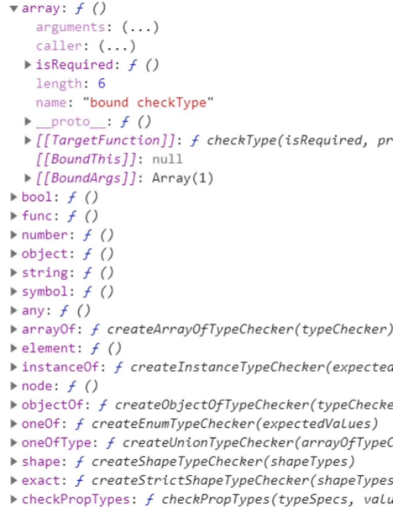

# React

## 1.1 组件属性

​		为了让组件渲染的结果具有多样性，我们要为组件传递属性数据。

### 1.1.1 传递属性

​		虚拟DOM是对真实DOM的模拟，因此它们传递属性的方式是一样的。

​				```<div id="ickt"></div>```

​		组件是对虚拟DOM的封装，因此组件与虚拟DOM传递属性的方式也是一样的。

​				```<Demo id="ickt"></Demo>```

​				在使用组件的时候，直接为组件传递属性

### 1.1.2 属性分类

​		虚拟DOM有四类属性：自定义数据属性，元素属性，非元素属性，特殊元素属性。

​		组件只有一类属性数据：自定义数据属性。

​				就是为了传递数据

### 1.1.3 使用属性

​		在组件中，我们通过this.props对象获取并使用属性数据，

​		注意：由于属性数据是在组件外部传递给组件的，因此组件只能在外部维护（修改）属性数据，绝不能在组件内部维护（修改）属性数据，在内部只能使用属性数据。

### 1.1.4 默认属性数据

​		为了保证在未传递属性数据的情况下，使用属性数据没有错误，我们可以为组件定义默认属性数据。

​				通过defaultProps静态属性定义

​		静态属性：

​				在类中，有三类数据：实例属性与方法，原型属性与方法，静态属性与方法

​				静态属性与方法是直接添加给类自身的，实例化对象无法访问，只能通过类来访问。

​						例如：Array.from，Array.of ……

​		在ES6中，为类定义静态属性和方法有两种方式：

​				第一种：通过类的点语法来定义

​				第二种：在类的代码块中，通过static关键字定义

​						方法：前面直接添加static

​						属性：为特性方法（get，set）的前面添加static关键字

​				区别：第一种没有设置特性，第二种设置了特性。

​		在react中，建议用第一种方式定义默认属性数据

​				类.defaultProps = {}

​		当我们定义了默认属性数据之后，使用的时候：

​				如果传递了属性数据，优先使用属性数据

​				如果没有传递属性数据，使用默认属性数据

### 1.1.5 属性校验

​		有时候要对属性做校验，react提供了prop-types模块，该模块提供了大量的校验方法，供我们校验数据。

​				npm i prop-types

​		我们通过propTypes静态属性，来定义属性数据的约束条件。

​				每种类型都提供了isRequired方法，说明该属性是必填的。

​						注意：使用isRequired方法的时候，不要设置默认属性数据。

 

```
// 组件
class Nav extends Component {
    // 静态属性
    static get color() {
        return 'red'
    }
    // 创建列表
    createList() {
        // 根据属性创建
        return this.props.data.map((item, index) => <li key={index}>{item}</li>)
    }
    // 渲染
    render() {
        console.log(this, 111, this.color, this.num)
        return (
            <ul>{this.createList()}</ul>
            // <ul>
            //     <li>好看视频</li>
            //     <li>爱奇艺高清</li>
            //     <li>优酷网</li>
            // </ul>
        )
    }
}

// 第一种方式
Nav.num = 100;
// 默认属性数据
// Nav.defaultProps = {
//     data: ['默认网址']
// }

// 访问
console.log(Nav.num, 222, Nav.color)
for (let key in Nav) {
    console.log('nav', key)
}

// 属性校验
console.log(PropTypes)
Nav.propTypes = {
    // data: PropTypes.string
    data: PropTypes.array.isRequired
}

// 渲染
render(<Nav data={['好看视频', '爱奇艺高清', '优酷网']} />, app)
render(<Nav data={['新浪新闻', '腾讯新闻', '观察者网']} />, app2)
render(<Nav></Nav>, app3)
```

 

## 1.2 DOM事件

为虚拟DOM绑定事件与真实DOM绑定事件是类似的:

真实DOM： <div onclick=”fn()”></div>

虚拟DOM： <div onClick={this.fn}></div>

注意：

1 事件名称首字母大写

2 通过插值语法，绑定组件中的方法

3 不要将函数执行（不要写圆括号）

4 默认参数就是事件对象

5 this默认是undefined

### 1.2.1事件对象

默认有一个参数就是事件对象。是React封装的事件对象，

因为react实现了事件委托模式：减少事件数量，预言未来元素，防止内存外泄。

react时时刻刻考虑性能问题

拓展：

1 在新版本中，将真实DOM的data-reactid属性变成点语法形式添加了。

2 在新版本中，使用插值符号的时候，建议将文本内容放在插值符号内。

并且新版本用文本节点渲染插值内容。

### 1.2.2 this指向

默认this指向undefined，想更改this的指向我们有三种方式更改。

第一种方式

在构造函数中，我们在this自身定义方法，并绑定this

我们在绑定this的到时候，可以传递其它数据

第二种方式

在定义事件的时候，直接为事件回调函数绑定this。并且还可以传递其它的参数。

与第一种方式相比：

第一种方式传递的参数是固定的，使用的是实例方法

第二种方式可以自由的传递参数，使用的是原型方法

第三种方式

在定义事件的时候，通过箭头函数来更改this指向，使其指向组件实例化对象。

我们还可以在任何位置传递参数

箭头函数可以简写，工作中更常用。

注意：第二种方式，理论上可以绑定其它对象，但是我们不建议，建议只能绑定组件实例化对象。

 

```
// 组件
class Demo extends Component {
    // 构造函数
    constructor() {
        super();
        // 第一种方式
        this.clickBtn2 = this.clickBtn2.bind(this, 100, true)
    }
    // 事件回调函数
    clickBtn(...args) {
        console.log('click btn', this, args, args[0].target, args[0].currentTarget)
    }
    clickBtn2(...args) {
        console.log(this, args);
    }
    clickBtn3(...args) {
        console.log(this, args);
    }
    clickBtn4(...args) {
        console.log(this, args);
    }
    // 渲染
    render() {
        return (
            <div>
                {/* 绑定事件 */}
                <button onClick={this.clickBtn}>btn-1</button>
                <button onClick={this.clickBtn2}>btn-2</button>
                {/* 第二种方式 */}
                <button onClick={this.clickBtn3.bind(this, 200, false)}>btn-3</button>
                {/* 第三种方式 */}
                <button onClick={(...args) => {
                    this.clickBtn4(100, true, ...args, 200)
                }}>btn-4</button>
                {/* 箭头函数简化 */}
                <button onClick={e => console.log(e, this)}>btn-5</button>
                {/* 不建议绑定其它的对象 */}
                <button onClick={this.clickBtn3.bind(obj, 100, 200)}>btn-6</button>
                <button>btn-7</button>
                <h1>hello {title}</h1>
                <h1>{'hello ' + title}</h1>
            </div>
        )
    }
}
```

 

## 1.3状态数据

状态数据与属性数据类似，都是为了给组件维护数据的。

属性数据是在组件的外部传递的，因此在组件的外部维护

状态数据是在组件的内部定义的，因此在组件的内部维护

根据组件是否有状态，可以将组件分成两类：无状态组件以及有状态组件

### 1.3.1无状态组件

当组件创建后，组件是一成不变的，组件不会与用户交互而产生数据，组件不会发送异步请求获取数据等等，这类组件就是无状态组件。（我们目前学习的组件都是无状态组件）。

由于无状态组件不需要在内部维护状态数据，因此还可以简写成函数组件

函数组件：通过函数定义的组件

参数是属性对象

返回值就是渲染的虚拟DOM

我们还可以通过箭头函数，来简化函数的定义

类组件：通过类定义的组件（我们目前定义的组件都是类组件）

### 1.3.2有状态组件

当组件创建完成，组件会因与用户交互而产生数据，组件会发送异步请求而获取数据等等，这类组件就是有状态组件。

我们要在内部维护状态数据。

### 1.3.3获取状态数据

与获取属性数据的方式类似。

获取状态数据的方式：this.state.

### 1.3.4修改状态数据

我们通过this.setState方法来修改状态数据。

参数是对象

key 		表示状态数据名称

value 		表示状态数据值

### 1.3.5初始化状态数据

我们在构造函数中，初始化状态数据。

在constructor中，通过为this.state赋值，实现状态数据的初始化、

由于组件继承了组件基类，因此要执行super方法。

构造函数的第一个参数表示属性数据对象，要传递给super方法。

如果没有传递给super方法，此时this.props是undefined与参数props不同。

如果传递给super方法，此时this.props与参数props就是相同的了

所以建议将参数props传递给super方法。

注意：工作中，由于我们可以在构造函数中，访问到属性数据，因此我们可以用属性数据为状态数据赋值，实现数据由外部流入内部。

之所以将属性数据存储到状态中，是因为属性数据只能在外部维护，而状态数据可以在内部维护，将属性数据存储到状态中，就可以在内部维护这些数据了

```
// 组件
class Ickt extends Component {
    // 构造函数
    constructor(props) {
        // 构造函数继承
        super(props);
        // console.log(props, this.props, props === this.props)
        // 初始化状态数据
        this.state = {
            // color: 'green'
            color: props.color,
            // 控制显示的页面
            num: 0
        }
    }
    // 创建每一条新闻
    createSubList(arr) {
        // 根据数组创建
        return arr.map((item, index) =>
            <div key={index}>{item}</div>
        )
    }
    // 创建列表
    createList() {
        // 获取当前的页面
        let num = this.state.num % this.props.data.length;
        return this.props.data.map((item, index) => 
            // 创建每一页
            <li key={index} style={{
                display: index === num ? '' : 'none'
            }}>{this.createSubList(item)}</li>
        );
    }
    // 切换页面
    toggle() {
        // 显示下一个页面
        this.setState({
            num: this.state.num + 1
        })
    }
    // 渲染
    render() {
        // console.log(this)
        return (
            <div>
                <span onClick={e => this.toggle()}>换一换</span>
                <ul>{this.createList()}</ul>
            </div>
        )
    }
}

// 使用
render(<Ickt color='red' data={[
    ['王力宏为医护唱歌', '郭富城母亲去世'],
    ['华为5G手机发货量', '科比追思会'],
    ['景区游览实名登记', '釜山世乒赛延期'],
    ['易建联捐赠防护服', '美股三大股指高开']
]}></Ickt>, app);
```

 

## 1.4子组件

在虚拟DOM中，可以定义子虚拟DOM，

在组件中，也可以定义子组件

```
<Parent>
    <Child />
</Parent>
```

Parent组件就是父组件

在Parent组件内部定义的Child组件就是子组件。

## 1.5组件间的通信

组件之间的通信通常有三类：

父组件向子组件通信

子组件向父组件通信

兄弟组件间的通信

### 1.5.1父组件向子组件通信

父组件向子组件通信：直接为子组件传递属性数据或者方法

属性数据：状态数据，属性数据，变量等，

方法：子组件接收方法后，有两种使用方式

第一种：作为子组件事件回调函数

默认参数是事件对象，this是undefined

我们在传递以及使用的时候可以绑定this

如果使用的时候绑定子组件，this指向子组件

一旦在传递的时候绑定了父组件，this指向父组件

我们可以传递数据：

顺序：父组件，子组件，事件对象。

第二种：在子组件方法中执行：

默认没有参数，this指向子组件属性对象

我们在传递的时候可以绑定父组件，this就永远指向父组件

我们可以传递数据

顺序：父组件，子组件。

我们在向子组件传递方法的时候，可以用箭头函数简化对父组件的绑定，工作中很常用。

工作中，建议将this指向父组件。

```
// 父组件
class Parent extends Component {
    // 构造函数
    constructor(props) {
        super(props);
        // 状态
        this.state = {
            color: 'red'
        }
    }
    // 传递的方法
    parentMethod(...args) {
        console.log(this, 111, args)
    }
    // 渲染
    render() {
        return (
            <div>
                <h1>parent part</h1>
                {/* 向子组件传递数据：变量，属性，状态 */}
                {/* <Child text="hello"></Child> */}
                {/* <Child text={this.props.msg}></Child> */}
                {/* <Child text={this.state.color}></Child> */}
                {/* 方法 */}
                {/* <Child method={this.parentMethod} text={this.state.color}></Child> */}
                {/* <Child method={this.parentMethod.bind(this, 'parent', 100)} text={this.state.color}></Child> */}
                {/* 简写成箭头函数，简化绑定父组件 */}
                <Child method={(...args) => console.log(this, 111, args)} text={this.state.color}></Child>
            </div>
        )
    }
}

// 子组件
class Child extends Component {
    // 子组件方法
    childMethod() {
        // 执行父组件传递的方法
        this.props.method('child', 200);
    }
    // 渲染
    render() {
        // console.log(this)
        return (
            <div>
                {/* 事件回调函数 */}
                {/* <h2 onClick={this.props.method.bind(this, 'child')}>{'child part -- ' + this.props.text}</h2> */}
                {/* 子组件方法中执行 */}
                <h2 onClick={this.childMethod.bind(this)}>{'child part -- ' + this.props.text}</h2>
            </div>
        )
    }
}
```

 

### 1.5.2子组件向父组件通信

父组件向子组件传递方法，并绑定父组件，此时执行方法的时候，this指向谁？通过this修改状态数据，修改的谁的状态数据呢？

子组件向父组件通信分成三步

第一步 父组件向子组件传递方法，并绑定父组件。

第二步 子组件执行方法，并传递数据

第三步 父组件接收数据，并更新状态。

工作中，在第一步传递方法的时候，为了简化对父组件的绑定，我们可以使用箭头函数。

 

```
// 父组件
class Parent extends Component {
    // 构造函数
    constructor(props) {
        super(props);
        // 状态
        this.state = {
            msg: ''
        }
    }
    // 定义方法
    // parentMethod(msg) {
    //     // console.log(msg)
    //     // 3 父组件更新状态
    //     this.setState({ msg })
    // }
    // 渲染
    render() {
        return (
            <div>
                <h1>{'parent part -- ' + this.state.msg}</h1>
                {/* 1 为子组件传递方法，并绑定父组件 */}
                {/* <Child method={this.parentMethod.bind(this)}></Child> */}
                {/* 简写成箭头函数 */}
                <Child method={msg => this.setState({ msg })}></Child>
            </div>
        )
    }
}

// 子组件
class Child extends Component {
    // 渲染
    render() {
        return (
            <div>
                {/* 执行方法，并传递数据 */}
                <input type="text" onChange={e => this.props.method(e.target.value)}/>
            </div>
        )
    }
}
```

 

### 1.5.3兄弟组件之间的通信

在同一个父组件中的定义的两个子组件互为兄弟组件。

那么兄弟组件之间如何实现通信呢？

兄弟组件之间没有必然的联系，但是它们都与父组件有关系。因此兄弟组件之间的通信我们可以看成以上两种通信的综合运用。

一个子组件将数据传递给父组件

父组件再将数据传递给另一个子组件

兄弟组件间通信共分四步

第一步 父组件向一个子组件传递方法，并绑定父组件。

第二步 子组件执行方法，并向父组件传递数据

第三步 父组件接收数据，并更新状态。

第四步 父组件将新的数据传递给另一个子组件。

兄弟组件通信的关键是有一个相同的父组件，相当于媒婆

对于不相干的两个组件之间的通信，后面会学习flux，reflux，redux等通信框架。

```
// 父组件
class Parent extends Component {
    // 构造函数
    constructor(props) {
        super(props);
        // 状态
        this.state = {
            msg: ''
        }
    }
    // 渲染
    render() {
        return (
            <div>
                <h1>parent part</h1>
                {/* 1 为子组件传递方法，并绑定父组件 */}
                {/* 3 父组件接收数据，更新状态 */}
                <Child method={msg => this.setState({ msg })}></Child>
                {/* 4 父组件将新的数据传递给另一个子组件 */}
                <Other text={this.state.msg}></Other>
            </div>
        )
    }
}

// 子组件
class Child extends Component {
    // 渲染
    render() {
        return (
            <div>
                {/* 2 子组件执行方法，并传递数据 */}
                <input type="text" onChange={e => this.props.method(e.target.value)}/>
            </div>
        )
    }
}

// 另一个子组件
class Other extends Component {
    // 渲染
    render() {
        return <h2>{'other: ' + this.props.text}</h2>
    }
}
```

 

# 作业

 