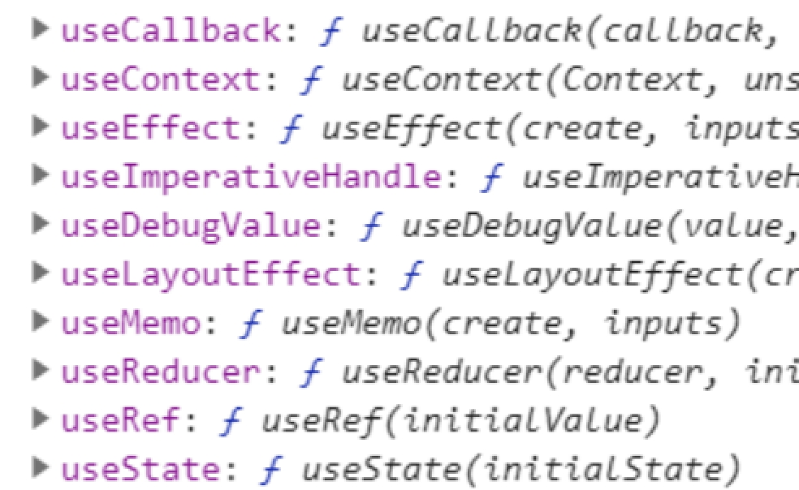
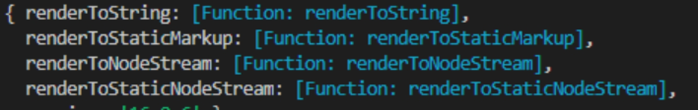

# 一、React

## 1.1高阶组件

​		react不允许我们直接修改组件，是为了保证组件的完成性。因此想为组件拓展功能，就要使用高阶组件技术。高阶组件技术的实现，有点类似装饰者模式。是对组件的包装，而不是对组件的拓展。

​				例如，使用axios的时候，我们直接使用axios，不能对组件基类拓展

​		使用高阶组件就是定义一个方法

​				方法的参数就是原来的组件以及参数

​				在方法中，定义一个新的组件类

​				我们对新组件拓展任何功能都不会影响原来的组件。

​				在类中，渲染参数组件

​						注意：我们要将高阶组件的属性数据传递给原来的组件。

​				最终返回这个新组件，

​				这个返回的组件就是高阶组件，这个方法就是高阶方法。

​		对组件拓展有两种方式：混合继承，高阶组件

​				混合继承：是对原来组件的继承，因此可以访问到原来的组件数据和方法，并且还可以重写这些数据和方法（可能会修改原来的组件）

​				高阶组件：是对原来组件的封装，因此我们拓展的新数据和方法是不会影响原来的组件的。

 

```
// 高阶方法
let log = Comp => {
    // 定义新组件
    class LogDemo extends Component {
        // 拓展新功能
        componentWillReceiveProps(props) {
            console.log(props)
        }
        // 渲染原来的组件
        render() {
            // console.log(123123213, this.props)
            // 我们要将属性传递给原来的组件
            return <Comp {...this.props}></Comp>
        }
    }
    // 返回新组件
    return LogDemo;
}

// 创建高阶组件
let LogDemo = log(Demo);
```

 

## 1.2 ref转发

​		ref转发就是让我们在组件外部访问组件内部的元素。

​		ref允许我们访问组件或者虚拟DOM。

​				我们既可以给虚拟DOM设置ref属性，也可以给组件设置ref属性

​		之前我们获取组件或者虚拟DOM有两种方式

​				第一种: 使用ref字符串

​						在组件中，通过this.refs去获取组件或者元素

​				第二种：创建ref对象

​						此时通过ref对象的current属性获取组件或者元素

### ***\*1.2.1 ref传递\****

​		ref字符串只能让我们在组件内使用组件或者元素。

​		而ref对象允许我们在组件外部获取组件内部的组件或者元素

​				我们通过为组件传递ref对象实现。

​				注意：

​						当给组件设置ref属性的时候，此时该ref对象指向组件实例

​						一个ref对象只能指向一个组件或者元素

​						当给组件设置ref属性的时候，这个ref属性起到了一定的作用，因此可以看做是组件的非元素属性，与之类似的还有key属性。

​						只有类组件可以设置ref属性，函数组件不可以

​		想让外部的ref对象指向组件内部的元素分成三步：

​				第一步 在组件外部创建ref对象

​				第二步 向组件传递ref对象，

​						注意：传递的时候，不要用ref属性传递，因为ref属性对组件是有意义的。

​				第三步 在组件中，将ref对象指向内部的其它元素。

### ***\*1.2.2取消ref指向\****

​		函数组件不能ref属性，为了可以设置ref属性，我们既要取消ref对象对函数组件的指向。

​		react提供了forwardRef方法，可以取消ref对象对组件的指向（包括函数组件和类组件）

​				forwardRef方法也是一个高阶方法。

​						参数是一个回调函数

​								第一个参数表示属性对象

​								第二个参数表示ref对象

​								我们通过forwardRef方法取消了ref指向组件的动作，因此我们就可以在回调函数中，获取ref对象，进而将ref转给组件在内部使用。

​		在高阶组件中有很多应用。

 

```
// 高阶方法
let log = Comp => {
    // 定义新组件
    class LogDemo extends Component {
        // 拓展新功能
        componentWillReceiveProps(props) {
            console.log(props)
        }
        // 渲染原来的组件
        render() {
            // console.log(123123213, this.props)
            // 我们要将属性传递给原来的组件
            return <Comp {...this.props}></Comp>
        }
    }
    // 返回新组件
    return forwardRef((props, ref) => {
        return <LogDemo {...props} icktRef={ref}></LogDemo>
    });
}

// 创建高阶组件
let LogDemo = log(Demo);

// 渲染
render(<App></App>, app)
```

 

## 1.3 hook

​		在新版本中，react提供了大量的hook方法，允许我们对函数组件做拓展。

​		函数组件是一个轻量级的组件，函数组件与类组件相比，功能少了很多，因此为了能在函数组件中，使用类组件的一些功能，react提供了hook方法，来拓展函数组件。

​				以下以use方法开头的都是hook函数

​		拓展功能例如：

​				使用状态数据

​						let [ 状态数据, 修改状态数据的方法 ] = useState(状态数据默认值)

​						此时我们用‘修改状态数据的方法’就可以更改状态数据了。组件就会进入存在期执行更新的方法。

​				生命周期方法

​						函数组件没有生命周期方法，我们可以通过useEffect函数来为函数组件拓展生命周期方法。

​						useEffect(callback)

​								callback相当有生命周期方法：componentDidMount, componentDidUpdate

​				工作中，虽然函数组件可以实现这些功能，但是都是模拟出来的，所以如果状态数据很复杂，使用很多周期方法，建议使用类组件。



 

```
// 定义组件
let App = props => {
    // let num = 0;
    // 拓展周期方法
    useEffect((...arg) => {
        console.log(222, arg)
    })
    // 状态数据
    let [num, addNum] = useState(0)
    console.log(1111, props)
    // 渲染
    return (
        <div>
            <h1>app part -- {num}</h1>
            {/* 改变数字 */}
            <button onClick={e => addNum(num + 1)}>增加数字</button>
        </div>
    )
}
```

 

# 二、服务器端渲染

​		前端渲染的主要问题：

​				1 渲染时间长，影响用户体验

​				2 无法做SEO优化

​				......

​		为了解决上述问题，react提供了服务器端渲染的技术。

​		在react架构中，核心库react只是负责创建虚拟DOM和组件，在不同端的渲染，要使用不同的渲染库。

​				浏览器端渲染：react-dom提供了渲染方法：render

​				服务器端渲染：react-dom/server.js提供了渲染方法。

## 2.1服务器端渲染

​		服务器端渲染就是将组件渲染出来，然后打印到模板中，返回给浏览器去显示。

​		服务器端渲染模块，提供了大量的方法，方便我们渲染页面

​				renderToString: 			将组件渲染成字符串

​				renderToStaticMarkup：		将组件渲染成字符串的同时会删除不必要的属性

​						例如data-reactroot等属性。

​						通常在渲染静态页的时候使用。

​				与vue的渲染方法类似，

​		服务器端渲染问题：无法绑定交互。

​		 

 

```
// 路由
app.get('/', (req, res) => {
    // ejs
    // res.render('index.html', {
    //     // 传递数据
    //     title: '爱创课堂',
    //     // content: renderToString(createElement(App, { color: 'red' }))
    //     content: renderToStaticMarkup(createElement(App, { color: 'red' }))
    // })
    // 定义数据
    let title = '爱创课堂';
    let content = renderToString(createElement(App, { color: 'red' }));
    // 不使用ejs渲染页面
    // res.end(`<!DOCTYPE html>
    // <html lang="en">
    // <head>
    //     <meta charset="UTF-8">
    //     <meta name="viewport" content="width=device-width, initial-scale=1.0">
    //     <title>${title}</title>
    // </head>
    // <body>
    //     <div id="app">${content}</div>
    // </body>
    // </html>`)
    // 多次返回内容
    res.write(`<!DOCTYPE html>
    <html lang="en">
    <head>
        <meta charset="UTF-8">
        <meta name="viewport" content="width=device-width, initial-scale=1.0">
        <title>`)
    // 返回标题
    res.write(title)
    res.write(`</title>
    </head>
    <body>
        <div id="app">`)
    // 渲染内容
    res.write(content)
    // 返回剩余
    res.end(`</div>
    </body>
    </html>`)
})
```

 

## 2.2性能优化

​		虽然服务器端渲染解决了前端渲染的问题，但是如果页面内容很多，服务器端渲染也会花费很多时间。

​		假设，渲染页面需要1000ms，用户发送请求后，就要等待1000ms才能看到结果。

​				react的解决方案，类似浏览器端渲染页面的方案、

​				react每渲染一些组件，就返回一些内容。

​						假设第一次渲染用了10ms，并返回给浏览器端，用户就可以提前990ms看到了内容。

​				为了让用户提前看到页面，react服务器端渲染提供了两个方法：

​						renderToNodeStream 			输出页面字符串

​						renderToStaticNodeStream		删除不必要的字段后，输出页面字符串

​						两者的区别与renderToString以及renderToStaticMarkup类似。

​						这两个方法实现了node中的stream流。

​								提供了pipe方法，

​										第一个参数表示响应对象res

​										第二个参数是配置对象

​												end配置：表示渲染完毕不会执行end方法，这样我们可以继续写入

​								提供了on方法

​										可以监听end事件，表示react处理完成，触发的事件

​										可以监听data事件，表示react处理时，返回内容的事件。

​										......

```
// 路由
app.get('/', (req, res) => {
    // 标题
    let title = '爱创课堂';
    // 多次返回内容
    res.write(`<!DOCTYPE html>
    <html lang="en">
    <head>
        <meta charset="UTF-8">
        <meta name="viewport" content="width=device-width, initial-scale=1.0">
        <title>`)
    // 返回标题
    res.write(title)
    res.write(`</title>
    </head>
    <body>
        <div id="app">`)
    // 写入内容
    // let stream = renderToNodeStream(createElement(App, { color: 'red' }))
    let stream = renderToStaticNodeStream(createElement(App, { color: 'red' }))
    // 通过stream渲染
    stream.pipe(res, { end: false })
    // 监听每一次写入的动作
    stream.on('data', res => console.log(res))
    // 监听stream写入完成
    stream.on('end', () => {
        console.log('end', 1111)
        // 返回剩余
        res.end(`</div>
        </body>
        </html>`)
    })
    // 渲染内容
    // res.write(content)
    // // 返回剩余
    // res.end(`</div>
    // </body>
    // </html>`)
})
```

 

## 2.3前后端同步渲染

​		前端渲染问题：

​				1 白屏时间长，影响用户体验

​				2 无法做SEO优化

​				......

​		服务器端渲染

​				无法绑定交互等等

​		所以为了解决上述问题，我们要使用前后端同步渲染的技术。

​		注意：前端环境不同，因此对应用的编译的配置不同。

## 2.4服务器端编译配置

​		在服务器端编译应用程序的配置与前端不同，

​				1 是给node使用的。

​				2 只处理应用程序，只会编译成字符串，不考虑html文件，css文件。js文件等静态资源

​						我们不需要为这些资源配置插件

​				3 node环境下使用的commonjs规范: libraryTarget: ‘commonjs2’

​				4 暴露默认的接口： libraryExport: ‘default’

​				5 服务器端只需要获取应用程序组件即可，所以前后端的入口文件不同

​				...

​		注意：前后端同步渲染的时候，给应用程序组件传递的属性数据必须一致。

## 2.5 hydrate

​		由于服务器端已经渲染了页面，所以浏览器端没有必要重新创建页面了，只需要绑定交互即可。

​		所以react提供了hydrate方法，只绑定交互而不会重新创建页面。

​				这也是为了优化性能。

​				hydrate方法使用方式跟render是一样的。

​		注意：使用前后端同步渲染技术，不要使用带static的渲染方法，因为会删除必要的属性，这样浏览器端就不知道服务器端渲染了。

```
// 引入react
import React from 'react';
// 引入渲染库
import { render, hydrate } from 'react-dom';
// 引入应用程序
import App from './App';

// 渲染
// render(<App color="#f30"></App>, app)
// 优化
hydrate(<App color="#f30"></App>, document.getElementById('app'))
```