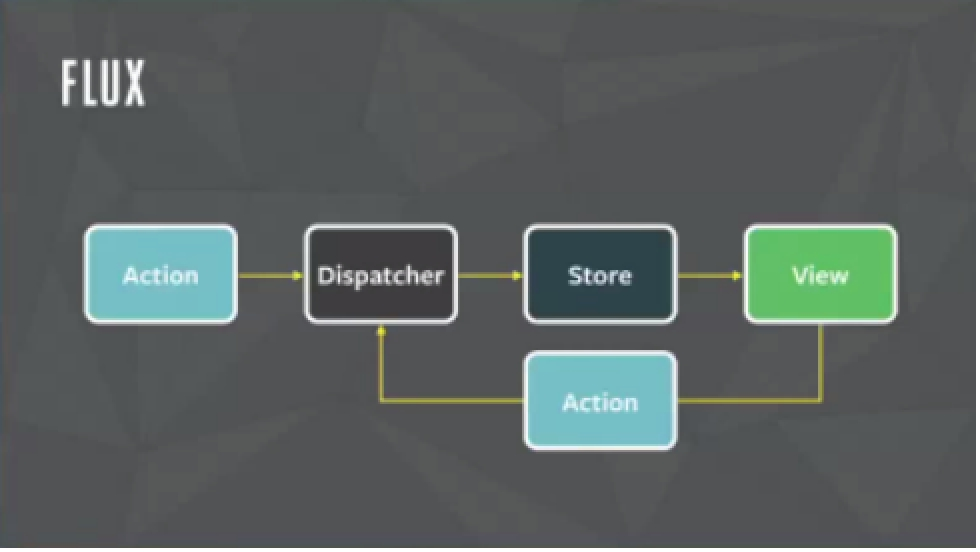
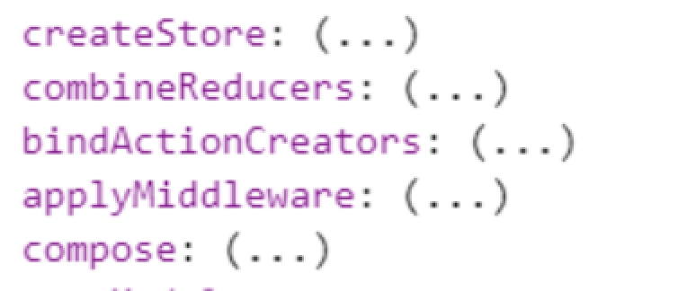

# 一、flux

​		为了简化组件通信问题，react提供了flux框架，实现了单一数据源，数据单向流动等特征。

​		解决了MVC框架的一些问题。

​		在MVC框架中，模型可以访问视图，视图可以访问模型，因此当系统足够复杂的时候，它们交织在一起，形成一个网状结构，此时增加一个模块，或者减少一个模块成本很高。

​		在flux框架中，数据沿着单一方向流动，因此当系统足够复杂的时候，这些沿着单一方向流动的数据环，让然可以看成是一个，因此增加一个模块，删除一个模块很容易。

 

## 1.1 flux的组成

​		在flux中由四部分组成：

​				view 		组件视图

​				action		用户或者视图发布的消息对象

​				dispatcher 	捕获消息对象的

​				store			存储数据

## 1.2通信流程

​		<font color="red">一个组件</font>发布一个action

​		action被dispatcher捕获到，根据消息类型处理数据

​		数据处理完成，传递给store去存储

​		store数据更新后，将新的数据传递给<font style="background: yellow">另一个组件</font>。

## 1.3 reflux和redux

​		早期react提出了flux架构思想。但是没有开源，所以很多开发者根据这一思想，创建一些通信框架：

​				reflux是基于组件的状态实现通信的

​						主要应用在es5开发中，

​				redux是基于组件的属性实现通信的

​						主要应用在es6开发中。

# 二、reflux

​		reflux简化了flux通信模型，移除了dispatcher

 

## 2.1组成部分

​		由三部分组成：

​				views 		组件视图

​				actions 		消息对象

​				stores 		存储的数据

## 2.2通信流程

​		<font color="red">一个组件</font>发布一个action

​		action被store获取，

​		store根据消息类型处理数据

​		数据改变后，store将新的数据传递给<font style="background: yellow">另一个组件</font>

​		后面我们会使用观察者模式实现reflux的通信。

# 三、redux

​		与flux类似，实现了单一数据源，数据单向流动等特征。

## 3.1组成部分

​		redux有四部分组成

​				components (view)		组件视图

​				action				消息对象

​				reducer 				处理消息模块

​				store 				存储数据的

## 3.2通信流程

​		<font color="red">一个组件</font>发布一个action

​		action经由store被reducer捕获

​		reducer根据消息类型处理数据，并将处理的结果存储在store中。

​		store中的数据改变，store将新的数据传递给<font style="background: yellow">另一个组件</font>。

 

## 3.3特点

​		redux有三大特点

​				1 单一数据源

​						一个应用程序中，有且只有一个store对象

​				2 state是只读的。

​						在store中，数据作为state来存档。

​						state是只读的，不能修改，即使在reducer中，也不能修改state，要返回新的state。

​				3 函数式编程

​						redux为了简化我们的开发，让我们用函数去定义reducer

​								一个函数就是一个reducer

## 3.4 redux模块

​		redux初衷希望像axios一样，可以在所有的框架中使用。

​		所以在不同的框架中，要使用不同的插件，

​				例如react中开发，要安装react-redux

​		redux模块提供了一些方法

​				createStore 		创建store

​						参数是reducer函数，

​						返回值就是store对象。

​				combineReducers 	合并多个reducer

​				applyMiddleware	添加中间件

​		 

## 3.5 action

​		action就是消息对象

​				type 			表示消息类型

​						消息名称字母大写，通常放在常量中

​				其它属性	表示数据

## 3.6 reducer

​		接收action并处理数据的方法

​		有两个参数

​				第一个参数表示上一个state数据

​						我们可以为其定义默认值，来初始化state

​						我们创建store的时候，会执行一次reducer方法，此时默认值就是初始化的state数据。

​								此时消息类型是@@redux/INIT

​				第二个参数表示action对象。

​		在函数中，我们根据消息对象的类型处理数据，并将处理的结果作为新的state数据并返回

​				返回值就是新的state数据对象

​		在reducer中，我们不能直接修改state数据，否则数据会丢失。

​				注意：如果state是一个值类型，可以修改

​						对于值类型来说，赋值相当于复制。

​						对于引用类型来说，赋值相当于引用。   

## 3.7 store对象

​		dispatch			发布消息的方法

​		subscribe			监听state的改变（测试使用）

​				一定要在发布消息之前监听。

​		getState 			获取state数据

​		replaceReducer 	替换reducer的方法

​		 

 

```
// 定义消息类型
const ADD_NUM = 'ADD_NUM';
const REMOVE_NUM = 'REMOVE_NUM';

// 定义action
// let addNum5 = { type: 'ADD_NUM', data: 5 }
let addNum5 = { type: ADD_NUM, data: 5 }
let removeNum2 = { type: REMOVE_NUM, data: 2 }

// 定义reducer
// 为state定义默认值，来初始化state。
function reducer(state = 0, action) {
    // console.log(state, action)
    // 根据消息类型，处理state
    switch (action.type) {
        // 增加数字
        case ADD_NUM:
            // 赋值相当于复制
            state += action.data;
            break;
        // 减少数字
        case REMOVE_NUM:
            state -= action.data;
            break;
        default:;
    }
    // 返回新的state对象
    return state;
}

// 定义store
let store = createStore(reducer)

// 监听消息
store.subscribe(() => console.log('state', store.getState()))

// console.log(store)
// 发布消息
store.dispatch(addNum5);
store.dispatch(addNum5);
store.dispatch(addNum5);
store.dispatch(removeNum2);
store.dispatch(removeNum2);
```


 

# 四、观察者模式解决组件通信问题

​		我们可以通过观察者模式解决组件间通信问题：

​				一个组件订阅消息。

​				一个组件发布消息。

​		在组件中订阅消息，就可以在回调函数中访问到组件实例。

​				因此我们就可以用接收的数据更新组件的状态，实现组件间的通信。

​		这种基于状态实现组件间通信的方式正式reflux的实现。

​				但是reflux可以存储数据

​				而观察者模式只是通信的框架，不负责数据的存储。

```
// 定义组件
class App extends Component {
    // 发布减少数字的消息
    sendRemoveNumMsg() {
        Observer.trigger('removeNum', 2)
    }
    // 渲染
    render() {
        return (
            <div>
                <button onClick={e => this.sendRemoveNumMsg()}>减少2</button>
                <hr/>
                <AddNum></AddNum>
                <ShowNum></ShowNum>
            </div>
        )
    }
}
// 增加数字组件
class AddNum extends Component {
    // 渲染
    render() {
        return (
            <div>
                <button onClick={e => Observer.trigger('addNum', 5)}>增加5</button>
                <hr/>
            </div>
        )
    }
}
// 展示数字组件
class ShowNum extends Component {
    // 构造函数
    constructor(props) {
        super(props);
        // 状态数据
        this.state = {
            num: 0
        }
    }
    // 订阅
    componentDidMount() {
        // 注册消息
        // Observer.on('addNum', (...args) => console.log('arddNum', args))
        Observer.on('addNum', num => this.setState({ num: this.state.num + num }))
        Observer.on('removeNum', num => this.setState({ num: this.state.num - num }))
    }
    // 渲染
    render() {
        return (
            <div>
                <h1>{'num: ' + this.state.num}</h1>
            </div>
        )
    }
}
```


 

# 五、redux解决组件通信问题

​		redux是一个通用的模块，因此在react中使用redux要安装相应的插件

​				npm install redux react-redux

​		redux实现通信与vuex类似。

​				在vuex中，为了让组件之间可以通信，

​						为组件拓展了commit和dispatch发布消息的方法

​						为组件拓展了state数据

​		所以在redxu中，想让组件实现通信关键是让组件获取dispatch方法以及state数据。

​		 

## 5.1 connect

​		在redux中，数据是通过属性传递的，因此connect方法是用来为组件的属性提供dispatch方法和state数据的方法

​		有两个参数，都是函数

​				第一个参数：如何向组件的属性传递state数据

​						参数表示state数据

​						返回值表示给组件的属性拓展的数据

​				第二个参数：如何向组件的属性传递dispatch方法

​						参数表示dispatch方法

​						返回值表示给组件的属性拓展的方法

​		connect方法返回值是一个高阶函数

​				该高阶函数创建的组件（高阶组件）可以获取store中的dispatch方法和state数据

​				没有被高阶函数处理的组件（原组件）不会获取数据和方法。

## 5.2 Provider

​		该组件可以给应用程序提供store数据对象

​				通过store属性传递store数据对象。

​				Provider内部的组件可以接收数据。

​		所以使用redux分成两步

​				第一步 使用connect方法，告诉组件如何接收数据和方法

​				第二步 使用Provider组件，为应用程序提供store数据源。

​		让其它的组件获取state数据和dispatch方法有两种方式。

​				第一种方式：通过父子组件通信的方式传递、

​				第二种方式：继续使用connect方法得到的高阶函数处理该组件。

 

```
let mapStateToProps = state => ({
    state,
    // 还可以拓展更多的数据
    // color: 'red'
})
// 向组件的属性拓展dispatch方法
let mapDispatchToProps = dispatch => ({
    dispatch,
    // 增加数字方法
    addNum(data) {
        // 重新发布消息
        dispatch({ type: ADD_NUM, data })
    }
}) 

// 高阶函数
let dealFn = connect(mapStateToProps, mapDispatchToProps)

// 拓展应用程序
let DealApp = dealFn(App);
let DealAddNum = dealFn(AddNum);

// 渲染
render(
    // 提供store数据源
    <Provider store={store}>
        <DealApp></DealApp>
    </Provider>
    , app)
```


 

# 六、路由

​		react三个特点：虚拟DOM，组件开发，多端适配。

​		react为了实现多端适配，为不同的端提供了不同的路由：

​				例如

​						web端使用react-router-dom

​						native端使用react-router-native

​						不论是哪个端都依赖react-router模块

​						所要安装两个模块：npm install react-router react-router-dom

​						注意：不同的react版本使用不用的路由模块。

## 6.1使用路由

​		使用路由分成两步

​				第一步 定义路由渲染的位置

​						可以通过Switch组件实现页面切换

​						可以直接通过Route组件定义路由

​								path 		定义路由规则

​										可以动态路由规则，也可以是静态路由规则

​								name 		定义路由名称

​								component 	定义渲染的组件

​								exact 		精确匹配

​				第二步 使用路由策略组件，渲染应用程序组件

​						BrowserRouter 	基于path实现的路由策略

​								类似vue路由中的history策略，需要服务器端配合

​						HashRouter 	基于hash实现的路由策略 

​		 

## 6.2路由重定向

​		我们通过Redirect组件实现路由重定向

​				from			定义匹配规则

​				to 			重定向的地址。

​		注意：在Switch组件中使用重定向。

## 6.3默认路由

​		我们让path匹配*来定义默认路由

​		由于默认路由匹配的很广，因此通常将其放在最后定义。

## 6.4路由导航

​		路由模块提供了Link组件，实现路由导航（切换页面）。

​				Link组件会根据不同的路由策略，为a标签设置不同的属性。

​				必须设置to属性，表示页面地址，即使是hash策略，也不要以#开头。

​		与a标签相比，Link组件在不同的策略下，兼容性更好。

## 6.5路由数据

​		通过Route组件渲染的页面组件会获取路由数据

​				match 		匹配的路由对象

​						params	表示动态路由参数

​				location 		模拟全局的location对象，定义的路由location对象

​						包含地址解析出来的数据

​				history 		模拟全局的history对象。包含切换路由的一些方法

​						例如：push, go, replace等等

​				staticContext 	路由上下文对象 

 

​		没有通过Route渲染的组件无法获取路由数据，想获取路由数据有两种方式

​				第一种，通过父子组件通信的方式获取

​				第二种，使用withRouter高阶方法，来创建高阶组件，高阶组件会获取路由数据，原来的组件不受影响。

```
// 应用程序
class App extends Component {
    // 渲染
    render() {
        console.log('app', this.props)
        return (
            <div>
                <h1>app part</h1>
                {/* <Header></Header> */}
                <RouterHeader></RouterHeader>
                <Switch>
                    {/* 1 路由渲染位置 */}
                    <Route path="/" exact name="home" component={Home}></Route>
                    {/* 列表页 */}
                    <Route path="/list/:page" name="list" component={List}></Route>
                    {/* 详情页 */}
                    <Route path="/detail/:id" name="detail" component={Detail}></Route>
                    {/* 从定向 */}
                    <Redirect from="/ickt" to="/detail/ickt"></Redirect>
                    {/* 默认路由 */}
                    <Route path="*" component={Home}></Route>
                </Switch>
            </div>
        )
    }
}

// 拓展高阶组件
let RouterHeader = withRouter(Header)

// 使用路由策略组件渲染应用程序
render(
    <HashRouter>
        <App></App>
    </HashRouter>
    , app)

// path策略
render(
    <BrowserRouter>
        <App></App>
    </BrowserRouter>
    , app)
```


 

## 6.6在路由中使用redux

​		在路由中使用redux就是让组件既可以获取路由的数据，也可以获取store数据

​				让组件获取store数据，可以通过dealFn拓展高阶组件实现。

​				让组件获取路由数据有两种方式：

​						1 通过Route组件渲染

​						2 通过withRouter组件拓展高阶组件

​				我们还可以父子组件通信的方式，向子组件传递store数据以及路由数据。

​		我们将路由策略组件写在Provider组件内部。

​		注意：在App组件中，通过Route组件渲染的组件与App组件不是直接的父子关系

​				Route组件与App组件才是父子关系


```
// 拓展高阶组件
let RouterHeader = withRouter(Header)

// 拓展高阶方法
let dealFn = connect(
    // 接收状态数据
    state => ({ state }),
    // 接收dispatch方法
    dispatch => ({ dispatch })
)

// 拓展App
let DealApp = dealFn(App);
let DealDetail = dealFn(Detail);

// 二次拓展
let RouterDealApp = withRouter(DealApp)

// 使用路由策略组件渲染应用程序
render(
    // 传递store数据
    <Provider store={store}>
        <HashRouter>
            {/* <DealApp></DealApp> */}
            {/* 1 route渲染App */}
            {/* <Route path="/" component={DealApp}></Route> */}
            {/* 2 多次拓展 */}
            <RouterDealApp></RouterDealApp>
        </HashRouter>
    </Provider>
    , app)
```


# 七、reducer拓展

​		路由提供了reducer，我们的应用中也定义了reuder。

​		此时就有了多个reducer，想使用多个reducer就要使用redux模块中的combineReducers方法来合并这些reducer

​				参数是一个对象

​						key 		表示命名空间

​						value 		reducer

​		合并reducer类似vue中的modules属性，对store进行切割

​				由于store中的数据是作为state来存储的，因此对store的切割就是对state的切割。

​				访问state要携带命名空间。

​		使用路由reducer要安装react-router-redux模块、


```
// 合并多个reducer
let allReducers = combineReducers({
    routerReducer,
    ickt: reducer
})

// 创建store
// 传递合并后的reducer
let store = createStore(allReducers);
```

