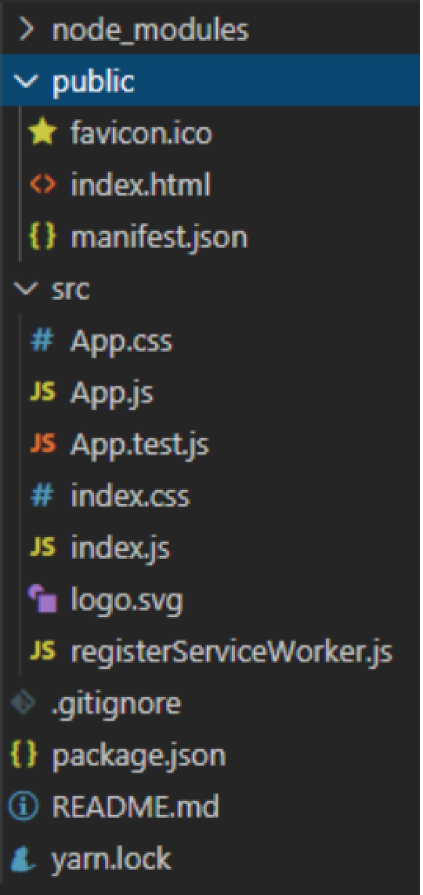

# 一、Redux
## 1.1 State拓展

​		在工作中，我们通常会将state数据定义成对象，此时我们是不能直接对state修改的。

​				之前至少有对state直接修改，是因为state是值类型的。因此赋值相当于复制。

​				如果state是引用类型的，我们直接对state修改会导致数据丢失的问题。

​		切换引用类型的state数据共分三步：

​				第一步 定义结果对象：result

​				第二步 用 action 数据修改 result

​				第三步 将 state 和 result 数据合并到一个新对象值（resul t数据覆盖 state）

​				ES提供了 Object.assign 方法，可以合并多个对象

​		注意：工作中，我们常常在第一步将 state 数据合并到 result 中，这样最后一步就可以直接返回 result 对象了。

```
// 工作中，我们可以在第一步合并state数据
function reducer(state = deafultState, action) {
    // 1 定义结果对象
    let result = Object.assign({}, state);
    // 判断消息类型
    switch (action.type) {
        // 如果是增加数字
        case ADD_NUM:
            // 值类型数据赋值相当于复制
            // state.num += action.data;
            // 2 修改result对象
            result.num += action.data;
            break;
        // 如果是减少数字
        case REMOVE_NUM:
            // state.num -= action.data;
            result.num -= action.data;
            break;
        default: ;
    }
    // console.log(state)
    // 返回新的数据。
    // return state;
    // 3 直接返回result
    return result;
}
```


## 1.2 action拓展

​		action有三类：静态 action，动态 action 和异步 action

### 1.2.1 静态 action

​		静态 action 就是一个对象

​				type 	定义类型

​				其他的属性定义数据

​		我们当前使用的 action 就是静态 action。

​		由于静态 action 中的数据是固定的，因此适用性不强。

### 1.2.2 动态action

​		动态 action 是一个方法

​				参数就是使用的时候，传递的数据

​				返回值是 action 对象

​						数据等可以通过参数来拼凑

​				由于动态 action 中的数据是灵活可变的，因此工作中常用。

​		我们在给组件属性对象拓展 dispatch 方法的时候，还可以拓展更多的方法。

​		动态 action 与属性拓展方法相比

​				属性拓展方法污染了组件的属性对象（不建议）

​				动态 action 没有污染属性对象，并且让我们可以更灵活的使用 action，因此工作中常用。

### 1.2.3 异步 action

​		工作中，我们常常会在一个组件中发送异步请求（或者执行其它的异步操作），如果获取的数据要在其它的组件中使用，我们可以将异步请求放在 action 中，这样的 action 就是一个异步 action。

​		异步 action 跟动态 action 类似，也是一个方法

​				参数就是使用方法的时候传递的数据

​				返回值也是一个方法，

​						第一个参数表示 dispatch 方法

​						在方法中我们发送异步请求，

​						请求返回数据之后，我们再使用 dispatch 方法提交同步的 action（动态 action 或者静态 action）

​				redux 默认不支持异步 action，想使用异步 action 要安装 redux-thunk 中间件插件。

## 1.3 拓展中间件

​		redux 模块提供了 applyMiddleware 方法，可以拓展中间件。

​				参数就是中间件

​				返回值是一个方法，可以用来拓展 createStore 方法

​				拓展后新的 createStore 创建的 store 对象就支持中间件的功能了。

```
// 静态action
let addNum5 = { type: ADD_NUM, data: 5 };
let removeNum2 = { type: REMOVE_NUM, data: 2 };

// 动态action
let addNum = (data) => ({ type: ADD_NUM, data })
// 存储数据
let saveTitle = data => ({ type: SAVE_TITLE, data })

// 异步action
// let getTitle = (...args) => {
//     console.log('outer', args)
//     return (...innerArgs) => {
//         console.log('inner', innerArgs)
//     }
// }
let getTitle = () => 
    // 返回的函数中，发送请求
    dispatch => {
        // 发送请求
        axios
            .get('/data/demo.json')
            // 监听数据返回
            // 数据返回，提交同步action去存储数据
            .then(({ data }) => dispatch(saveTitle(data.title)))
    }

// 安装中间件
// let newCreateStore = applyMiddleware(ReduxThunk)(createStore);
// // 新的方法创建store
// let store = newCreateStore(allReducers)
// 合并
let store = applyMiddleware(ReduxThunk)(createStore)(allReducers)
```


# 二、react-quill

​		这是一个富文本编辑器UI框架，我们直接引入就可以使用。

​				npm i quill react-quill

​		我们要手动的引入三个依赖的样式文件

​				quill/dist/quill.core.css

​				quill/dist/quill.snow.css

​				quill/dist/quill.bubble.css

​		实现数据双向绑定

​				通过value绑定状态数据

​				在 onChange 事件中，更新状态数据

```
// 组件
class App extends Component {
    // 构造函数
    constructor(props) {
        super(props);
        // 状态
        this.state = {
            msg: 'hello'
        }
    }
    // 渲染
    render() {
        return (
            <div>
                {/* 富文本编辑器 */}
                <ReactQuill value={this.state.msg} onChange={msg => this.setState({ msg })}></ReactQuill>
                <div dangerouslySetInnerHTML={{ __html: this.state.msg }}></div>
                <h1>app part</h1>
            </div>
        )
    }
}
```


# 三、antd-mobile

​		这是一个移动端的UI框架，是由蚂蚁金服团队维护的框架。

​				该 ant-design 框架包含 pc 端和移动端。

​		我们主要学习移动端的UI框架：antd-mobile

​		官网：https://ant.design/index-cn

​		移动端官网：https://mobile.ant.design/docs/react/introduce-cn

​		在移动端使用要设置mate标签。

​		该模块没有样式。要手动的引入样式：antd-mobile/dist/antd-mobile.css|less

​		React 的 UI 库的组件命名规范：首字母大写。

## 3.1 按需加载

​		在react中，我们使用UI库，react建议我们使用什么组件，引入什么组件。

​				在vue中，使用UI库的时候，建议我们引入全部，统一安装

​		因此在UI库中，一些没有用到的组件就不需要打包了。这个功能就是按需打包。

​				按需加载

​						在浏览器端，使用什么资源，加载什么资源。（seajs，requirejs）

​				按需打包

​						在开发时候，需要什么资源，打包什么资源。

​				它们都是用了做性能优化的技术。

​		react为按需打包提供了插件：babel-plugin-import插件。

​				babel 的插件在 options.plugins 中配置

​						是一个数组，每一个成员代表一个插件

​								成员可以是字符串，代表插件名称

​								成员还可以是数组，

​										第一个成员代表插件名称

​										第二个成员代表插件配置。

​												libraryName	模块名称

​												style				  样式文件

​						注意：组件一旦被按需打包，样式就会自动的加载进来了，而不需要手动的引入。

```
class App extends Component {
    // 构造函数
    constructor(props) {
        super(props);
        // 状态
        this.state = {
            msg: 'hello'
        }
    }
    // 渲染
    render() {
        return (
            <div>
                <WhiteSpace></WhiteSpace>
                <WingBlank>
                    <Button type="primary">hello</Button>
                </WingBlank>
                <Flex justify="center">
                    <Block></Block>
                    <Block></Block>
                    <Block></Block>
                </Flex>
                <InputItem 
                    placeholder="请输入用户名"
                    value={this.state.msg}
                    onChange={msg => this.setState({ msg })}
                    error={true}
                    onErrorClick={e => Toast.info('输入错误')}
                ></InputItem>
                {/* <Calendar visible={true}></Calendar> */}
            </div>
        )
    }
}
```


# 四、Element-React

​		element-react是一个react在pc端的UI框架，提供了大量的组件，方便我们的开发。

​		与element-ui是由同一个团队开发并维护的。因此它们的用法很相似。

​		官网：[https://elemefe.github.io/element-react/#/zh-CN/quick-start](#/zh-CN/quick-start)

​		elment-react没有内置样式，我们要自己安装

​				npm i element-react element-theme-default

​		我们要手动安装样式，样式中包含字体图标，因此要使用url-loader加载机。

​		组件命名规范：组件名称首字母大写。

## 4.1 表单校验

​		三个组件

​				vue						react

​				el-form				 Form

​				el-form-item 	   Form.Item（为了使用方便，我们通常将Item解构出来）

​				el-input				 Input

​		设置内容

​				1 Input 组件设置 placeholder 属性

​				2 Form.Item 组件设置 label 属性

​				3 Form 组件设置 labelWidth 属性

​		表单校验

​				1 为 Input 组件实现数据双向绑定。

​				2 为 Form 组件设置 model 属性。

​				3 为 Form.Item 设置 prop 属性

​				4 设置校验规则：为 Form 设置 rules 属性

​						是一个对象

​								key 表示字段名称

​								value 是一个数组，表示校验规则，每一个成员代表一条校验规则

​										require		   表示是否是必填的

​										message		出现问题提示的文案

​										trigger			触发校验的事件（不设置，表示一边输入一边触发）

​										validator		校验方法

​		提交表单

​				1 绑定提交事件

​				2 设置 ref 属性

​				3 使用表单组件的 validate 方法，校验是否合法。

```
<Form labelWidth="100" model={data} rules={this.rules} ref={this.login}>
    <Item label="用户名" prop="username">
        {/* <Input placeholder="请输入用户名" value={this.state.username} onChange={username => this.setState({ username })}></Input> */}
        {/* 修改的时候，不要覆盖掉原有的属性 */}
        {/* <Input placeholder="请输入用户名" value={data.username} onChange={username => this.changeValue('username', username)}></Input> */}
        {/* 当我们将所有的数据放在同一个对象中，修改的时候，千万不要覆盖原来的属性 */}
        {/* 我们还可以使用ES6中的结构语法来简化 */}
        {/* 对象复制的...语法不属于es6规范，因此编译器要换成最新的。 */}
        <Input placeholder="请输入用户名" value={data.username} onChange={username => this.setState({ data: { ...data, username } })}></Input>
    </Item>
    <Item label="密码" prop="password">
        {/* <Input placeholder="请输入密码" value={data.password} onChange={password => this.changeValue('password', password)}></Input> */}
        <Input type="password" placeholder="请输入密码" value={data.password} onChange={password => this.setState({ data: { ...data, password } })}></Input>
    </Item>
    <Item>
        <Button type="success" onClick={e => this.submitData()}>登录</Button>
    </Item>
</Form>
```


# 五、create-react-app

​		是一款 React 框架的脚手架，通过该脚手架，我们可以快速的进入开发。

## 5.1 安装

​		npm install -g create-react-app

​		安装完成，会提供 create-react-app 指令

## 5.2 创建项目

​		指令：create-react-app 项目名称

​		此时需要连接网络。

## 5.3 目录部署

​		node_modules		依赖的模块

​		public						静态资源目录

​				favicon.ico				图标

​				index.html				模版入口文件

​				manifest.json			离线缓存配置文件

​		src								开发目录

​				App.css						应用程序组件样式

​				App.js							应用程序组件脚本

​				App.test.js					应用程序组件单元测试文件

​				index.js						入口脚本文件

​				index.less					全局样式文件

​				logo.svg						react的logo

​				registerServiceWorder.js	web workers 文件

​		.gitignore			  git配置

​		package.json		包配置

​		README.md		 介绍文件

​		yarn.lock				yarn锁文件

​		 

​		create-react-app也是用 yarn 来维护 的，因此安装模块建议使用 yarn 指令

​				yarn add react-router-dom react-router redux

​				yarn add 相当于 npm install

​		组件命名规范：首字母大写。

## 5.4 指令

​		start		启动项目的指令

​				默认端口号是3000

​		build		发布项目指令

​				默认会向build目录下发布

​		test		运行单元测试指令

​		eject		发布webpack配置

​				实现功能：

​						将模版文件发布到外部的views目录下

​						将静态资源发布到外面的dist目录下

​		这些指令可以用npm运行，也可以用yarn运行。建议用yarn运行。

## 5.5 pwa应用

​		create-react-app 也实现 pwa 应用。

​		pwa应用：我们可以将网站在计算机桌面创建快捷启动图标，这样以后我们点击图标就可以打开页面了。

​		我们可以在public/manifest.json文件中修改配置。

​		`yarn start`

