# 一、单元测试

​		针对一个模块（组件，文件）的测试，被称之为单元测试

​		单元测试有两个结果

​		​		测试成功：所有的单元测试都成功

​		​		测试失败：有一个单元测试失败了

​		react也是使用了jest测试框架

​		测试文件默认以.test.为结尾的。

## 1.1测试方法

​		describe 		测试整体描述

​		​		第一个参数表示测试的整体描述

​		​		第二个参数表示测试体

​		it 			单次测试

​		​		第一个参数表示测试描述

​		​		第二个参数表示本次测试的内容

​		expect 		断言方法

​		​		参数就是执行的内容

​		​		我们可以对结果做断言

## 1.2断言方法

​		toBe     

​		​		类似于`===`     

​		​		expect(true).toBe(true);

​		toEqual 

​		​		比较变量字面量的值  

​		​		expect({ foo: 'foo'}).toEqual( {foo: 'foo'} );

​		toMatch

​		​		是否匹配正则表达式  

​		​		expect('foo').toMatch(/foo/);

​		toBeDefined

​		​		检验变量是否定义

​		​		var foo = {

​		​		​		​bar: 'foo'

​		​		};

​		​		expect(foo.bar).toBeDefined();

​		toBeNull

​		​		检验变量是否为`null`

​		​		var foo = null;

​		​		expect(foo).toBeNull();

​		toBeTruthy

​		​		检查变量值是否能转换成布尔型`真`值

​		​		expect({}).toBeTruthy();

​		toBeFalsy

​		​		检查变量值是否能转换成布尔型`假`值

​		​		expect('').toBeFalsy();

​		toContain

​		​		检查在数组中是否包含某个元素

​		​		expect([1,2,4]).toContain(1);

​		toBeLessThan

​		​		检查变量是否小于某个数字

​		​		expect(2).toBeLessThan(10);

​		toBeGreaterThan

​		​		检查变量是否大于某个数字或者变量

​		​		expect(2).toBeGreaterThan(1);

​		toBeCloseTo

​		​		比较两个数在保留几位小数位之后，是否相等,用于数字的精确比较

​		​		expect(3.1).toBeCloseTo(3, 0);

​		toThrow

​		​		检查一个函数是否会throw异常

​		​		expect(function(){ return a + 1;}).toThrow();  // true

​		​		expect(function(){ return a + 1;}).not.toThrow(); // false

​		toHaveBeenCalled

​		​		检查一个监听函数是否被调用过

​		toHaveBeenCalledWith

​		​		检查监听函数调用时的参数匹配信息

## 1.3周期方法

​		beforeEach 		每一个it语句执行前

​		afterEach			每一个it语句执行后

​		beforeAll 			所有的it语句执行前

​		afterAll 			所有的it语句执行后

```
// 引入测试的方法
import { color, arr, obj } from './demo';

// 测试
describe('测试demo文件', () => {
    // 周期方法
    // beforeEach(() => {
    //     console.log(111, 'beforeEach')
    // })
    // afterEach(() => {
    //     console.log(222, 'afterEach')
    // })
    // beforeAll(() => {
    //     console.log(333, 'beforeAll')
    // })
    // afterAll(() => {
    //     console.log(444, 'afterAll')
    // })
    it('测试color变量', () => {
        // 判断其值
        expect(color)
            // .toBe('green')
            .toBe('red')
    })
    it('测试arr数组', () => {
        // 包含成员
        expect(arr)
            .toContain(2)
            // .toContain('2')
    })
    it('测试obj对象', () => {
        // 对象字面量
        expect(obj)
            // .toEqual({ num: 200 })
            .toEqual({ num: 100 })
    })
})
```

 

## 1.4测试虚拟DOM

​		jest只是一个测试业务逻辑的框架，为了测试react中的组件，react团队提供了enzyme框架。

​		enzyme也遇到了babel编译ES语法的问题，

​				版本不停的更新，enzyme也要随之更新

​				enzyme也是提供了babel类似的解决办法，为每一个react版本提供了不同的适配器插件
​				例如16版本，就提供了16版本的适配器模块： enzyme-adapter-react-16

​						yarn add enzyme enzyme-adapter-react-16

​		为了使用不同版本的适配器，我们要在src目录下创建一个setupTests.js配置文件

​				通过enzyme的configure方法参数对象的adapter属性，引入对应版本的适配器。

​				注意：一旦执行eject指令，输出配置后，此时在寻找setupTests.js文件的时候有问题。

## 1.5 shallow

​		enzyme模块提供了shallow方法，通过该方法，我们可以在node环境下像web端那样渲染虚拟DOM。

​				所以可以测试该虚拟DOM

​		单元测试框架在测试业务逻辑的时候收益高，对于测试虚拟DOM的属性，样式等，使用浏览器更方便。所以在工作中，单元测试要慎用。

```
// 引入react
import React from 'react';
// 引入应用程序
import App from './App';
// 测试方法
import { shallow } from 'enzyme';

// 整体描述
describe('测试应用程序组件', () => {
    // 渲染的结果
    let wrapper = null;
    // it语句执行前创建
    beforeEach(() => {
        // 渲染
        wrapper = shallow(<App></App>);
    })
    // 每一个it语句执行完毕
    afterEach(() => {
        wrapper.unmount()
    })
    // 测试组件
    it('测试是否包含h1', () => {
        // 渲染组件
        // let app = shallow(<App></App>);
        // console.log(app)
        // 断言
        expect(wrapper.contains(<h1 className="App-title">Welcome to React</h1>))
            .toBeTruthy()
    })
    it('查找包含App-intro类的元素', () => {
        // 渲染组件
        // let app = shallow(<App></App>);
        // 查找
        expect(wrapper.find('.App-intro'))
            // 判断长度
            // .toHaveLength(1)
            .toHaveLength(2)
    })
    it('判断应用程序容器元素的属性', () => {
        expect(wrapper.props().className)
            .toBe('App1')
    })
})
```

 

# 二、ReactNative

## 2.1 ReactNative简介

​		react有三个特点：虚拟DOM，组件开发，多端适配

​				常见的混合开发有三类

​						第一类：类小程序开发，

​								如，微信小程序等

​						第二类：hybird，cordova等开发

​								这些应用程序用浏览器内核渲染我们的页面
​						第三类：reactnative，flutter等开发

​								用前端技术开发项目，最终编译成源生的语言去运行。

### 2.1.1安装

​		npm i -g react-native-cli

​		安装完成提供了react-native指令， 

​		github地址：https://github.com/reactnative

​		中文网站：https://reactnative.cn/docs/getting-started/

### 2.1.2创建项目

​		react-native init 项目名称

​		此时要链接网络，下载项目

### 2.1.3启动项目

​		ios端： react-native run-iso

​		android端：react-native run-android

### 2.1.4目录结构

​		\_\_tests\_\_			单元测试

​		android 			android系统编译工具

​		ios 				ios系统编译工具

​		node_modules 		依赖的模块

​		.babelrc 			babel配置

​		.开头的都是配置，通常不需要修改，

​		App.js 				应用程序组件

​		app.json			应用程序配置

​		index.js 			入口文件

​		package.json		项目的包的配置

​		yarn.lock 			yarn锁文件。

​		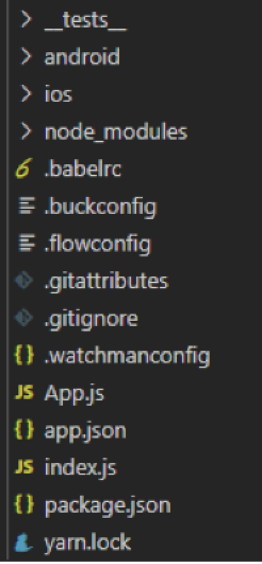 

## 2.2 mac系统安装ios

​		只需要两步

​				第一步 安装xcode开发工具。

​				第二步 创建项目并运行

## 2.3 windows系统安装android

### 2.3.1安装python

​		双击安装程序，进行下一步安装

​		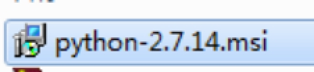 

​		<font color="red">注意：今天安装的所有软件，一定要往默认目录下安装，并且路径不要出现中文字符</font>

### 2.3.2安装java

​		双击安装程序，进行下一步安装

​				 

### 2.3.3安装sdk

​		通常有两种安装方式

​				第一种：安装sdkmanager，通过该工具安装sdk包。

​						工作中建议

​								（可选）

​				第二种：直接解压已经安装好的sdk压缩包。

​						学习中建议

​								（解压）

​										例如： 解压到d:\android-sdk

 

​				如果是第一种方式，sdk需要安装的包

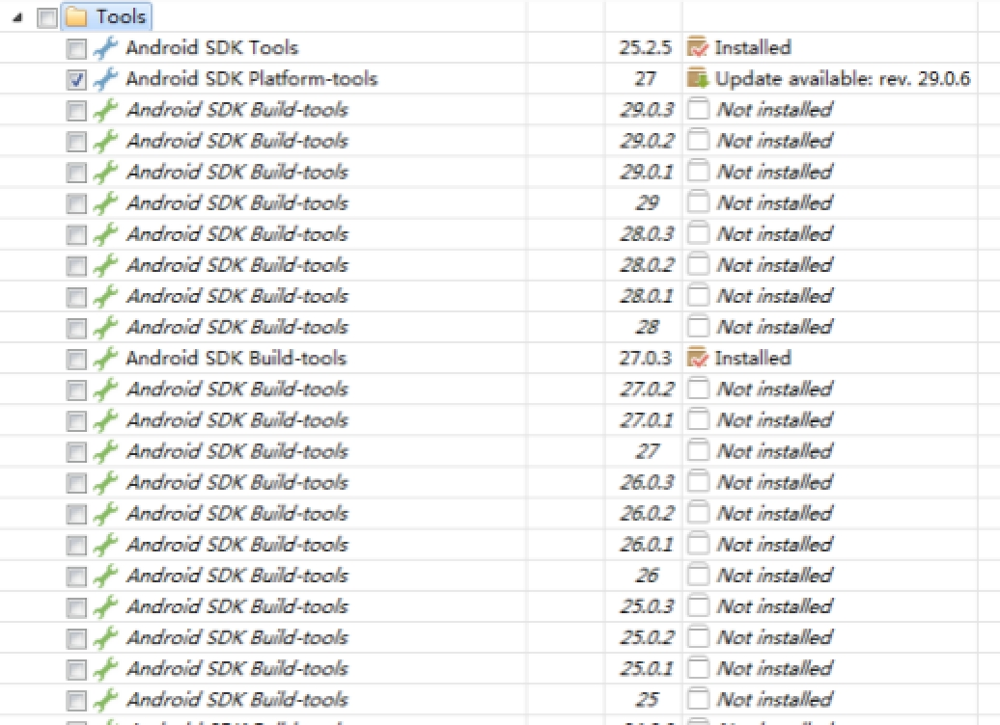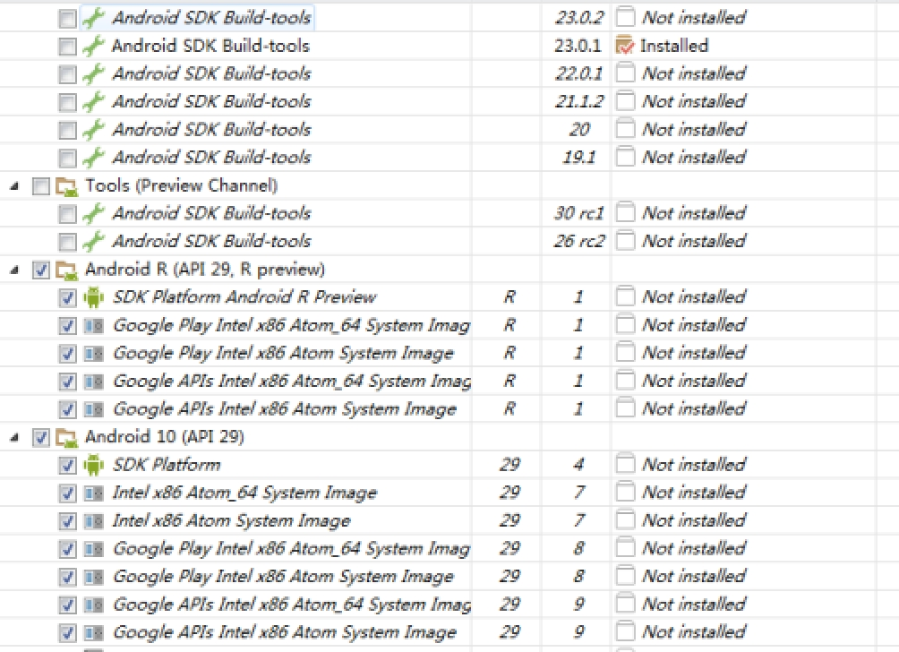 

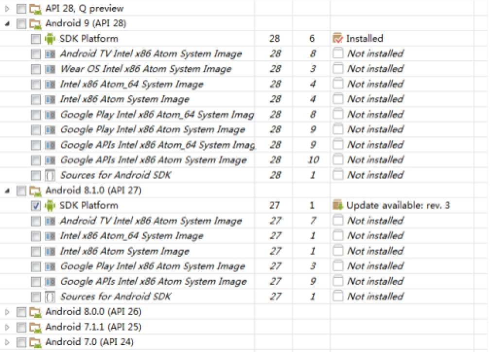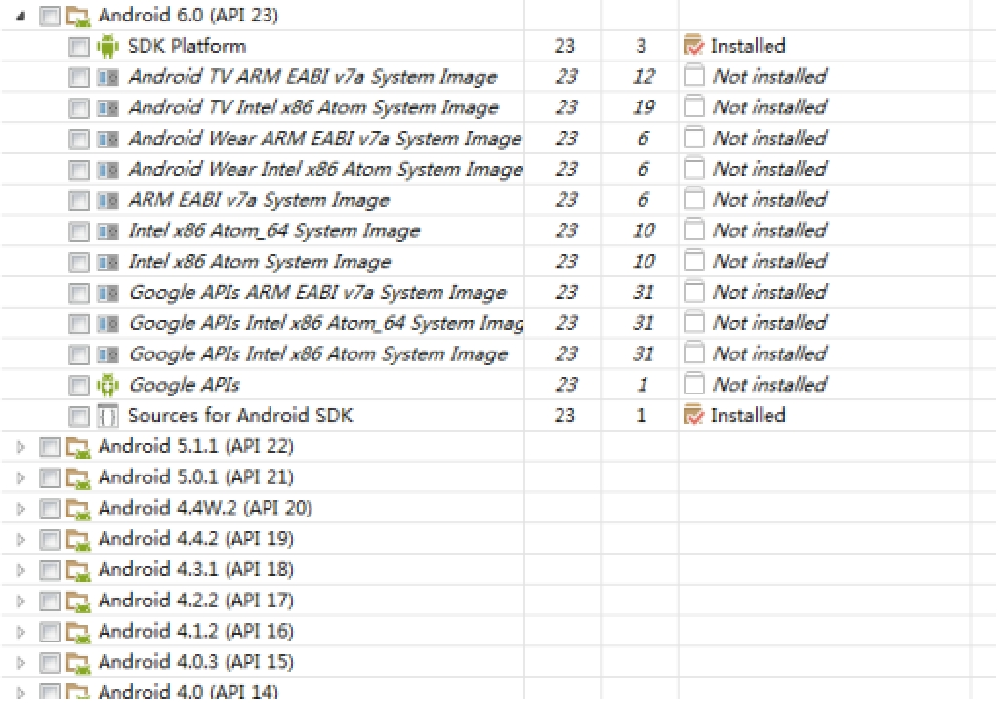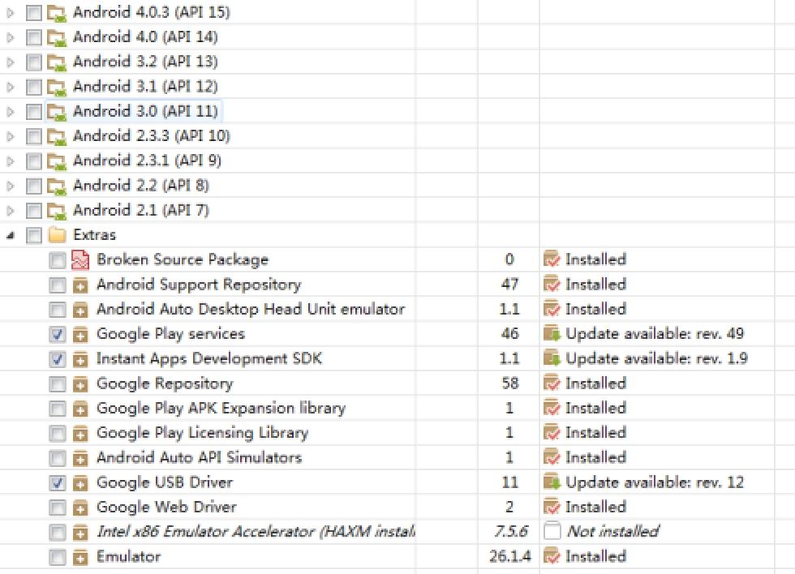 

​		安装的时候，一定要勾选accept liscense

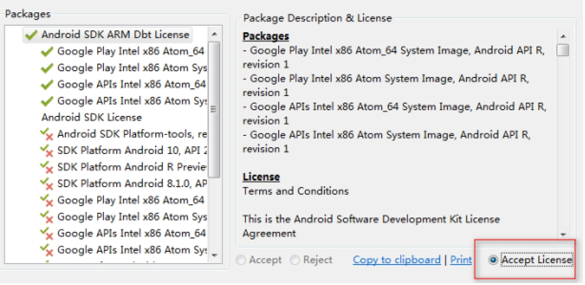 

### 2.3.4配置环境变量

​		在系统中，可以被用户使用的变量

​		打开环境变量配置菜单：在计算机图标上点击右键 => 属性 => 高级系统设置 => 环境变量

​		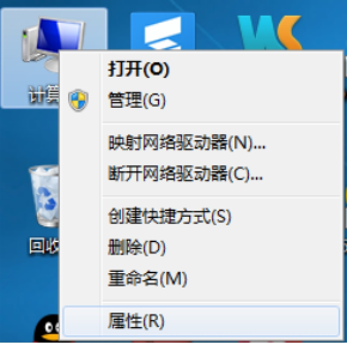 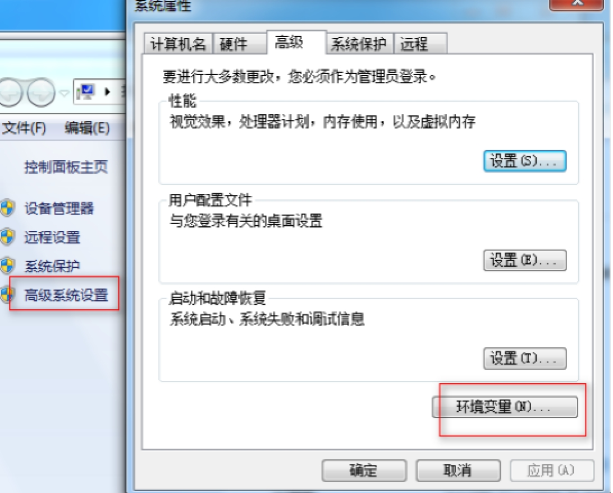

​				环境变量分成两类

​						一类是用户环境变量

​								只能对当前用户生效

​						一类是系统环境变量

​								针对所有的用户生效

​				环境变量三类操作

​						 

​						新建：创建一个新的环境变量

​								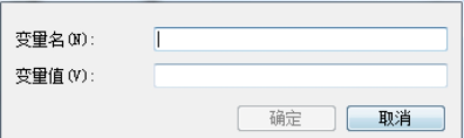 

​						编辑：修改当前的环境变量

​						删除：删除当前的环境变量

### 2.3.5配置java环境变量

​		新建JAVA_HOME环境变量

​				变量名：JAVA_HOME

​				变量值：C:\Program Files (x86)\Java\jdk1.8.0_144

​		修改path环境变量

​				添加bin目录，有两种添加方式

​						第一种：C:\Program Files (x86)\Java\jdk1.8.0_144\bin

​						第二种：%JAVA_HOME%\bin

​				添加jre\bin目录，两种方式

​						第一种：C:\Program Files (x86)\Java\jdk1.8.0_144\jre\bin

​						第二种：%JAVA_HOME%\jre\bin

​				<font color="red">统一使用第一种方式添加</font>

​				<font color="red" style="background: yellow;">注意：修改环境变量的时候，如果是win7系统的，一定要先备份再修改，路径之间用；隔开</font>

### 2.3.6配置android环境变量

​		新建ANDROID_HOME环境变量

​				变量名：ANDROID_HOME

​				变量值：d:\android-sdk

​		修改path环境变量

​				添加tools目录，两种方式

​						第一种：d:\android-sdk\tools

​						第二种：%ANDROID_HOME%\tools

​				添加platform-tools目录，两种方式

​						第一种：d:\android-sdk\platform-tools

​						第二种：%ANDROID_HOME%\platform-tools

​				<font color="red">统一使用第一种方式添加</font>

### 2.3.7测试环境变量

​		环境变量安装完成，要重启cmd。

​		测试java

​				打开cmd，输入javac指令

​		测试sdk

​				打开cmd，输入android

​				打开cmd，输入adb

## 2.4手机运行

### 2.4.1 运行步骤

​		1 用USB线链接手机和电脑。

​		2 打开手机的开发者模式

​		3 在cmd中，输入adb devices指令，确认有设备链接电脑

​		4 进入项目目录，运行react-native run-android

​		清空项目缓存指令

​				cd android		进入android目录

​				gradlew clean 		清空缓存

​				cd .. 				返回项目根目录

​		<font color="red">注意：项目的解压路径也不要出现中文</font>

### 2.3.2手机调试

​		在项目目录下，打开cmd，输入adb shell input keyevent 82

​				手机会出现设置菜单

​						reload 						重新加载页面

​						disable|enable hot reloading 	是否启动热加载

## 2.5模拟器调试

### 2.5.1安装vbox

​		双击安装程序，进行下一步安装

​				 

### 2.5.2安装genymotion

​		双击安装程序，进行下一步安装

​				 

​		启动模拟器顺序：启动vbox。再启动genymotion。

​				 

### 2.5.3注册账号并登录

​		网址：https://www.genymotion.com/account/create/

​		点击设置 => 输入用户名和密码进行登录。

​		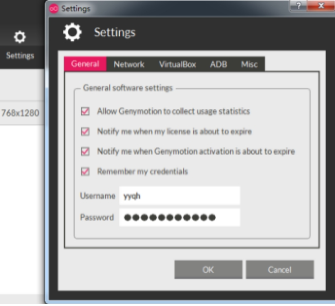 

### 2.5.4设置adb

​		点击adb面板，选择自定义adb目录，选择adk解压目录。

​				注意：根据电脑不同，有些电脑在点击browse按钮的时候，会卡顿一会。要耐心等待。

​		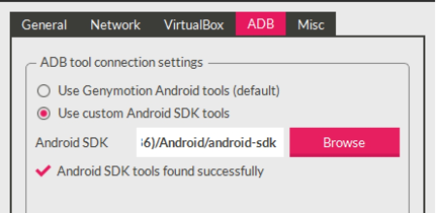 

### 2.5.5安装设备

​		点击选择设备并安装，此时需要连接网了。由于设备在国外服务器上，因此安装的时候可能会失败。

​				学习的时候，建议安装低版本。

​		手动安装

​				管理 => 导入虚拟电脑 => 选择ova文件 => 下一步 => 直到安装完毕。

​				安装完成，重启vbox和genymotion，就可以在genymotion看到一个设备。

​				双击已经安装好的设备，来启动手机模拟器。

​				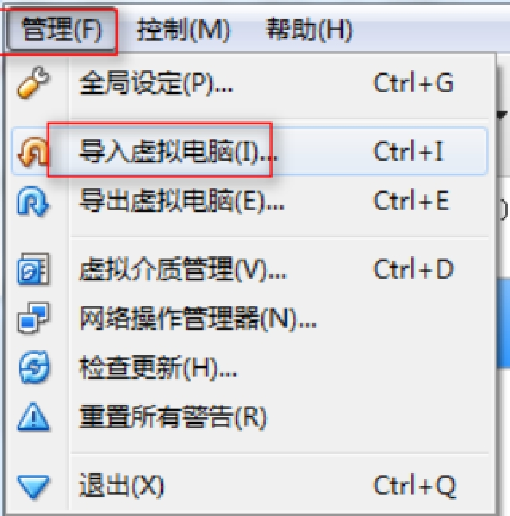 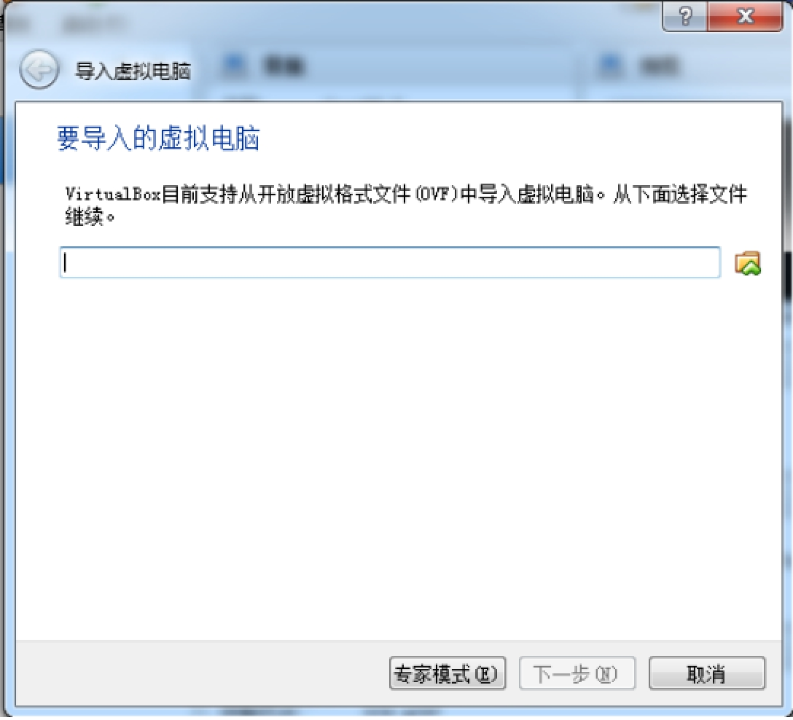

​				ova文件：

### 2.5.6运行项目

​		1 打开cmd。输入adb devices，看是否有设备链接。

​		2 进入项目目录。运行react-native run-android指令运行项目。

​		注意：第一次运行项目，需要去国外服务器上下载资源，需要一些时间，大家耐心等待。

​		我们的项目开发完毕打包后，就可以在手机上，电视上，车载系统中等等android系统下运行了。

## 2.6调试工具

### 2.6.1系统工具

​		我们点击设备的菜单按钮，可以打开设置菜单

​				reload 						重新加载项目

​				endable|disable hot reloading		是否启动热加载。

​				 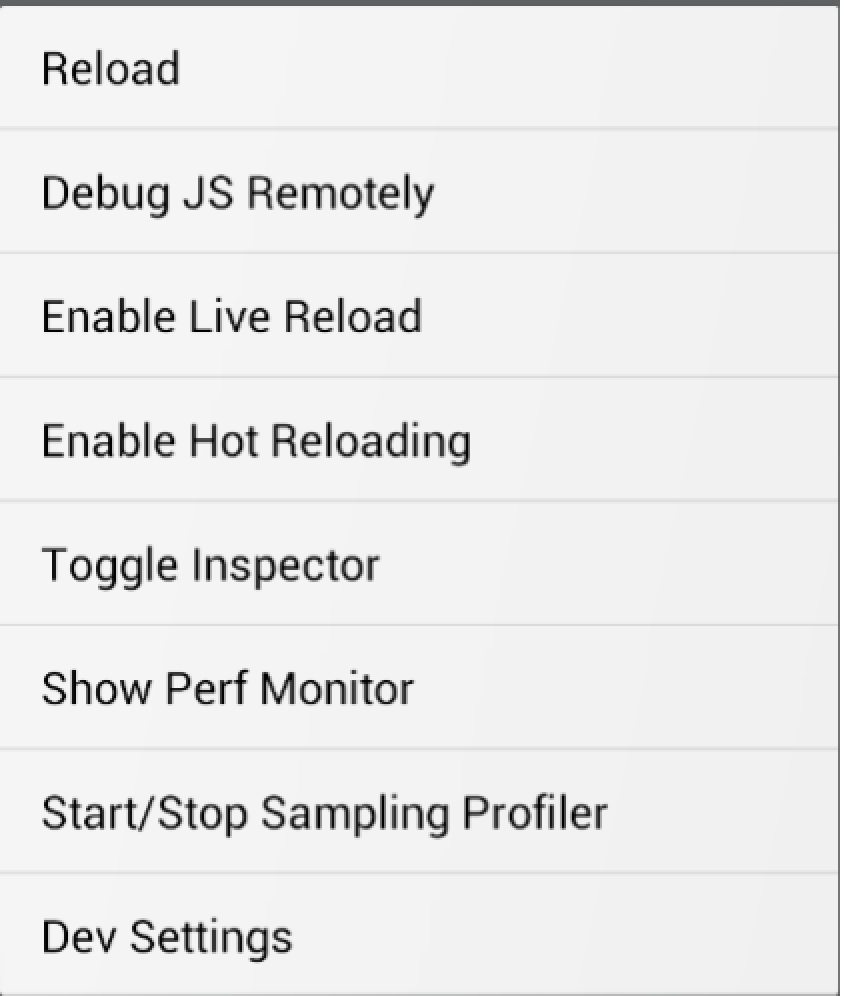

### 2.6.2打印日志

​		react-native提供了log指令，可以打印日志。

​				ios系统下：		react-native log-ios

​				android系统下：	react-native log-android

​		注意：要在项目的目录下运行。

### 2.6.3查看虚拟DOM

​		react提供了一个调试虚拟DOM的工具：react-devtools。我们要安装

​				npm i -g react-devtools@3.6			

​				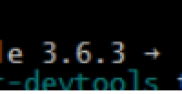 

​		通过该工具，我们可以查看到虚拟DOM的层级结构，属性数据，状态数据，上下文数据，盒模型，样式，文件，DOM树等信息。

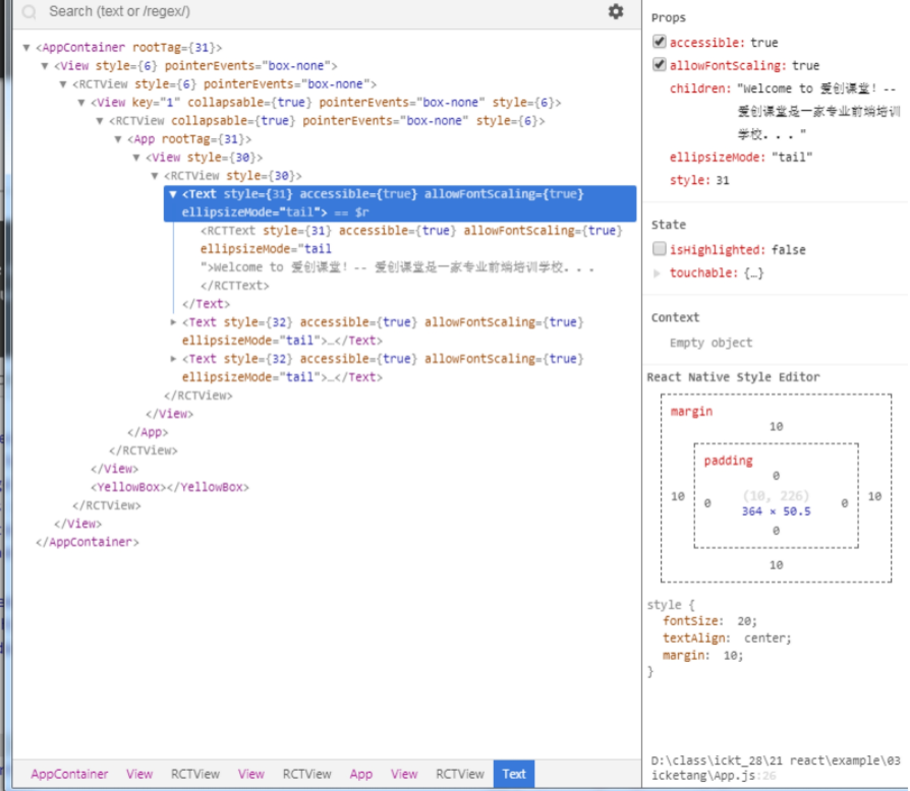 

## 2.7组件

​		react实现了多端适配，因此我们可以通过核心库（react）创建虚拟DOM和组件，然后在不同的端用不同的渲染库去渲染。

​				web端：render | hydrate

​				node端：renderToString | renderToStaticMarkup | renderToNodeStream | renderToStaticNodeStream

​				ios端 | android 端：registreComponent

​		在native中，创建组件与web端创建组件的语法是一样的。

​				基于ES6语法，定义组件和虚拟DOM

​						class 组件名称 extends Component<{}> {}

​								<{}>是ts语法中的泛型，用来说明前面的数据的类型的。

​								我们在开发中，也可以不用定义。

​						组件也是具有属性数据，状态数据，生命周期方法等等。

​		native不是web环境，因此不支持web中的元素，所以react-native模块提供了大量的组件，可以代替这些元素。

​				例如： 

​						div元素可以用View（容器）组件定义

​						span元素可以用Text（文本）组件定义

```
// 引入库
import React, { Component } from 'react';
// 引入组件
import { View, Text } from 'react-native';


// 定义组件
export default class App extends Component {
    // 构造函数
    constructor(props) {
        super(props);
        // 状态
        this.state = {
            msg: 'hello 爱创课堂！'
        }
    }
    // 周期方法
    componentDidMount() {
        console.log(222, 'componentDidMount')
    }
    // 渲染方法
    render() {
        // 解构
        let { msg } = this.state;
        return (
            <View>
                <Text>hello</Text>
                <Text>{msg}</Text>
                <Text>{msg}</Text>
            </View>
        )
    } 
}
```

 