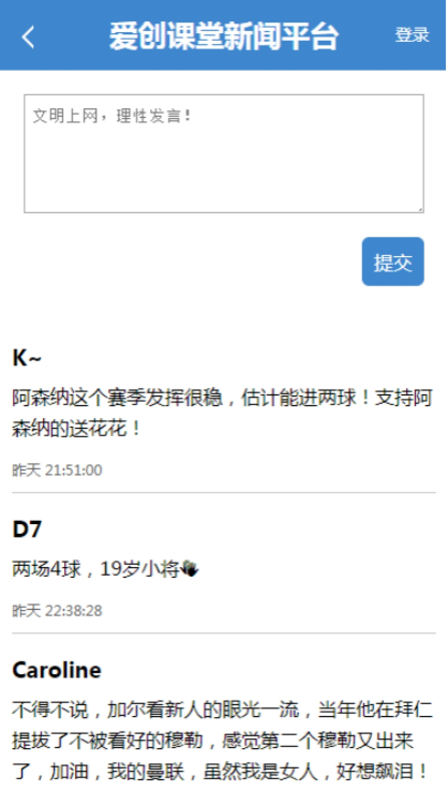

# 一、ReactNative

## 1.1样式

​		react-native不是web环境，因此不能使用css，但是我们可以为组件设置style属性来添加样式。

​				样式是一个对象

​						key 		表示样式名称，要使用驼峰式命名

​						value 	表示样式属性值

​								如果是长度，不要带单位

​		为了复用样式，react-native提供了StyleSheet.create方法来创建样式，是一个对象

​				key		表示一组样式名称（选择器）

​				value	就是一组样式

​				我们通过该形式可以复用样式。

​				注意：StyleSheet.create方法创建的结果对象中，key对应的属性值是该样式对象数据存储的地址

​				使用这种方式设置样式，可以简化虚拟DOM属性的设置，避免jsx语法中，出现样式臃肿问题。

​		在react-native中，不能使用复合样式，

​				例如 padding: 20 40 60; 是不允许的。

​						我们要单独定义

​								paddingTop: 20

​								paddingBottom: 60

​								paddingLeft: 40

​								paddingRight: 40

​		在react-native中，每一个组件设置的样式是受到限制的。

​				例如View组件不能设置字体相关的样式。

​				react-native对一些特殊的css样式不支持，text-indent等。

## 1.2路由

​		react-native默认没有内置路由，

​				web端路由模块：react-router-dom

​				native端路由模块：react-router-native

​				想使用路由要安装：yarn add react-router-native

### 1.2.1使用路由

​		native端与web端使用路由的步骤是一样的。

​				第一步 通过Route组件定义路由渲染位置，

​						path 				定义地址

​						component		引入组件

​						name 			定义路由名称

​						exact			是否精确匹配

​						...

​						如果只能渲染一个页面，还可以使用Swtich组件。

​				第二步 确定路由策略：NativeRouter

​						我们在最外层使用NativeRouter路由策略组件

### 1.2.2路由导航

​		我们通过Link组件定义路由导航

​				通过to属性定义地址。

### 1.2.3路由数据

​		通过Route组件或者withRouter拓展的组件可以获取路由数据

​				history		管理路由的，提供了切换路由方法

​				location 		是对路由地址的解析，包含路由地址信息

​				match 		表示路由对象，包含路由的一些配置信息，以及解析的动态路由参数：params。

​		对于其它的组件，我们还可以通过父子组件通信的方式传递路由数据。

```
// 组件
export default class App extends Component {
    // 渲染
    render() {
        console.log('app', this.props)
        return (
            <NativeRouter>
                <Text style={{ color: 'red' }}>hello ickt</Text>
                <Link to="/">
                    <Text style={{ color: 'red' }}>home</Text>
                </Link>
                <Link to="/list/1">
                    <Text style={{ color: 'red' }}>list</Text>
                </Link>
                <Link to="/detail/1">
                    <Text style={{ color: 'red' }}>detail</Text>
                </Link>
                {/* <Text style={{ color: 'red' }}>hello ickt2</Text>
                <Text style={style.title}>hello ickt3</Text>
                <Text style={style.title}>hello ickt4</Text> */}
                {/* <Route exact path="/" component={Home}></Route> */}
                <Switch>
                    <Route exact path="/" component={Home}></Route>
                    <Route path="/list/:page" component={List}></Route>
                    <Route path="/detail/:id" component={Detail}></Route>
                </Switch>
            </NativeRouter>
        )
    }
}
```

 

# 二、项目实战

​		我们基于ReactNative实现一个移动端新闻App。

## 2.1技术架构

​		我们使用了ReactNative，路由，jsx语法，ES6， ES Module等技术实现App的开发。

## 2.2目录部署

​		src 		开发目录

​				pages 		所有的页面

​				components	所有共享组件

​				App.js 		应用程序组件

​				Router.js 	路由组件

​				index.js 	入口文件

​		组件命名规范：组件首字母大写。

​				一个组件对应一个文件，因此就不用专门为组件创建目录了。

## 2.3效果图

 

 

 

```
// 组件
export default class App extends Component {
    // 渲染
    render() {
        return (
            <View>
                {/* <Header leftContent="返回" rightContent="登录" onLeftClick={e => console.log('click left')} onRightClick={e => console.log('click right')} title="爱创课堂">hello</Header> */}
                <Header rightContent="登录" onLeftClick={e => this.props.history.go(-1)}>
                    <Link to="/">
                        <Text style={{
                            color: '#fff',
                            textAlign: 'center',
                            lineHeight: 50,
                            fontSize: 20,
                            position: 'relative',
                            left: -10
                        }}>爱创课堂新闻平台</Text>
                    </Link>
                </Header>
                {/* <Text>App part</Text> */}
                {/* <Link to="/"><Text>home</Text></Link>
                <Link to="/detail/1"><Text>detail</Text></Link>
                <Link to="/comments/1"><Text>comments</Text></Link> */}
                <Switch>
                    <Route path="/detail/:id" component={Detail}></Route>
                    <Route path="/comments/:id" component={Comments}></Route>
                    <Route path="*" component={Home}></Route>
                </Switch>
            </View>
        )
    }
}
```

 

## 2.4异步请求

​		web端发送异步请求用axios模块

​		native端发送异步请求用fetch方法

​				第一个参数表示请求地址

​						只支持https协议。地址中可以携带query数据

​				第二个参数表示配置对象

​						data 		post请求携带数据

​						method		定义请求方式

​						...

​				fetch方法也实现了promise规范。

​						我们通过then方法监听数据返回，返回的数据提供了json方法，可以将json数据转化成js数据。

## 2.5图片

​		我们通过Image组件定义图片，

​				通过source属性定义图片地址，是一个对象

​						通过uri定义图片的地址

​						也可以通过require方法引入本地的图片

​				图片默认没有宽高，所以要设置宽高。

​		图片可以通过resizeMode属性来进行裁剪与拉伸

​				cover 			等比例拉伸后，完整的覆盖整个容器（默认）

​				stretch			不等比例拉伸，但是会覆盖整个容器

​				contain			图片等比缩放，在容器内显示整个图片，因此上下左右会留白

​				repeat 			图片重复平铺在容器内

​				center 			图片比缩放，但是居中显示。

## 2.6 ScrollView

​		用来定义滚动视图的组件，与View组件一样，都是一个容器，

​				区别：

​						View组件无法滚动

​						SrollView组件可以滚动

## 2.7 FlatList

​		也是用来创建滚动视图的组件，与ScrollView组件相比，内部封装了循环数据的迭代器方法。

​				data 			定义循环的数据

​				renderItem 	定义渲染的方法

​						参数是一个对象

​								item	表示成员值

​								index 	表示索引值

​						返回值就是循环渲染的内容。

​				keyExtractor	定义key属性的方法

​						第一个参数表示成员值

​						第二个参数表示索引值

​						返回值就是设置的key属性

## 2.8 Button

​		该组件用来定义按钮

​				要定义title属性，表示按钮标题

​				要定义onPress事件方法，表示点击按钮的时候触发的事件。

## 2.9 TextInput

​		该组件用来定义输入框，

​				可以实现数据双向绑定

​						value 			定义绑定的数据

​						onChangeText 	当输入数据时候执行的方法

​								参数是内容，可以直接更新状态

​				其它属性

​						placeholder 	提示文案

​						mutiline 		多行文本框

```
// 组件
export default class Home extends Component {
    // 构造函数
    constructor(props) {
        super(props);
        // 状态数据
        this.state = {
            data: []
        }
    }
    // 组件创建前
    componentWillMount() {
        // 获取数据
        fetch('https://www.icketang.com/icketanglessonpublicdata/data/list.json')
            // 监听数据返回
            .then(res => res.json())
            // 继续监听
            .then(data => this.setState({ data }))
    }
    // 渲染列表
    // createList() {
    //     // 根据状态数据渲染
    //     return this.state.data.map(item => <NewsItem key={item.id} data={item}></NewsItem>)
    // }
    // 渲染
    render() {
        // return (
        //     // <View>{this.createList()}</View>
        //     <ScrollView>{this.createList()}</ScrollView>
        // )
        // 循环列表
        return <FlatList
                data={this.state.data}
                renderItem={({ item }) => <NewsItem data={item}></NewsItem>}
                keyExtractor={item => item.id}
            ></FlatList>
    }
}
```