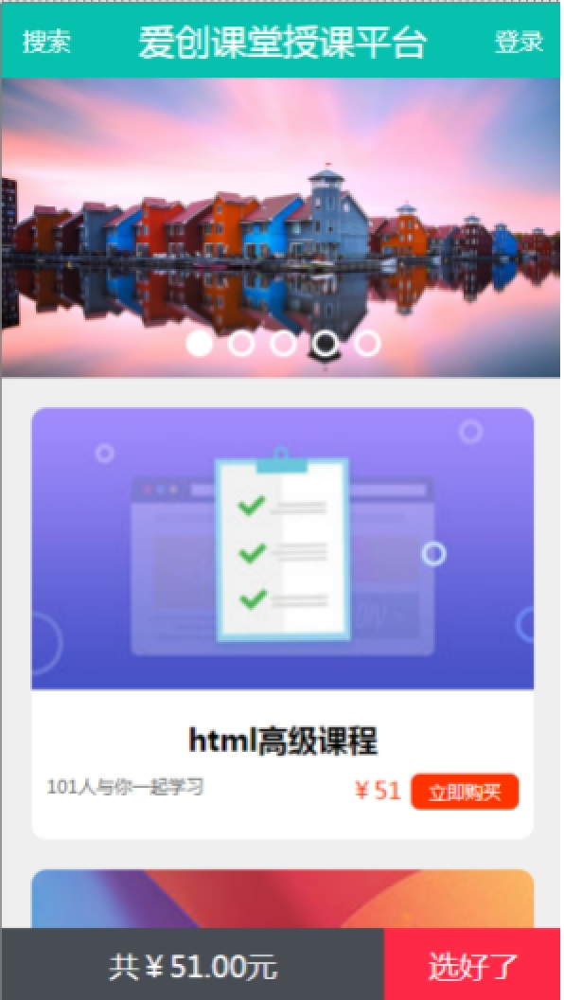
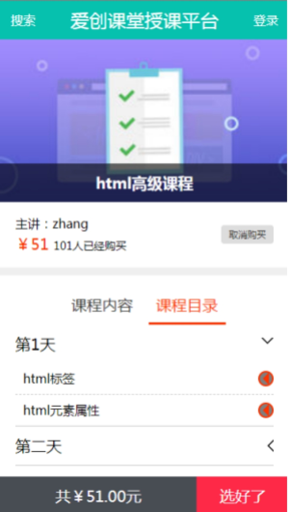
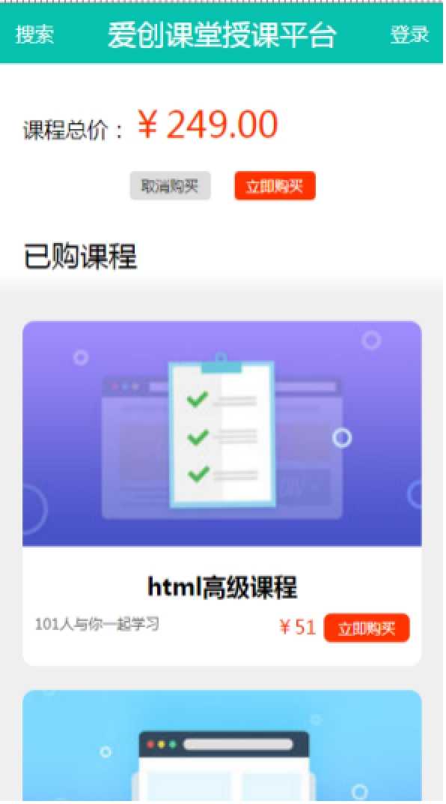
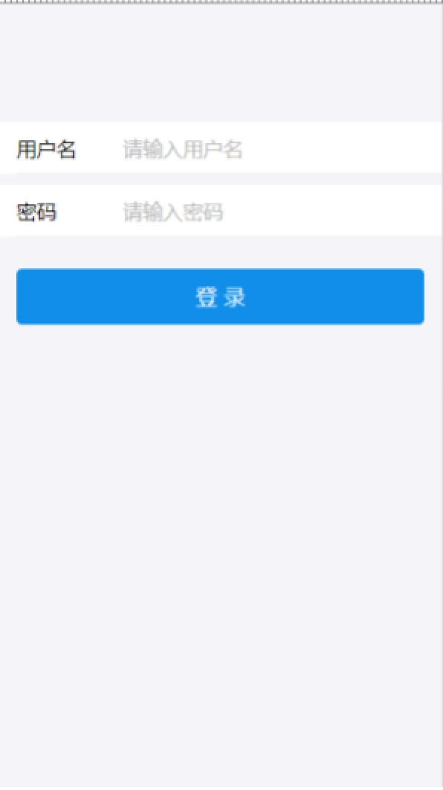
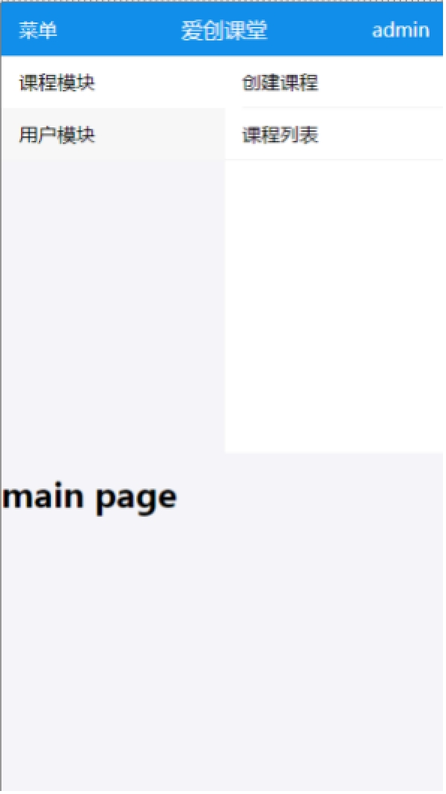
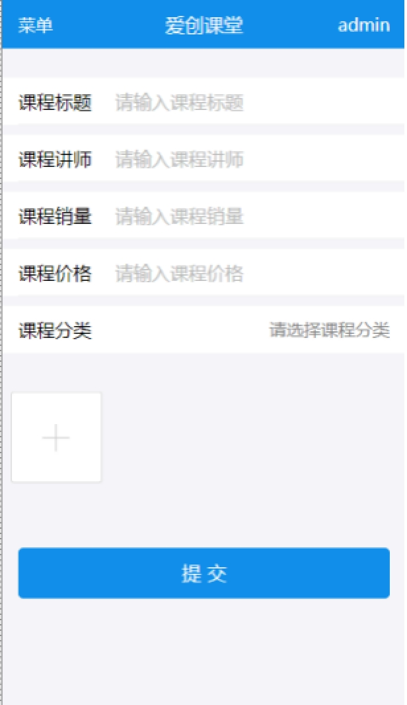
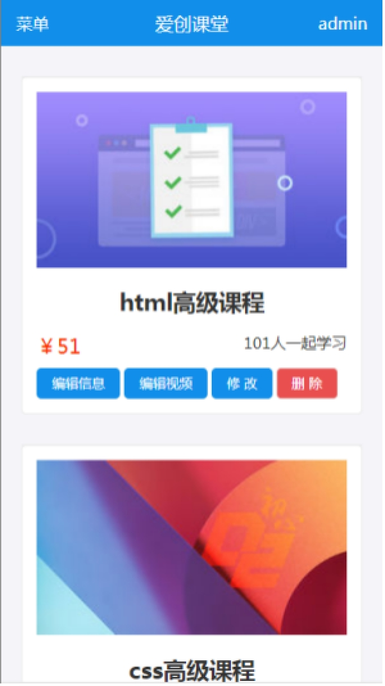
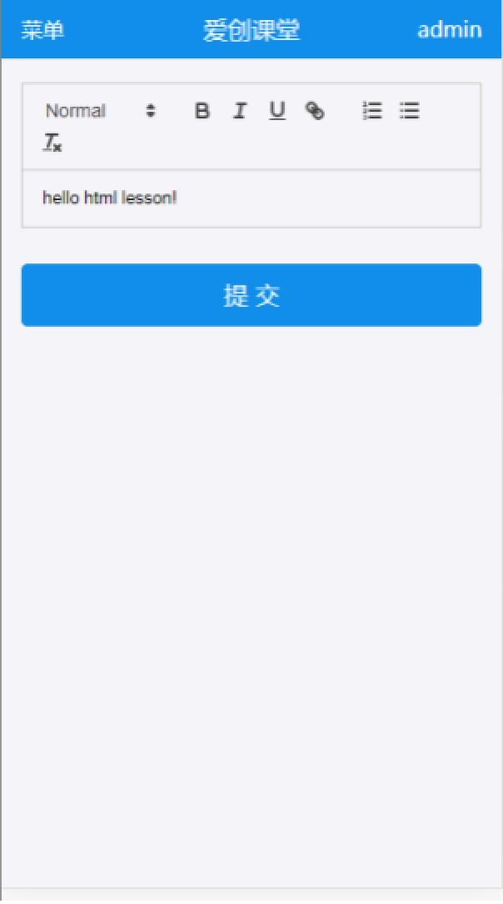
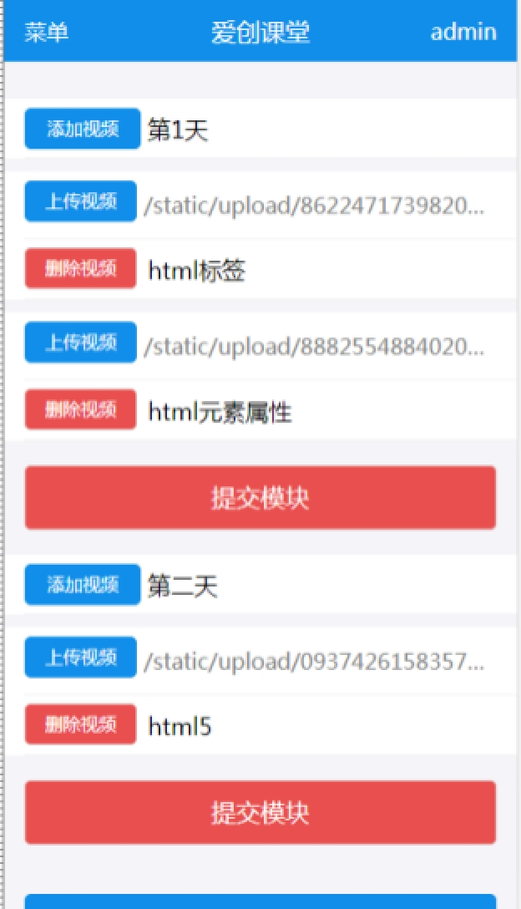
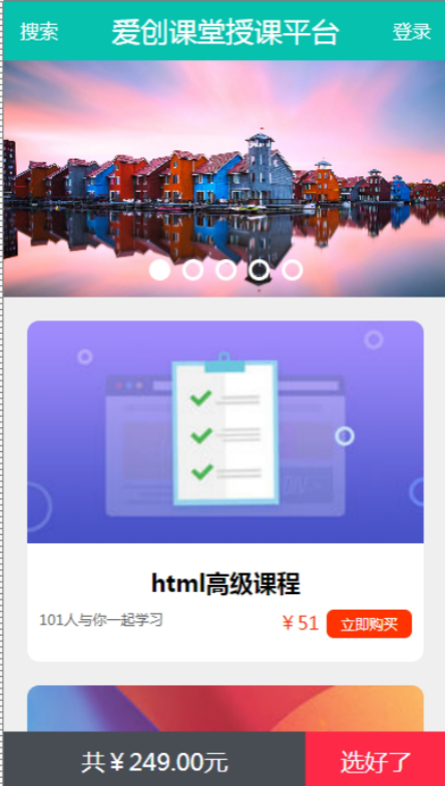

# 一、项目实战

​		我们基于React实现包含移动端，后台管理系统，服务器端以及数据库授课网站。

## 1.1 效果图

  

  

  

## 1.2 项目整体架构

​		整个项目分成三步部分：

​				移动端项目：home

​						我们基于create-react-app脚手架开发，使用mock数据

​				后台管理系统项目：admin

​						我们用webpack实现脚手架功能，进行开发，使用mock数据

​				服务器端：server

​						我们基于express以及mongodb实现服务器端的开发。

## 1.3 搭建服务器

​		我们检测发布的是否正确，我们在server项目中，简单的搭建一个服务器。

​				实现的功能有：

​						创建应用程序

​						配置模板拓展名

​						资源的静态化

​						路由

​						mock数据

​						服务器端（http+https）

```
// 引入express和ejs
let express = require('express');
let ejs = require('ejs');
// 引入path
let path = require('path');
// 引入服务器模块
let http = require('http');
let https = require('https');
// 引入fs
let fs = require('fs');

// 创建应用程序
let app = express();

// 插值语法
ejs.delimiter = '$';
// 拓展名
app.engine('.html', ejs.__express);

// 静态化
app.use('/static/', express.static(path.join(process.cwd(), './static/')))
app.use('/favicon.ico', express.static(path.join(process.cwd(), './favicon.ico')))
app.use('/service-worker.js', express.static(path.join(process.cwd(), './static/home/service-worker.js')))
app.use('/manifest.json', express.static(path.join(process.cwd(), './static/home/manifest.json')))

// mock数据
app.use('/data/', (req, res, next) => {
    // 中间件中，添加拓展名
    // req.url += '.json';
    // 将url转成个数组
    let arr = req.url.split('?')
    // 添加拓展名
    arr[0] += '.json';
    // 更新url
    req.url = arr.join('?')
    // 进入下一个中间件。
    next();
}, express.static(path.join(process.cwd(), './static/data/')))

// 路由
app.get('/', (req, res) => {
    res.render('home.html')
})

// 启动服务器
// app.listen(3000)
// 定义端口号
let httpPart = 3001;
let httpsPart = 3002;
// 引入秘钥文件
let key = fs.readFileSync(path.join(process.cwd(), './ssl/private.pem'))
let cert = fs.readFileSync(path.join(process.cwd(), './ssl/file.crt'))
// 启动服务
http.createServer(app)
    .listen(httpPart, () => console.log('http port listen at ' + httpPart))
https.createServer({ key, cert }, app)
    .listen(httpsPart, () => console.log('http port listen at ' + httpsPart))
```

 

# 二、移动端开发

​		我们基于react实现移动端授课网站的开发。

## 2.1技术架构

​		我们使用了react, 路由, redux, jsx, ES6, ES Module, create-react-app, webpack, less等技术实现移动端授课网站的开发.

## 2.2目录部署

​		我们遵守create-react-app目录规范来创建我们的目录。

​		src			开发目录

​				components 		共享的组件

​				pages 				所有页面

​				action 				消息目录

​				consts				消息类型等常量

​				reducer				处理消息的目录

​				store				存储数据的目录

​				App 				应用程序组件目录

​						App.jsx				应用程序组件

​						App.less			应用程序样式

​				index.jsx			入口文件

## 2.3资源发布

​		我们将静态资源发布到server/static/home目录下。

​		我们将模板资源发布到server/views/home.html文件中、

## 2.4修改配置

​		我们通过yarn eject指令输出webpack配置。

​				path.js

​						静态资源发布位置

​						入口文件名称

​				webpack.config.dev.js

​						要添加less加载机

​				webpack.config.prod.js

​						要添加less加载机

​						模板发布位置

​						修改在模板中，引入静态资源的相对位置。

## 2.5端口号

​		服务器端端口号是3001|3002

​		移动端项目端口号是3000

 

```
// config after eject: we're in ./config/
module.exports = {
  dotenv: resolveApp('.env'),
  // ickt 资源发布位置
  appBuild: resolveApp('../server/static/home'),
  appPublic: resolveApp('public'),
  appHtml: resolveApp('public/index.html'),
  // ickt 入口文件名称
  appIndexJs: resolveApp('src/index.jsx'),
  appPackageJson: resolveApp('package.json'),
  appSrc: resolveApp('src'),
  yarnLockFile: resolveApp('yarn.lock'),
  testsSetup: resolveApp('src/setupTests.js'),
  appNodeModules: resolveApp('node_modules'),
  publicUrl: getPublicUrl(resolveApp('package.json')),
  servedPath: getServedPath(resolveApp('package.json')),
};
```

 

# 三、作业

​		实现课程卡片组件

​		 